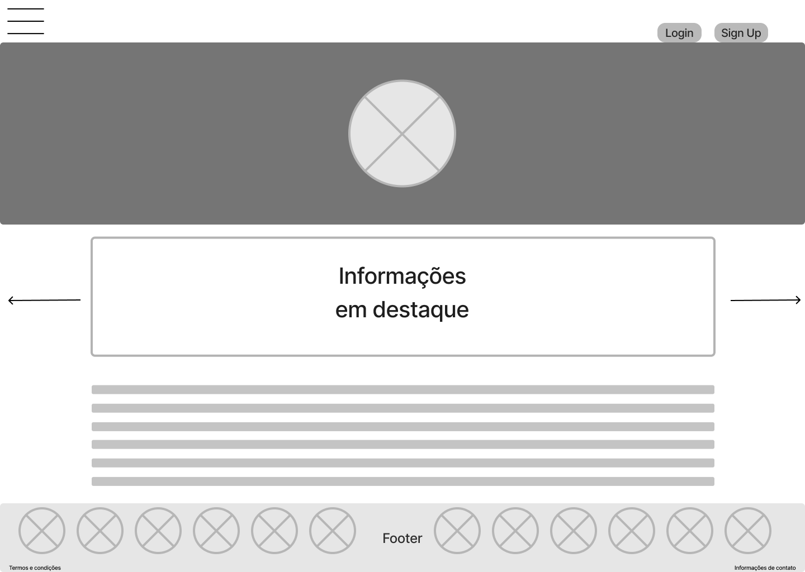
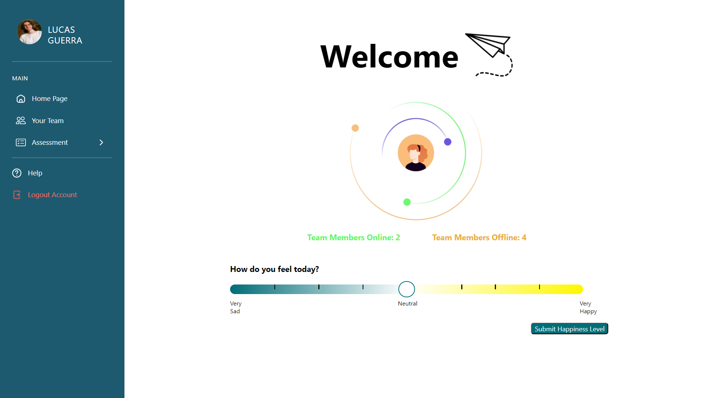

# WAD - Web Application Document - Módulo 2 - Inteli

## Tech Flex
#### Nomes dos integrantes do grupo:
- Daniel Dias

- Gabriel Nascimento

- Igor Silva

- Leonardo Martins

- Lucas Guerra

- Thiago Volcati

## Lista de figuras
[Figura 01 - 5 forças de Porter](#f1)

[Figura 02 - Análise SWOT](#f2)

[Figura 03 - Proposta de valor](#f3)

[Figura 04 - Matriz de risco](#f4)

[Figura 05 - Descrição e planos de ação e resposta aos riscos](#f5)

[Figura 06 - Persona Estudante 1](#f6)

[Figura 07 - Persona Estudante 2](#f7)

[Figura 08 - Persona Tutora](#f8)

[Figura 09 - Arquitetura da solução com padrão MVC](#f9)

[Figura 10 - Wireflow](#f10)

[Figura 11 - Wireframe Login (US01)](#f11)

[Figura 12 - Wireframe Gerenciamento de Times (US01)](#f12)

[Figura 13 - Wireframe Team Members (US01)](#f13)

[Figura 14 - Wireframe Perfil Pessoal (US01)](#f14)

[Figura 15 - Wireframe Home Page (US02)](#f15)

[Figura 16 - Wireframe Login (US02)](#f16)

[Figura 17 - Wireframe Team Members (US02)](#f17)

[Figura 18 - Wireframe Avaliações (US02)](#f18)

[Figura 19 - Wireframe Signup Page (US03)](#f19)

[Figura 20 - Wireframe Dados Pessoais (US03)](#f20)

[Figura 21 - Wireframe Preenchimento Cultural (US03)](#f21)

[Figura 22 - Wireframe Preenchimento Profissional (US03)](#f22)

[Figura 23 - Wireframe Home Page (US04)](#f23)

[Figura 24 - Wireframe Login (US04)](#f24)

[Figura 25 - Wireframe Team Members (US04)](#f25)

[Figura 26 - Wireframe outros Perfis (US04)](#f26)

[Figura 27 - Wireframe Perfil Pessoal (US04)](#f27)

[Figura 28 - Paleta de Cores](#f28)

[Figura 29 - Tipografia](#f29)

[Figura 30 - Iconografia e imagens](#f30)

[Figura 31 - Protótipo de Alta Fidelidade Parte 1](#f31)

[Figura 32 - Protótipo de Alta Fidelidade Parte 2](#f32)

[Figura 33 - Protótipo de alta fidelidade Login (US01)](#f33)

[Figura 34 - Protótipo de alta fidelidade Team Members (US01)](#f34)

[Figura 35 - Protótipo de alta fidelidade Avaliações (US01)](#f35)

[Figura 36 - Modelagem relacional](#f36)

[Figura 37 - HTML rudimentar da página de Login](#f37)

[Figura 38 - HTML rudimentar da página de Signup](#f38)

[Figura 39 - HTML rudimentar da página de Homepage](#f39)

[Figura 40 - HTML rudimentar da página de Team Page](#f40)

[Figura 41 - HTML rudimentar da página de Perfil Pessoal](#f41)

[Figura 42 - HTML rudimentar de Self-assesment Decision Making](#f42)

[Figura 43 - HTML rudimentar de Self-assesment Colaboration](#f43)

[Figura 44 - HTML rudimentar do Group Assesment Colaboration](#f44)

[Figura 45 - HTML rudimentar do Group Assesment Decision Making](#f45)

[Figura 46 - HTML rudimentar do Collaboration Feedback](#f46)

[Figura 47 - HTML rudimentar do Decision Making Feedback](#f47)

[Figura 48 - Modelo Relacional para Primeira Versão do SIstema WEB](#f48)

[Figura 49 - Exemplo de página no figma onde foi adicionado um botão pensado na User Experien](#f49)

[Figura 50 - Visualização do Hapiness Meter Funcional](#f50)

[Figura 51 - Visualização do hapiness meter funcionando no Banco de Dados](#f51)

[Figura 52 - Página de "MyProfile"](#f52)

[Figura 53 - Página de "View-Personal-Profile"](#f53)

[Figura 54 - Protótipo de Alta Fidelidade da Página de Perfis Alheios](#f554)

[Figura 55 - Página de Login](#f55)

[Figura 56 - Página de Sign-Up](#f56)

[Figura 57 - Exemplo de usuário respondendo formulário](#f57)

[Figura 58 - Feedback exibido para um usuário](#f58)

[Figura 59 - Home Page](#f59)

[Figura 60 - Other Profile](#f60)

[Figura 61 - Home Page](#f61)

[Figura 62 - Group Assessment Collaboration](#f62)

[Figura 63 - Página de help](#f63)

[Figura 64 - Feedbacks Self Assessment](#f64)

[Figura 65 - Admin Page](#f65)

[Figura 66 - Imagem de perfil adicionada no site](#f66)

[Figura 67 - Sucesso de testes](#f67)

[Figura 68 - Tarefa 1](#f68)

[Figura 69 - Resultados da tarefa 1](#f69)

[Figura 70 - Tarefa 2](#f70)

[Figura 71 - Resultados da tarefa 2](#f71)

[Figura 72 - Tarefa 3](#f72)

[Figura 73 - Resultados da tarefa 3](#f73)

[Figura 74 - Tarefa 4](#f74)

[Figura 75 - Resultados da tarefa 4](#f75)

[Figura 76 - Tarefa 5](#f76)

[Figura 77 - Resultados da tarefa 5](#f77)

[Figura 78 - Tarefa 6](#f78)

[Figura 79 - Resultados da tarefa 6](#f79)

[Figura 80 - Tarefa 7](#f80)

[Figura 81 - Resultados da tarefa 7](#f81)

[Figura 82 - Tarefa 8](#f82)

[Figura 83 - Resultados da tarefa 8](#f83)

[Figura 84 - Ocorrências](#f84)

[Figura 85 - SUS (System usability scale)](#f85)

[Figura 86 - Medidor de felicidade](#f86)

[Figura 87 - Status de disponibilidade](#f87)

[Figura 88 - Avaliação em pares](#f88)

[Figura 89 - Gráficos de feedbacks](#f89)

## Lista de tabelas

[Tabela 01 - User Story Mia Miao](#t1)

[Tabela 02 - User Story Hai Rong](#t2)

[Tabela 03 - User Story Mingzhe Wang](#t3)

[Tabela 04 - User Story Hai Rong 2](#t4)


## Sumário

[1. Introdução](#c1)

[2. Visão Geral da Aplicação Web](#c2)

[2.1.1 Contexto da indústria](#c211)

[2.1.2 Modelo das 5 forças de Porter](#c212)

[2.1.3 Análise SWOT](#c213)

[2.1.4. Solução](#c214)

[2.1.5. Proposta de Valor](#c215)

[2.1.6. Matriz de riscos](#c216)

[2.2. Personas](#c22)

[2.3. User Stories](#c23)

[3. Projeto Técnico da Aplicação Web](#c3)

[3.1 Arquitetura](#c31)

[3.2 Wireframes](#c32)

[3.3. Guia de estilos](#c33)

[3.3.1 Cores](#c331)

[3.3.2 Tipografia](#c332)

[3.3.3 Iconografia e imagens](#c333)

[3.4 Protótipo de alta fidelidade](#c34)

[3.5. Modelagem do banco de dados](#c35)

[3.5.1 Modelo relacional](#c351)

[3.5.2 Consultas SQL e lógica proposicional](#c352)

[3.6. WebAPI e endpoints](#c36)

[4. Desenvolvimento da Aplicação Web](#c4)

[4.1. Primeira versão da aplicação web](#c41)

[4.2. Segunda versão da aplicação web](#c42)

[4.3. Versão final da aplicação web](#c43)

[5. Testes da Aplicação Web](#c5)

[5.1  Relatório de testes automatizados](#c51)

[5.2  Testes de usabilidade](#c52)

[5.2.1  Registros de testes e melhorias](#c521)


[6. Conclusões e trabalhos futuros](#c6)

[7. Referências](#c7)

[Anexos](#c8)

<br>


# <a name="c1"></a>1. Introdução 

### Problemática Central
&nbsp;&nbsp;&nbsp;&nbsp;A Faculdade Holandesa Zuyd enfrenta o desafio de criar uma plataforma web eficaz para o acompanhamento de estudantes de diversas universidades globais engajados em uma simulação de finanças. Este desafio é agravado pelas barreiras culturais que afetam a comunicação entre os estudantes, que não estão relacionadas a diferenças linguísticas, mas às distintas normas e práticas culturais que influenciam suas interações e colaborações.

### Solução Desenvolvida
&nbsp;&nbsp;&nbsp;&nbsp;A solução proposta é uma plataforma de acompanhamento que não apenas facilita a comunicação entre os participantes, mas também incorpora ferramentas educativas e interativas para promover o entendimento e a apreciação das diferenças culturais. Os aspectos essenciais para a criação de valor deste produto incluem:

- **Feedback Contínuo e Avaliação**: A plataforma permitirá que os alunos avaliem o desempenho e as contribuições uns dos outros, fornecendo feedback valioso que pode ser utilizado para melhorar a colaboração e o entendimento mútuo dentro do grupo.

- **Ferramentas de Sensibilização Cultural**: Integração de recursos educacionais e interativos que facilitam o entendimento das variadas normas culturais, ajudando os alunos a superar barreiras de comunicação não verbais e a entender as expectativas de comportamento entre diferentes culturas.

- **Análise de Comportamento e Feedback de Usuário**: A plataforma coletará dados sobre como os alunos interagem, que serão analisados para fornecer insights aos professores e aos próprios alunos sobre como melhorar a comunicação e a eficiência do trabalho em equipe.

- **Interface Intuitiva e Acessível**: Projeto de uma interface amigável que é intuitiva para usuários de diversas origens culturais, assegurando que a navegação e o uso da plataforma sejam simples e diretos.

### Alinhamento com as Expectativas do Cliente
&nbsp;&nbsp;&nbsp;&nbsp;Essa solução está alinhada com as expectativas do cliente, pois aborda diretamente a questão das barreiras culturais, um ponto crucial identificado para o sucesso da simulação de finanças. À medida que o projeto progride, os detalhes e funcionalidades da plataforma serão continuamente refinados e atualizados para garantir que ela atenda eficazmente às necessidades dos usuários e aos objetivos educacionais da faculdade Zuyd.

# <a name="c2"></a>2. Visão Geral da Aplicação Web 

## <a name="c21"></a>2.1. Escopo do Projeto 

### <a name="c211"></a>2.1.1. Contexto da indústria 

&nbsp;&nbsp;&nbsp;&nbsp;A Universidade de Ciências Aplicadas Zuyd, na Holanda, opera em um cenário educacional em constante evolução. Enquanto tendências como internacionalização e educação online moldam a indústria, a Zuyd se destaca por seu modelo de negócios centrado em parcerias estratégicas com empresas, garantindo relevância prática em seus programas acadêmicos. Compete com outras universidades locais e internacionais, posicionando-se como um player colaborativo e orientado para o mercado. Seu modelo de negócios inclui receitas de taxas de matrícula, projetos de pesquisa e consultoria, refletindo sua missão de oferecer uma educação aplicada e sustentável.

### <a name="c212"></a> 2.1.2. Modelo de 5 Forças de Porter 

&nbsp;&nbsp;&nbsp;&nbsp;A análise das cinco forças de Porter é crucial para a Zuyd e outras empresas, fornecendo uma visão abrangente do ambiente competitivo. Ela permite identificar ameaças e oportunidades, desenvolver estratégias competitivas e adaptar-se às mudanças do mercado. Para a Zuyd, essa análise é essencial para entender sua posição no mercado educacional e tomar decisões estratégicas informadas para garantir sua competitividade e relevância a longo prazo.

<div align="center">
<sub><a name="f1"></a>Figura 01 - 5 forças de Porter</sub>

<sup>Fonte: Material produzido pelos autores (2024)</sup>
</div>

&nbsp;&nbsp;&nbsp;&nbsp; *1. Poder de Negociação dos Fornecedores da Zuyd:*

O poder de negociação dos fornecedores é uma consideração crítica para a Zuyd, pois pode afetar diretamente seus custos de produção, qualidade dos produtos e capacidade de inovar. Várias dinâmicas influenciam esse poder:
- Concentração de Fornecedores: A Zuyd precisa avaliar se existe uma concentração significativa de fornecedores em seu setor. Se um pequeno número de fornecedores domina o mercado de matérias-primas ou recursos essenciais para a Zuyd, esses fornecedores têm mais poder para impor condições desfavoráveis, como aumentos de preços.
- Disponibilidade de Substitutos: A presença de substitutos viáveis para os produtos ou recursos fornecidos pelos fornecedores também é crucial. Se não houver alternativas realistas, a Zuyd pode ficar em uma posição mais fraca nas negociações, sujeita às condições estabelecidas pelos fornecedores.
- Custos de Troca Elevados: A Zuyd precisa considerar se mudar de fornecedores exigiria investimentos significativos em termos de tempo, dinheiro ou recursos. Custos de troca elevados tornam a Zuyd mais dependente dos fornecedores existentes, concedendo a estes mais poder nas negociações.
- Importância dos Insumos: Se os insumos fornecidos pelos fornecedores são críticos para a qualidade ou desempenho dos produtos ou serviços da Zuyd, isso aumenta o poder de negociação dos fornecedores. Se esses insumos não puderem ser facilmente substituídos, os fornecedores têm mais influência sobre a Zuyd.

  Para gerenciar esse poder de negociação dos fornecedores, a Zuyd pode buscar diversificar suas fontes de fornecimento, desenvolver parcerias estratégicas com fornecedores confiáveis, internalizar certos processos de produção ou buscar alternativas de insumos. Essas estratégias podem ajudar a Zuyd a reduzir sua dependência de fornecedores específicos e mitigar os riscos associados ao poder de negociação desses fornecedores.
T

&nbsp;&nbsp;&nbsp;&nbsp;*2. Poder de Negociação dos Compradores da Zuyd:*

O poder de negociação dos compradores é uma consideração significativa para a Zuyd, pois pode impactar diretamente sua lucratividade, margens e capacidade de manter uma base de clientes fiéis. Várias dinâmicas influenciam esse poder:
- Concentração dos Compradores: Se os clientes da Zuyd estão concentrados em um número relativamente pequeno de grandes compradores, esses compradores podem ter mais influência sobre os preços e condições de venda. Isso pode colocar pressão sobre a Zuyd para reduzir seus preços ou fornecer serviços adicionais para manter esses compradores.
- Disponibilidade de Alternativas: A disponibilidade de alternativas para os produtos ou serviços da Zuyd é outro fator importante. Se os clientes têm muitas opções concorrentes, eles têm mais poder para negociar preços mais baixos ou exigir maior qualidade ou valor agregado.
- Custos de Mudança: Os custos que os compradores enfrentam ao mudar de fornecedor também afetam seu poder de negociação. Se os custos de mudança forem baixos, os compradores podem ser mais propensos a buscar alternativas, colocando pressão sobre a Zuyd para manter preços competitivos e serviços de alta qualidade.
- Sensibilidade ao Preço: A sensibilidade dos compradores aos preços dos produtos ou serviços da Zuyd é crucial. Se os produtos ou serviços são percebidos como commodities ou se os compradores têm orçamentos restritos, eles podem ser mais propensos a negociar preços mais baixos ou buscar alternativas mais baratas.

  Para gerenciar esse poder de negociação dos compradores, a Zuyd pode adotar várias estratégias, como diferenciar seus produtos ou serviços para torná-los únicos, fornecer um alto nível de serviço ao cliente para construir relacionamentos duradouros, segmentar o mercado para atender a nichos específicos de clientes ou oferecer programas de fidelidade e descontos para incentivar a repetição de negócios. Essas estratégias podem ajudar a Zuyd a manter sua base de clientes, mesmo diante da pressão dos compradores por preços mais baixos ou melhores condições de venda.

&nbsp;&nbsp;&nbsp;&nbsp; *3. Ameaça de Novos Entrantes para a Zuyd:*

A ameaça de novos entrantes é uma consideração importante para a Zuyd, pois pode afetar sua participação de mercado, lucratividade e posição competitiva. Várias dinâmicas influenciam essa ameaça:
- Barreiras à Entrada: A existência de barreiras à entrada pode determinar a facilidade com que novas empresas podem entrar no mercado e competir com a Zuyd. Barreiras como altos custos de capital, tecnologia proprietária, regulamentações governamentais, acesso limitado a canais de distribuição ou economias de escala significativas podem dissuadir novos concorrentes de entrar no mercado.
- Custos de Mudança para os Clientes: Se os clientes da Zuyd enfrentarem custos significativos ao mudar de fornecedor ou adotar novos produtos ou serviços, isso pode reduzir a ameaça de novos entrantes. Os custos de mudança podem incluir a necessidade de treinamento, adaptação de sistemas existentes ou interrupção das operações comerciais.
- Diferenciação de Marca e Produtos: Se a Zuyd tiver uma forte diferenciação de marca ou produtos, isso pode criar uma barreira para novos entrantes. Os clientes podem estar mais propensos a comprar produtos ou serviços da Zuyd devido à sua reputação, qualidade percebida ou recursos exclusivos, dificultando a entrada de novos concorrentes.
- Acesso a Canais de Distribuição: O acesso a canais de distribuição estabelecidos pode ser uma vantagem significativa para empresas existentes, como a Zuyd. Se os novos entrantes enfrentarem dificuldades para obter acesso aos mesmos canais de distribuição que a Zuyd, isso pode limitar sua capacidade de alcançar clientes e competir efetivamente.

  Para mitigar a ameaça de novos entrantes, a Zuyd pode adotar várias estratégias, como investir em tecnologia e inovação para manter uma vantagem competitiva, fortalecer sua marca e lealdade do cliente, expandir sua presença geográfica ou verticalizar sua cadeia de valor para controlar mais aspectos de suas operações. Ao fazer isso, a Zuyd pode tornar-se menos vulnerável à entrada de novos concorrentes e manter sua posição de mercado.


&nbsp;&nbsp;&nbsp;&nbsp;*4. Ameaça de Produtos ou Serviços Substitutos para a Zuyd:*

A ameaça de produtos ou serviços substitutos é uma preocupação significativa para a Zuyd, pois pode reduzir a demanda por seus produtos ou serviços e afetar sua participação de mercado. Várias dinâmicas influenciam essa ameaça:
- Preço-Desempenho dos Substitutos: A atratividade dos produtos ou serviços substitutos em termos de preço e desempenho é um fator-chave. Se os substitutos oferecerem um valor percebido mais alto para os clientes em relação aos produtos ou serviços da Zuyd, isso pode aumentar a ameaça de substituição.
- Disponibilidade de Alternativas: A disponibilidade de alternativas viáveis aos produtos ou serviços da Zuyd também é importante. Se os clientes têm muitas opções de substituição, eles podem ser mais propensos a abandonar os produtos ou serviços da Zuyd em favor de alternativas mais atraentes.
- Custos de Troca para os Clientes: Os custos que os clientes enfrentam ao mudar para produtos ou serviços substitutos podem afetar a ameaça de substituição. Se os custos de troca, como treinamento, adaptação de sistemas ou interrupção das operações comerciais, forem baixos, os clientes podem ser mais propensos a adotar substitutos.
- Tendências do Mercado e Tecnológicas: Mudanças nas preferências dos clientes ou avanços tecnológicos podem criar novas oportunidades para produtos ou serviços substitutos. Se novas tecnologias ou tendências de mercado tornarem os substitutos mais atraentes, isso pode aumentar a ameaça de substituição para a Zuyd.

  Para enfrentar a ameaça de produtos ou serviços substitutos, a Zuyd pode adotar várias estratégias, como investir em pesquisa e desenvolvimento para manter uma vantagem tecnológica, diferenciar seus produtos ou serviços para torná-los únicos, fortalecer suas relações com clientes para aumentar a fidelidade ou expandir para novos mercados ou segmentos de clientes menos suscetíveis à substituição. Ao fazer isso, a Zuyd pode mitigar a ameaça de produtos ou serviços substitutos e proteger sua participação de mercado.

&nbsp;&nbsp;&nbsp;&nbsp;*5. Rivalidade entre os Concorrentes Existentes para a Zuyd:*

A rivalidade entre os concorrentes existentes é uma consideração crítica para a Zuyd, pois pode afetar sua participação de mercado, margens de lucro e capacidade de crescimento. Várias dinâmicas influenciam essa rivalidade:
- Número de Concorrentes: O número de concorrentes ativos no mercado onde a Zuyd opera é um fator-chave. Se houver muitas empresas competindo pelos mesmos clientes e recursos, isso pode intensificar a rivalidade e levar a uma pressão maior sobre os preços e margens de lucro.
- Taxa de Crescimento do Mercado: A taxa de crescimento do mercado afeta a rivalidade entre os concorrentes existentes. Em mercados com crescimento lento, a competição por uma fatia do mercado existente tende a ser mais acirrada, enquanto em mercados em crescimento, as empresas podem focar mais em expandir sua base de clientes do que em competir diretamente umas com as outras.
- Diferenciação de Produtos e Serviços: A diferenciação dos produtos ou serviços oferecidos pela Zuyd em relação aos concorrentes pode influenciar a rivalidade. Se a Zuyd oferecer produtos ou serviços únicos ou de alta qualidade que se destacam da concorrência, isso pode ajudar a reduzir a rivalidade direta com outros concorrentes.
- Custos Fixos e Variáveis: A estrutura de custos das empresas concorrentes também desempenha um papel na rivalidade. Empresas com altos custos fixos podem ser mais propensas a competir agressivamente por uma participação no mercado para cobrir esses custos, o que pode levar a uma intensificação da rivalidade.

  Para lidar com a rivalidade entre os concorrentes existentes, a Zuyd pode adotar várias estratégias, como investir em diferenciação de produtos ou serviços para se destacar da concorrência, desenvolver eficiências operacionais para reduzir custos e manter margens de lucro saudáveis, focar em segmentos de mercado menos contestados ou buscar oportunidades de expansão em mercados adjacentes. Ao fazer isso, a Zuyd pode posicionar-se de forma mais competitiva no mercado e mitigar os efeitos da rivalidade entre os concorrentes existentes.

 Em resumo, a análise das cinco forças de Porter oferece à Zuyd uma visão detalhada do cenário competitivo em que está inserida. Ao compreender a dinâmica do poder de negociação dos fornecedores e compradores, as ameaças de novos entrantes e de produtos substitutos, bem como a rivalidade entre os concorrentes, a Zuyd pode desenvolver estratégias sólidas para proteger sua posição no mercado educacional. Investir em diversificação de fornecedores, diferenciação de produtos e eficiências operacionais é fundamental para garantir sua competitividade a longo prazo e manter a fidelidade dos clientes.


### <a name="c213"></a>2.1.3. Análise SWOT

&nbsp;&nbsp;&nbsp;&nbsp;A análise SWOT é uma ferramenta estratégica utilizada para medir quais são as forças, fraquezas, oportunidades e ameaças em uma empresa. Esse método é extremamente importante no contexto educacional, pois permite às instituições entender quais fatores podem levar ao sucesso ou fracasso dos alunos, sejam eles internos ou externos. Por isso, a análise SWOT da ZUYD é essencial para analisar a instituição dentro do atual ambiente competitivo de faculdades. 

<div align="center">
<sub><a name="f2"></a>Figura 02 - Análise SWOT</sub>

<sup>Fonte: Material produzido pelos autores (2024)</sup>
</div>

*Strength*:
O trabalho em grupo é a base do método de educação da Zuyd, fazendo com que os alunos trabalhem em projetos juntos afim de que eles aprendamm a trabalhar em  equipe e assim se desenvolvam. Criando profissionais prontos para um ambiente realista de trabalho. A Zuyd também  possui um corpo docente estremamente presente para  dúvidas e turoria dos dicentes, e para auxilialos, eles fornecem materiais de estudo e pesquisa. A faculdade possui uma comunidade muito ligada ao  estrangeiro e conexão com outras culturas, além de fornecer programas de intercâmbio para uma variedade de países, criando um ambiente extremamente  diversificado e com pluralidade cultural. Assim, atraindo mais alunos para se juntarem à faculdade.

*Weakness*:
A Zuyd apenas possui cursos e Inglês e Neerlandês, assim perdendo a oportunidade de ter muitos alunos por causa dessa barreira linguística. Além disso, ela possui apenas uma sede, localizada na Holanda, essa tendo poucos cursos para escolher entre, diminuindo a quantidade de alunos que consegue atrair.

*Opportunities*:
Segundo a Statistics Netherlands, a Holanda teve um aumento significativo de estudantes internacionais, assim abrindo ainda mais oportunidades para que alunos de outros lugares do mundo tenham essa troca de cultura e conhecimento na Zuyd. A faculdade também participa de diversas competições e dinâmicas internacionais, criando conexões e parcerias com  outras faculdades ao redor do globo.

*Threats*:
Por suas limitações de tamanho e popularidade, outras faculdades maiores e mais famosas, perdendo oportunidade de recrutar alunos inteligentes e com muito potencial. Mudanças no câmbio do Euro podem ser críticas para a permanência de alguns alunos na faculdade, podendo haver perda desses estudantes. Além disso, Problemas internos ou externos podem se tornar públicos à mídia, trazendo prejuízos para a faculdade em uma questão de popularidade e marketing.

### <a name="c214"></a>2.1.4. Solução 

1. A falta de integração e de entendimento entre os indivíduos de diferentes culturas acarreta em problemas de colaboração e comunicação durante o *CESIM Global Challenge*, em que tais empecilhos podem levar as equipes a tomarem decisões equivocadas que impactarão negativamente no desenvolvimento da simulação. Além disso, a falta de autoconhecimento dos participantes envolvidos também é um problema a ser resolvido.
2. A edição de 2024 do jogo conta com 13 universidades, de 12 diferentes países e 4 continentes distintos (fonte: student manual 2023/2024).
3. Desenvolver uma plataforma web, que conte com funcionalidades como exibição de informações culturais fornecidas pelos próprios usuários, status de disponibilidade, medidor de satisfação, avaliações e feedbacks de avaliações. Além de auxiliar os estudantes participantes, a plataforma também irá ajudar os tutores, com funcionalidades de visualização de avaliações de todos os alunos e de enviar comentários individuais ou para os grupos.
4. O usuário, ao fazer login, irá preencher os campos de informações pessoais e culturais. Posteriormente, através da plataforma ele irá realizar as avaliações individuais e em pares, verificar os resultados e descobrir qual seu tipo de perfil de colaboração: harmonizador, diretor, iniciador, analista ou conformista. Além disso, poderá verificar os status de disponibilidade dos outros membros, anexar e receber documentos.
5. Maior integração, entendimento de diferentes culturas, colaboração e comunicação mais efetiva entre os participantes. Possibilidade de acesso aos relatórios individuais e das avaliações em pares, assim, podendo ser possível identificar se jogador se enxerga da mesma maneira que pessoas de diferentes países enxergam ele. Assim, é esperado uma evolução no autoconhecimento dos participantes e na capacidade de tomada de decisões.
6. O projeto será considerado sucesso caso seja uma ferramenta que auxilie na integração entre indivíduos de diferentes nacionalidades e que consiga solucionar, em partes, os problemas de comunicação e colaboração decorrentes. As medidas para avaliar o sucesso disso serão os medidores de satisfação dos participantes e redução de erros comuns por diferenças culturais em edições passadas do *CESIM Global Challenge*.


### <a name="c215"></a>2.1.5. Proposta de Valor 
&nbsp;&nbsp;&nbsp;&nbsp; O Canva de Proposta de Valor é uma ferramenta visual e estratégica utilizada para o desenvolvimento de produtos, soluções e projetos. Essa utilidade tem foco em garantir que uma solução proposta atenda às necessidades e desejos dos clientes. Ela ajuda a mapear e entender os benefícios que a solução proposta devem oferecer para atender as solicitações do cliente e criar ganhos significativos para eles.

<div align="center">
<sub><a name="f3"></a>Figura 03 - Proposta de Valor</sub>

<sup>Fonte: Material produzido pelos autores (2024)</sup>
</div>


**Na seção "Proposta de Valor", há três componentes principais destacados na figura, que buscam trazer o papel da corporação no modelo de negócios proposto.**

&nbsp;&nbsp;&nbsp;&nbsp; *1. Produtos e Serviços:* 
- Uma plataforma web que fornece informações de contato, cultura e habilidades dos participantes do Cesim Game

&nbsp;&nbsp;&nbsp;&nbsp;A plataforma serve como um banco de dados interativo para participantes do Cesim Game, onde eles compartilharão informações pertinentes sobre seus perfis de trabalho e cultura, auxiliando na coordenação e colaboração entre membros de diferentes nacionalidades.

&nbsp;&nbsp;&nbsp;&nbsp; *2. Criadores de Ganho:* 
- Promove uma melhor compreensão das dinâmicas interculturais
- Oferece um ambiente de simulação realista no contexto internacional

&nbsp;&nbsp;&nbsp;&nbsp; Ao oferecer insights sobre diferentes culturas, costumes e hábitos dos membros da equipe, a plataforma visa melhorar a comunicação e a colaboração entre equipes multiculturais. Além disso, preparar os participantes para enfrentar desafios reais de integração da equipe superando barreiras culturais no meio dos negócios internacionais é um dos objetivos, criando um cenário mais próximo da realidade.

&nbsp;&nbsp;&nbsp;&nbsp; *3. Aliviadores de Dor:* 
- Acervo de informações pertinentes sobre horários e forma de trabalho do grupo
- Sistema de feedback anônimo e construtivo

Estes recursos incentivarão a melhoria contínua e o desenvolvimento pessoal dentro do grupo, além de proporcionar informações organizacionais que são críticas para a eficiência, permitindo ajustes às diferentes zonas horárias e práticas de trabalho.

**Na seção "Segmentos de Clientes", também existem três componentes principais destacados na figura, que buscam trazer o papel do cliente no modelo de negócios atual.**

&nbsp;&nbsp;&nbsp;&nbsp; *1. Trabalhos do Cliente:* 
- Pesquisar e entender por si só diferenças culturais 
- Identificar na prática os perfis e habilidades dos parceiros

 &nbsp;&nbsp;&nbsp;&nbsp;Atualmente não existe qualquer tipo de indicador de como interagir e delegar tarefas no ínicio do jogo. Os jogadores são postos em grupos sem saber nada sobre o perfil profissional de seus colegas, e quando há a preocupação de respeito cultural, é de dever do próprio participante procurar e estudar os costumes regionais dos membros de seu grupo.

&nbsp;&nbsp;&nbsp;&nbsp; *2. Dores:*

- Dificuldades de comunicação devido a barreiras linguísticas e culturais.
- Desafios na coordenação e organização eficaz com membros de diferentes fusos horários e práticas culturais.

&nbsp;&nbsp;&nbsp;&nbsp;A falta de compreensão mútua devido a diferenças culturais e linguísticas pode resultar em comunicação deficiente e dificultar a colaboração entre membros de equipes multiculturais. Além disso, a gestão de diferentes fusos horários e práticas culturais pode representar obstáculos significativos para a eficiência operacional e a coordenação de atividades conjuntas.

&nbsp;&nbsp;&nbsp;&nbsp; *3. Ganhos:* 
- Desenvolver habilidades interpessoais e de comunicação em um contexto internacional

- Aprofundamento de conhecimento sobre habilidades e perfis profissionais dos seus parceiros de equipe

- Melhorar o entendimento sobre diversidade cultural e sua aplicação em negócios.

&nbsp;&nbsp;&nbsp;&nbsp;Ao interagir com a diversidade cultural da plataforma, os usuários têm a chance de aprimorar a comunicação *rapport* entre eles e seu conhecimento de relações interpessoais em um contexto de negócios internacionais. Além disso, ter acesso ao tipo de perfil profissional de seus parceiros, vai gerar maior proximidade entre eles, ajudando na delegação e organização de tarefas iniciais.

&nbsp;&nbsp;&nbsp;&nbsp;A partir dessa análise, conclui-se que a solução proposta pretende facilitar a interação e a eficácia de equipes internacionais dentro do *Cesim Game*. Ao fornecer uma plataforma que não apenas alivia as dificuldades interculturais, mas também melhora a compreensão e o desempenho colaborativo. Os usuários poderão desfrutar de uma experiência mais rica e produtiva, resultando em um aprendizado mais profundo e aplicável ao contexto de negócios num âmbito global.


### <a name="c216"></a>2.1.6. Matriz de Riscos 

&nbsp;&nbsp;&nbsp;&nbsp;Com base nas informações fornecidas sobre o projeto de plataforma web da Faculdade Holandesa Zuyd para simulação de finanças com estudantes de diversas universidades globais, podemos construir uma matriz de risco estruturada que identifica potenciais ameaças e oportunidades, avaliando seus impactos e probabilidades, e delineando planos de ação adequados. Aqui está um exemplo de como essa matriz de riscos pode ser configurada:


<div align="center">
<sup><a name="f4"></a>Figura 04 - Matriz de risco
<br>

<br>
<sub>Fonte: Elaborado pelos autores (2024).
</div>

<div align="center">
<sup><a name="f5"></a>Figura 05 - Descrição e planos de ação e resposta aos riscos
<br>

<br>
<sub>Fonte: Elaborado pelos autores (2024).
</div>


### Explicação da Matriz
- **Probabilidade** indica quão provável é que o risco ocorra.
- **Impacto** refere-se à gravidade das consequências se o risco se materializar.
- **Plano de Ação** descreve as medidas preventivas e corretivas para lidar com o risco.
- **Resposta Planejada** é a estratégia de resposta ao risco, podendo ser de mitigação, prevenção, aceitação ou contingência.

### Conclusão
&nbsp;&nbsp;&nbsp;&nbsp;Considerando a matriz de riscos para o projeto da plataforma web da Faculdade Holandesa Zuyd, podemos concluir estrategicamente que a atenção deve estar voltada principalmente para a superação das barreiras culturais. Este é o cerne do desafio e o objetivo mais crítico para o sucesso da simulação de finanças envolvendo estudantes internacionais. O projeto fará um recorte estratégico focando na integração de ferramentas de sensibilização e educação cultural, que são fundamentais para facilitar a comunicação e colaboração entre os participantes.
<br>
&nbsp;&nbsp;&nbsp;&nbsp;Portanto, o projeto irá enfatizar a criação de uma interface intuitiva e o desenvolvimento de mecanismos de feedback e avaliação dos alunos, que são essenciais para promover o entendimento e a apreciação das diferenças culturais. É importante citar que adaptar-se e ser acessível a estudantes de diversas origens culturais será o fator determinante para o seu sucesso da plataforma.

## <a name="c22"></a>2.2. Personas 

&nbsp;&nbsp;&nbsp;&nbsp;Visando promover uma melhor integração entre os participantes, nosso projeto consiste no desenvolvimento de um site para o *Cesim Global Challenge*. Este programa une estudantes de diversas partes do mundo, o que resulta em uma enorme variedade de culturas e hábitos. O entendimento mútuo entre os participantes se tornam essenciais para o sucesso do programa.
<br>
&nbsp;&nbsp;&nbsp;&nbsp;Pensando nisso, a principal tarefa do nosso projeto é desenvolver uma plataforma que facilite a integração e colaboração entre os participantes. O objetivo é criar um ambiente virtual onde seja possível compreender e respeitar as diferenças culturais de cada um. Isso inclui oferecer funcionalidades que permitam aos usuários avaliar colegas e entender as diferenças culturais que influenciam suas interações.
<br>
&nbsp;&nbsp;&nbsp;&nbsp;Para isso, utilziamos a técnica de criação de personas, que é um personagem fictício que representa o cliente ideal de um negócio. Criamos representações não reais, de usuários baseadas em dados coletados sobre seus comportamentos, motivações, objetivos, desafios e preocupações. Essas personas ajudam nossa equipe a manter o foco no usuário durante todo o processo de desenvolvimento, garantindo que as funcionalidades do site sejam sempre assertivas.
<br>
&nbsp;&nbsp;&nbsp;&nbsp;As personas foram baseadas em estudantes e tutores da China. Para aprofundar a veracidade das personas, foi pesquisado a universidade chinesa que possui alunos participando da edição de 2024 do *Cesim Global Challenge*, que é a Heilongjiang International University. Além disso, certos detalhes das personas foram baseados em um artigo que discorre acerca da relação entre alunos e professores universitários chineses.
<br>
&nbsp;&nbsp;&nbsp;&nbsp;Segue as imagens das personas criadas:
<div align="center">
<sup><a name="f6"></a>Figura 06 - Persona Estudante 1
<br>

<br>
<sub>Fonte: Elaborado pelos autores (2024).
</div><br>
&nbsp;&nbsp;&nbsp;&nbsp;Hai Rong, de Harbin, equilibra estudos e vida pessoal e busca aprimorar suas habilidades de comunicação. Sua persona reflete as complexidades da vida de uma estudante envolvida em interações globais, enfrentando desafios emocionais e culturais reais, alinhados com a necessidade da plataforma de apoiar um crescimento completo dos estudantes.<br>
<div align="center">
<sup><a name="f7"></a>Figura 07 - Persona Estudante 2
<br>

<br>
<sub>Fonte: Elaborado pelos autores (2024).
</div>

<br>

&nbsp;&nbsp;&nbsp;&nbsp;Mingzhe é um estudante de Harbin com aspirações em negócios internacionais. Ele representa um usuário típico da plataforma, com metas que alinham com o desejo de superar barreiras culturais, algo comum entre estudantes chineses em contextos internacionais. Seu perfil inclui características como ser exigente e introvertido, refletindo a dedicação e os desafios enfrentados por alunos em ambientes acadêmicos competitivos.

<br>
<div align="center">
<sup><a name="f8"></a>Figura 08 - Persona Tutora
<br>

<br>
<sub>Fonte: Elaborado pelos autores (2024).
</div><br>


&nbsp;&nbsp;&nbsp;&nbsp;Mia Miao simboliza a tutora dedicada e experiente, com suas características e aspirações baseadas em um entendimento das expectativas educacionais na China. Com 42 anos, sua experiência como professora em Heilongjiang a posiciona como alguém muito comprometida com o sucesso acadêmico de seus alunos, refletindo a ênfase da cultura chinesa na educação e no respeito pela hierarquia e sabedoria dos educadores.
<br>
&nbsp;&nbsp;&nbsp;&nbsp;Portanto, as personas são fundamentais pois ao implementar essas personas no desenvolvimento do site, é possível elaborarmos um site que se adeque com as experiências dos diversos usuários que utilizarão o site. Com isso, no desenvolvimento do projeto, as pessoas desenvolvedoras terão em mente pessoas, que apesar de fictícias, representam indivíduos com necessidades reais e que o projeto desenvolvido resolveria seus problemas. Por exemplo, a aplicação web seria útil para a professora Mia Miao porque irá trazer maior dinamicidade no Cesim Game, o que é importante para ela porque uma de suas frustrações são as atividades repetitivas e entediantes acarretadas de seu trabalho. Desse modo, será possível cumprir os propósitos de promover uma maior compreensão cultural entre os integrantes. Consequentemente, isso deverá resultar em uma colaboração mais efetiva e em uma experiência de jogo aperfeiçoada para todos os envolvidos.

## <a name="c23"></a>2.3. User Stories

&nbsp;&nbsp;&nbsp;&nbsp;As *user stories*, ou histórias de usuário, são uma ferramenta fundamental para ser possóvel identificar as necessidades e dores do ponto de vista do usuário, e por conta disso desenvolvemos as personas. A partir das personas, criamos histórias que representem ações que o usuário irá fazer com o produto, o que permite que a equipe de desenvolvimento tenha um foco nas necessidades e prioridades do usuário, em vez de desenvolver um projeto enviesado com base na equipe desenvolvedora.
<br>
&nbsp;&nbsp;&nbsp;&nbsp;Além disso, as *user stories* tem como características serem flexíveis e adaptáveis, de fácil ajuste. Nesse sentido, na criação das seguintes *user stories* também foi utilizado o critério de qualidade INVEST, que é um acrônimo que descreve características essenciais das histórias de usuário, das quais são: "Independente", "Negociável", "Valiosa", "Estimável", "Sob Medida" e "Testável". Assim, seguindo o críterio INVEST, é esperado a criação de histórias claras, facilmente gerenciáveis e direcionadas para o sucesso do projeto.

<div align="center">
<sup><a name="t4"></a>Tabela 01 - User Story Hai Rong
</div>

Identificação | US01
--- | ---
Persona | Hai Rong
User Story | "Como estudante, desejo criar a minha conta e acessar a página de *self assessment collaboration* e *self assessment decision making*, com o objetivo de me avaliar"
Critério de aceite 1 | CR1. Cenário: O jogador precisa estar em um time <br> O administrador deve ter criado um jogo, universo e um time e adicionado o usuário a um time.
Critério de aceite 2 | CR2. Cenário: Acesso  à página de *login* <br>Teste de Aceite: Quando a estudante estiver na página de *Login*, ela deve ser capaz de visualizar claramente os campos para inserir e-mail, senha e *signup*
Critério de aceite 3 | CR3. Cenário: Acesso à página de *signup* <br>Teste de Aceite: Na página de login, ela deve ser capaz de visualizar e clicar no botão *signup*
Critério de aceite 4 | CR4. Cenário: Preenchimento das Credenciais <br>Teste de Aceite: Na página de *signup*, a estudante deve ser capaz de visualizar claramente os campos para inserir usuário, e-mail, senha e confirmar senha
Critério de aceite 5 | CR5. Cenário: Autenticação Bem-Sucedida <br>Teste de Aceite: Após inserir suas credenciais corretamente e clicar no botão '*Signup*', a estudante será autenticada com sucesso na plataforma como estudante
Critério de aceite 6 | CR6. Cenário: Redirecionamento para a "*Self-assessment Collaboration*" <br>Teste de Aceite: Após a autenticação bem-sucedida, a estudante será redirecionada para a página "*Self-assessment Collaboration*" da plataforma
Critério de aceite 7 | CR7. Cenário: Respondendo o "*Self-assessment Collaboration*" <br>Teste de Aceite: Na página de avaliação, a estudante deve marcar as opções ela que mais identifica e enviar apertar o botão de "send" para enviar as respostas
Critério de aceite 8 | CR8. Cenário: Redirecionamento para a "*Self-assessment Decision Making*" <br>Teste de Aceite: Após o envio bem-sucedido, a estudante será redirecionada para a  página "*Self-assessment Collaboration*" da plataforma
Critério de aceite 9 | CR9. Cenário: Respondendo o "*Self-assessment Collaboration*" <br>Teste de Aceite: Na página de avaliação, a estudante deve marcar as opções ela que mais identifica e enviar apertar o botão de "send" para enviar as respostas.
<div align="center">
<sub>Fonte: Elaborado pelos autores (2024).
</div>
<br>

<div align="center">
<sup><a name="t4"></a>Tabela 02 - User Story Hai Rong 2
</div>

Identificação | US02
--- | ---
Persona | Hai Rong
User Story | "Como estudante, desejo acessar os formulários individuais, para poder expressar o meu próprio comportamento, com o objetivo de entender como eu me comporto e melhorar a minha eficiencia no grupo."
Critério de aceite 1 | CR1. Cenário: O jogador precisa estar em um time <br> O administrador deve ter criado um jogo, universo e um time e adicionado o usuário a um time.
Critério de aceite 2 |CR2. Cenário: Acesso à página de *login* <br>Teste de Aceite: Quando a estudante estiver na página de *Login*, ela deve ser capaz de visualizar claramente os campos para inserir e-mail e senha
Critério de aceite 3 |CR3. Cenário: Autenticação Bem-Sucedida <br>Teste de Aceite: Após inserir suas credenciais corretamente e clicar no botão '*Login*', a estudante será autenticada com sucesso na plataforma como estudante
Critério de aceite 4 |CR4. Cenário: Redirecionamento para a "*Welcome page*" <br>Teste de Aceite: Após a autenticação bem-sucedida, a estudante será redirecionada para a "*Welcome page*" da plataforma
Critério de aceite 5 |CR5. Cenário: Redirecionamente para a página de *individual assessment* <br>Teste de Aceite: Após acessar a "*Welcome page*", a estudante deverá clicar em *assessment* e em *individual* na barra lateral para ser redirecionada para a página de *individual assessmen*. Esse botão deve ser fácil de identificar e acessar
Critério de aceite 6 | CR6. Cenário: Visualização do formulário *"Self-assesment - Colaboration"* <br>Teste de Aceite: Após acessar a página de formulário individual, o usuário deve responder todas perguntas e clicar no botão "Send" para confirmar seu envio.
Critério de aceite 7 | CR7. Cenário: Visualização do resultado do *"Self-assesment - Colaboration"* <br>Teste de Aceite: Após responder o formulário individual, o usuário deve visualizar o resultado dos testes (indicando em qual perfil ele se encaixa). Para a expriência ser concluída ele deve clicar no botão "Decision Making Questions"
Critério de aceite 8 | CR8. Cenário: Visualização do formulário *"Self-assesment - Decision Making"* <br>Teste de Aceite: Após acessar a página de formulário individual, o usuário deve responder todas perguntas e clicar no botão "Send" para confirmar seu envio.
Critério de aceite 9 | CR9. Cenário: Visualização do resultado do *"Self-assesment - Decision Making* <br>Teste de Aceite: Após responder o formulário individual, o usuário deve visualizar o resultado dos testes (indicando em qual perfil ele se encaixa).

<div align="center">
<sub>Fonte: Elaborado pelos autores (2024).
</div>
<br>

<div align="center">
<sup><a name="t4"></a>Tabela 03 - User Story Hai Rong 3
</div>

Identificação | US03
--- | ---
Persona | Hai Rong
User Story | "Como estudante, desejo acessar os formulários de grupo, para poder expressar o comportamento dos outros integrantes, com o objetivo de classificar e melhorar o entendimento do grupo como um todo."
Critério de aceite 1 | CR1. Cenário: O jogador precisa estar em um time <br> O administrador deve ter criado um jogo, universo e um time e adicionado o usuário a um time.
Critério de aceite 2 | CR2. Cenário: Acesso à página de *login* <br>Teste de Aceite: Quando o estudante estiver na página de *Login*, ele deve ser capaz de visualizar claramente os campos para inserir e-mail e senha
Critério de aceite 3 |CR3. Cenário: Autenticação Bem-Sucedida <br>Teste de Aceite: Após inserir suas credenciais corretamente e clicar no botão '*Login*', o estudante será autenticado com sucesso na plataforma como estudante
Critério de aceite 4 | CR4. Cenário: Redirecionamento para a "*Welcome page*" <br>Teste de Aceite: Após a autenticação bem-sucedida, o estudante será redirecionado para a "*welcome page*" da plataforma
Critério de aceite 5 |CR5. Cenário: Redirecionamente para a página de *group assessment* <br>Teste de Aceite: Após acessar a "*Welcome page*", o estudante deverá clicar em *assessment* e em *Evaluate Group* na barra lateral para ser redirecionado para a página de *group assessment*. Esse botão deve ser fácil de identificar
Critério de aceite 6 | CR6. Cenário: Visualização dos formulários de *"Colaboration of group"* <br>Teste de Aceite: Após clicar no botão de avaliação, o usuário deve avaliar os colegas em cada uma das classificações do espectro do *Colaboration*, após isso deve apertar o botão *"Submit"* para guardar as informações e, para finalizar, ser redirecionado para *"Group-assessment Decision Making.
Critério de aceite 7 | CR7. Cenário: Visualização dos formulários de *"Decision Making of group"* <br>Teste de Aceite: Após clicar no botão de avaliação, o usuário deve avaliar os colegas em cada uma das classificações do espectro do *Decision Making*, e para finalizar deve apertar o botão *"Confirm"* para guardar as informações.

<div align="center">
<sub>Fonte: Elaborado pelos autores (2024).
</div>
<br>

<div align="center">
<sup><a name="t4"></a>Tabela 04 - User Story Hai Rong 4
</div>

Identificação | US04
--- | ---
Persona | Hai Rong
User Story | "Como estudante, desejo acessar os resultados dos formulários sobre os outros integrantes do meu grupo e sobre mim mesmo, para poder entender o comportamento de cada um e, assim, colaborarmos de forma mais eficaz."
Critério de aceite 1 | CR1. Cenário: O jogador precisa estar em um time <br> O administrador deve ter criado um jogo, universo e um time e adicionado o usuário a um time.
Critério de aceite 2 | CR2. Cenário: Acesso à página de *login* <br>Teste de Aceite: Quando o estudante estiver na página de *Login*, ele deve ser capaz de visualizar claramente os campos para inserir e-mail e senha
Critério de aceite 3 |CR3. Cenário: Autenticação Bem-Sucedida <br>Teste de Aceite: Após inserir suas credenciais corretamente e clicar no botão '*Login*', o estudante será autenticado com sucesso na plataforma como estudante
Critério de aceite 4 | CR4. Cenário: Redirecionamento para a "*Welcome Page*" <br>Teste de Aceite: Após a autenticação bem-sucedida, o estudante será redirecionado para a "*Welcome Page*" da plataforma
Critério de aceite 5 |CR5. Cenário: Redirecionamento para a página de *feedback* <br>Teste de Aceite: Após acessar a "*Welcome Page*", o estudante deverá clicar em *assessment* e em *feedbacks* na barra lateral para ser redirecionado para a página de *feedbacks*. Esse botão deve ser fácil de identificar
Critério de aceite 6 | CR6. Cenário: Visualização dos *feedbacks* <br>Teste de Aceite: Após acessar a página de *feedback*, o estudante terá acesso aos *feedbacks*, podendo alternar entre *Decision Making* e *Collaboration*, as informações mostrarão se cada participante é *Director*, *Harmonizer*, *Conformist*, *Initiator*, *Analyst* e *Analytical*, *Conceptual*, *Directive*, *Behavioral* estarão dispostas de forma clara e de fácil entendimento.

<div align="center">
<sub>Fonte: Elaborado pelos autores (2024).
</div>
<br>

<div align="center">
<sup><a name="t4"></a>Tabela 05 - User Story Hai Rong 5
</div>

Identificação | US05
--- | ---
Persona | Hai Rong
User Story | "Como estudante, desejo acessar a página de Help através da sidebar para entender o funcionamento dos botões e as funcionalidades do site, com o objetivo de navegar com mais eficiência e aproveitar todas as funcionalidades oferecidas."
Critério de aceite 1 | CR1. Cenário: O jogador precisa estar em um time <br> O administrador deve ter criado um jogo, universo e um time e adicionado o usuário a um time.
Critério de aceite 2 | CR2. Cenário: Acesso à página de *login* <br>Teste de Aceite: Quando o estudante estiver na página de *Login*, ele deve ser capaz de visualizar claramente os campos para inserir e-mail e senha
Critério de aceite 3 |CR3. Cenário: Autenticação Bem-Sucedida <br>Teste de Aceite: Após inserir suas credenciais corretamente e clicar no botão '*Login*', o estudante será autenticado com sucesso na plataforma como estudante
Critério de aceite 4 | CR4. Cenário: Redirecionamento para a "*Welcome Page*" <br>Teste de Aceite: Após a autenticação bem-sucedida, o estudante será redirecionado para a "*Welcome Page*" da plataforma
Critério de aceite 5 |CR5. Cenário: Redirecionamento para a página de "*Help*" <br>Teste de Aceite: O usuário deve clicar no ícone ou link de "*Help*" na barra lateral e ser redirecionado para a página de "*Help*".
Critério de aceite 6 | CR6. Cenário: Visualização da página de "*Help*" <br>Teste de Aceite: Na página de "*Help*", o usuário deve ser capaz de visualizar claramente informações sobre os ícones e caminhos para todas as funcionalidades do site.
<div align="center">
<sub>Fonte: Elaborado pelos autores (2024).
</div>
<br>

<div align="center">
<sup><a name="t4"></a>Tabela 06 - User Story Hai Rong 6
</div>

Identificação | US06
--- | ---
Persona | Hai Rong
User Story | "Como estudante, desejo acessar a página de Help através da sidebar para entender o funcionamento dos botões e as funcionalidades do site, com o objetivo de navegar com mais eficiência e aproveitar todas as funcionalidades oferecidas."
Critério de aceite 1 | CR1. Cenário: O jogador precisa estar em um time <br> O administrador deve ter criado um jogo, universo e um time e adicionado o usuário a um time.
Critério de aceite 2 | CR2. Cenário: Acesso à página de *login* <br>Teste de Aceite: Quando o estudante estiver na página de *Login*, ele deve ser capaz de visualizar claramente os campos para inserir e-mail e senha
Critério de aceite 3 |CR3. Cenário: Autenticação Bem-Sucedida <br>Teste de Aceite: Após inserir suas credenciais corretamente e clicar no botão '*Login*', o estudante será autenticado com sucesso na plataforma como estudante
Critério de aceite 4 | CR4. Cenário: Redirecionamento para a "*Welcome Page*" <br>Teste de Aceite: Após a autenticação bem-sucedida, o estudante será redirecionado para a "*Welcome Page*" da plataforma
Critério de aceite 5 |CR5. Cenário: Clicando no botão de *logout* <br>Teste de Aceite: O usuário deve clicar no botão de *logout* na *sidebar* que está claramente identificada
Critério de aceite 6 | CR6. Cenário: Redirecionamento para a página de *login* <br>Teste de Aceite: Após o encerramento da sessão, o usuário deve ser automaticamente redirecionado para a página de *login*.
<div align="center">
<sub>Fonte: Elaborado pelos autores (2024).
</div>
<br>

<div align="center">
<sup><a name="t4"></a>Tabela 07 - User Story Hai Rong 7
</div>

Identificação | US07
--- | ---
Persona | Hai Rong
User Story | "Como estudante, desejo terminar a sessão do meu cadrastro e voltar para a página de *login*, com o desejo de conseguir colocar a minha credenciais novamente."
Critério de aceite 1 | CR1. Cenário: O jogador precisa estar em um time <br> O administrador deve ter criado um jogo, universo e um time e adicionado o usuário a um time.
Critério de aceite 2 | CR2. Cenário: Acesso à página de *login* <br>Teste de Aceite: Quando o estudante estiver na página de *Login*, ele deve ser capaz de visualizar claramente os campos para inserir e-mail e senha
Critério de aceite 3 |CR4. Cenário: Autenticação Bem-Sucedida <br>Teste de Aceite: Após inserir suas credenciais corretamente e clicar no botão '*Login*', o estudante será autenticado com sucesso na plataforma como estudante
Critério de aceite 4 | CR4. Cenário: Redirecionamento para a "*Welcome Page*" <br>Teste de Aceite: Após a autenticação bem-sucedida, o estudante será redirecionado para a "*Welcome Page*" da plataforma
Critério de aceite 5 |CR5. Cenário: Redirecionamento para o "*profile*" <br>Teste de Aceite: Ao clicar na foto ou nome na barra lateral, o usuário deve ser redirecionado para sua página de perfil, onde encontrá um botão claremente identificado para editar o perfil.
Critério de aceite 6 | CR6. Cenário: Edição do perfil <br>Teste de Aceite: Na página de edição de perfil, o usuário deve ser capaz de alterar informações como foto de perfil, número de telefone, redes sociais, entre outros. Cada campo deve ser claramente identificado e fácil de alterar.
<div align="center">
<sub>Fonte: Elaborado pelos autores (2024).
</div>
<br>

<div align="center">
<sup><a name="t4"></a>Tabela 08 - User Story Hai Rong 8
</div>

Identificação | US08
--- | ---
Persona | Mia Miao
User Story | "Como administrador, desejo acessar a URL 'admin/createGame' para criar um jogo, e em seguida ser capaz de criar universos e times dentro desse universo, para estruturar e gerenciar a participação dos usuários."
Critério de aceite 1 | CR1. Cenário: Acesso à URL especial para criação de jogo <br>Teste de Aceite: O administrador deve acessar a URL 'admin/createGame' e ser apresentado com uma página prórpria para criar um novo jogo.
Critério de aceite 2 |CR2. Cenário: Criação de um novo jogo <br>Teste de Aceite: O administrador deve preencher os detalhes necessários e clicar no botão, claramente identificado, 'Create Game'. 
Critério de aceite 3 | CR3. Cenário: Redirecionamento para a criação de universos <br>Teste de Aceite: Após criar o jogo, o administrador deve ser redirecionado para uma nova página onde ele pode criar universos dentro desse jogo.
Critério de aceite 4 |CR4. Cenário: Criação de um universo <br>Teste de Aceite: O administrador deve inserir detalhes do universo e clicar em 'Create Universe'.
Critério de aceite 5 |CR5. Cenário: Redirecionamento para a página de criação de times <br>Teste de Aceite: Após criar o universo, o administrador deve ser redirecionado para uma página onde ele pode começar a criar times dentro do universo criado.
Critério de aceite 6 |CR6. Cenário: Criação de times <br>Teste de Aceite: Na página de criação de times, o administrador deve ser capaz de criar times, fornecendo informações como nome do time e membros. Um botão de 'Create Team' deve finalizar a criação.

<div align="center">
<sub>Fonte: Elaborado pelos autores (2024).
</div>
<br>

## <a name="c31"></a>3.1. Arquitetura

&nbsp;&nbsp;&nbsp;&nbsp;Um diagrama de arquitetura é uma representação visual da estrutura de um sistema de software, mostrando os componentes principais e como eles se relacionam entre si. Ele ajuda os desenvolvedores a entender a organização geral do sistema e como as partes individuais interagem. <br>
&nbsp;&nbsp;&nbsp;&nbsp;Segue abaixo a arquitetura da solução com padrão de projeto MVC, desenvolvido no site [draw.io](https://app.diagrams.net/#G1xIXmNwW5p7qpkjlqONxfmRygGqbbaWrR#%7B%22pageId%22%3A%22RXc2RLLWSJeJABgzcuFo%22%7D), onde é possível visualizar com mais detalhes.

<div align="center">
<sup><a name="f9"></a>Figura 09 - Arquitetura da solução com padrão MVC
<br>

<br>
<sub>Fonte: Elaborado pelos autores (2024).
</div>
<br>

&nbsp;&nbsp;&nbsp;&nbsp;O usuário acesso o site pelo navegador e a partir disso ele visualiza os elementos da tela, se relacionando com as "Views". As Views está relacionada à interface de usuário e as ações que o usuário faz ao interagir com as views são passadas para o controller, que, por sua vez, realiza a conexão para os models. Views, Controllers e Models estão presentes no servidor e, para gerenciar as inúmeras informações, também é necessário um servidor de banco de dados, separado dos Views, Controllers e Models. Models é o componente responsável pela integração com o servidor de banco de dados.
<br>


**Views**: 
<br>
*Login*: Contém o *Form* para que os usuários façam login, além do *Main Content* e *Footer*.
<br>
*Signup*: Caso o usuário precise se cadastrar no site, ele irá para a página de signup, que contém os elementos de "form", "main content" e "footer".
<br>
*Welcome*: Mostra a página principal, com *Header*, *Form*, *Sidebar*, *.
<br>
*MyProfile*: Página de perfil pessoal do usuário, que possui "Header", "Form", "Sidebar", "Widget" e "Main Content".
<br>
*TeamPage*: Página que apresenta o informações sobre o grupo de jogadores. Possui "Header", "Form", "Sidebar", "Widget", "footer" e "Main Content".
<br> 
*SelfAssessment*: Exibe a página de avaliações individuais, com *Header*, "Main Content", *Form*, *Sidebar* e *Navigation Tabs*.
<br>
*GroupAssessmentCollaboration* e *GroupAssessmentdm*: Páginas de avaliações em pares. Possui *Header*, "Main Content", *Form*, *Sidebar* e *Navigation Tabs*.
<br>
**SelfAssessmentDM:** Página para definir avaliação de tomada de decisão individual.
<br>
**FeedbackDecisionMaking:** Página para feedback de tomada de decisão.
<br>
**FeedbackCollaboration:** Página para feedback de colaboração.

- *Header*: É a parte superior da página, que contém a logo, o menu de navegação principal e outros elementos importantes.
- *Sidebar*: Uma área na lateral superior da página que quando o usuário clicar pode ter acesso à links que levam a outras telas do site.
- *Footer*: A parte inferior da página, em que haverão links de redirecionamento para outras telas da aplicação web e créditos.
- *Form*: Áreas onde os usuários podem inserir dados, como formulários de inscrição, formulários de contato, clicar em botões de interação, etc.
- *Main Content*: Área central que contém a maior parte das informações ou funcionalidades da página.
- *Navigation Tabs*: Abas que facilitam a navegação entre seções relacionadas dentro da mesma página ou funcionalidade.
- *Widget*: Mostra informações resumidas em um determinado espaço da página, de forma rápida e prática.

**Controllers**:
<br>
*UserController*: Gerencia todas as operações relacionadas a usuários.<br>

*TeamController:* Gerencia operações relacionadas aos times. <br>

*StatusController:* Gerencia status dos usuários.<br>

*ProfessionalProfileController:* Gerencia perfis profissionais.<br>

*PreGameDMController:* Calcula métricas de tomada de decisão pré-jogo.<br>

*PreGameCollaborationController:* Calcula métricas de colaboração pré-jogo.
<br>

*FeedbackController:* Gerencia feedback entre usuários.
<br>

*AdminController*: Controles administrativos sobre o sistema.<br>

- UserController:<br>
*Login*: Autentica usuários.<br>
*Signup*: Registra novos usuários.<br>
*LogoutUser*: Desconecta usuários do sistema.<br>
*DeleteUser()*: Remove uma conta de usuário.<br>
*UpdateProfile()*: Atualiza informações do perfil do usuário.<br>

- AdminController: <br>
*ViewSystemStatus()*: Verifica o status atual do sistema.<br>
*ManageUsers()*: Supervisiona todas as contas de usuário.<br>
*ManageUniverse()*: Administra vários segmentos da plataforma.<br>
*ManageGroups()*: Supervisiona atividades e permissões de grupos.<br>
*UpdateSystemSettings()*: Ajusta configurações do sistema.

- *StatusController:*
     - *ChangeStatus*: Altera o status de um usuário.

- *ProfessionalProfileController:*
     - *FeedbackPreGameCollaboration*: Fornece feedback pré-jogo sobre colaboração.

- *PreGameDMController:*
   - *CalculateAmbiguityStructureScore*: Calcula a pontuação de estrutura de ambiguidade.

- *PreGameCollaborationController:*
     - *CalculateAmbiguityStructureScore*: Calcula a pontuação de estrutura de ambiguidade.

- *FeedbackController:*
     - *FeedbackPreGameCollaboration*: Gerencia feedback pré-jogo sobre colaboração.

- *GroupAssessmentDMController:*
     - *FeedbackOutingDM*: Gerencia feedback de saída de decisão de grupo.

- *GroupAssessmentCollaborationController:*
     - *FeedbackOutingCollaboration*: Gerencia feedback de saída de colaboração de grupo.


- Interação entre controllers com models e views: Os controllers são os responsáveis pela troca de informações do views com o models, de modo que quando o usuário interage com a View, como um preenchimento de um formulário, essa informação é enviada para o controller, este interpreta a ação e envia para o model. O model executa a lógica de negócios e acessa o banco de dados, podendo enviar ou consulturar informações do banco. Após isso, com os dados recebidos do model, o controller encaminha os dados para a view e assim o usuário recebe uma resposta visual.

<br>

**3. Models**
   - Responsáveis pela lógica de negócios e acesso ao banco de dados.
   - Exemplos de models incluem:
     - **users:** Gerencia informações dos usuários, como ID, nome, email, senha, nacionalidade, fuso horário, status, data de nascimento, gênero, medidor de felicidade, número de telefone, perfis de redes sociais, primeira língua, universidade e time ao qual pertence.
     - **comments:** Gerencia os comentários dos usuários.
     - **pre_game_dm:** Armazena respostas de formulários de tomada de decisão pré-jogo.
     - **pre_game_collaboration:** Armazena respostas de formulários de colaboração pré-jogo.
     - **peer_evaluation_dm:** Armazena avaliações de pares em tomada de decisão.
     - **peer_evaluation_collaboration:** Armazena avaliações de pares em colaboração.
     - **type_question:** Gerencia tipos de perguntas.
     - **end_game_dm:** Armazena respostas de formulários de fim de jogo de tomada de decisão.
     - **end_game_collaboration:** Armazena respostas de formulários de fim de jogo de colaboração.
     - **team:** Gerencia informações sobre os times.
     - **tutor:** Gerencia informações dos tutores.

     - **Users:**
       - userID: Um identificador único para cada usuário.
       - name: O nome completo do usuário.
       - email: O endereço de e-mail do usuário.
       - password: A senha do usuário.
       - nationality: A nacionalidade do usuário.
       - time_zone: O fuso horário do usuário.
       - status: O status do usuário.
       - birthdate: A data de nascimento do usuário.
       - gender: O gênero do usuário.
       - happiness_meter: Indicador do nível de felicidade do usuário.
       - phone_number: O número de telefone do usuário.
       - instagram: O perfil do Instagram do usuário.
       - facebook: O perfil do Facebook do usuário.
       - twitter: O perfil do Twitter do usuário.
       - first_language: A primeira língua do usuário.
       - university: A universidade do usuário.
       - id_team: Identificador do time ao qual o usuário pertence.

     - **Comments:**
       - textID: Um identificador único para cada comentário.
       - text: O conteúdo do comentário.
       - datetime: Data e hora em que o comentário foi postado.
       - FROM id_user: Identificador do usuário que postou o comentário.
       - TO id_user: Identificador do usuário para quem o comentário foi direcionado.
       - id_tutor: Identificador do tutor que pode estar envolvido no comentário.

     - **PreGameDM:**
       - preGameDmID: Um identificador único para cada formulário de pré-jogo de decision-making.
       - id_user: Identificador do usuário que preencheu o formulário.
       - round: Rodada do jogo.
       - answer1-6: Respostas às perguntas do formulário.

     - **PreGameCollaboration:**
       - preGameCollaborationID: Um identificador único para cada formulário de pré-jogo colaboração.
       - id_user: Identificador do usuário que preencheu o formulário.
       - round: Rodada do jogo.
       - answer1-6: Respostas às perguntas do formulário.

     - **PeerEvaluationDM:**
       - peerEvaluationDmID: Um identificador único para cada avaliação de par DM.
       - question: Pergunta avaliada.
       - answer: Resposta à avaliação.
       - round: Rodada do jogo.
       - FROM id_user: Identificador do usuário que fez a avaliação.
       - TO id_user: Identificador do usuário que foi avaliado.

     - **PeerEvaluationCollaboration:**
       - peerEvaluationCollaborationID: Um identificador único para cada avaliação de par colaboração.
       - id_question: Identificador da pergunta avaliada.
       - answer: Resposta à avaliação.
       - round: Rodada do jogo.
       - FROM id_user: Identificador do usuário que fez a avaliação.
       - TO id_user: Identificador do usuário que foi avaliado.

     - **TypeQuestion:**
       - typeQuestionID: Um identificador único para cada tipo de pergunta.
       - type_question: Tipo da pergunta.

     - **EndGameDM:**
       - endGameDmID: Um identificador único para cada formulário de fim de jogo DM.
       - id_user: Identificador do usuário que preencheu o formulário.
       - answer1-2: Respostas às perguntas do formulário.

     - **EndGameCollaboration:**
       - endGameCollaborationID: Um identificador único para cada formulário de fim de jogo colaboração.
       - id_user: Identificador do usuário que preencheu o formulário.
       - answer1-2: Respostas às perguntas do formulário.

     - **Team:**
       - teamID: Um identificador único para cada time.
       - id_tutor: Identificador do tutor responsável pelo time.
       - team_name: Nome do time.

     - **Tutor:**
       - tutorID: Um identificador único para cada tutor.
       - name: Nome do tutor.
       - email: Endereço de e-mail do tutor.
       - password: Senha do tutor.
       - nationality: Nacionalidade do tutor.
       - time_zone: Fuso horário do tutor.
       - age: Idade do tutor.
       - gender: Gênero do tutor.
       - status: Status do tutor.

*Relações users*: A entidade users se relaciona com praticamente todas as outras pelo fato de é necessário identificar as ações realizadas por cada usuário, para registrar as ações realizadas por eles.<br>
*Relação tutor-comments*: O tutor pode enviar comentários para outros usuários, participantes do jogo, assim, é necessário a chave estrangeira *id_tutor* para identificar qual tutor está enviando o comentário.<br>
*Relação type_question-peer_evaluation_collaboration*:  Fundamental para que seja possível identificar qual tipo de questão (tipos de estilo de colaboraçãs) está sendo armazenado na tabela de avaliação em pares.<br>
*Relação user-team*: Necessário para indicar de qual time cada usuário pertence.<br>
*Relação tutor-team*: Necessário para armazenar qual tutor supervisiona cada time.

**Infraestrutura**<br>
&nbsp;&nbsp;&nbsp;&nbsp;A arquitetura é sustentada por servidores web que hospedam a aplicação MVC e servidores de banco de dados que armazenam as informações dos Models. Os servidores web executam a lógica dos Controllers e renderizam as Views, enquanto os servidores de banco de dados são responsáveis por guardar e gerenciar os dados dos Models. Utiliza-se o Sails.js para implementar o padrão de projeto MVC no desenvolvimento do projeto, juntamente com Node.js.
 
**Implicações da arquitetura:**<br>
&nbsp;&nbsp;&nbsp;&nbsp;A escolha do MVC se dá pela separação clara de componentes, de front-end e back-end, o que facilita a manutenção e a expansão do sistema, pois é uma estrutura organizada que possibilita que diversos desenvolvedores trabalhem simultaneamente em diferentes funções. Os Controllers agem como intermediários entre Views e Models, o que aumenta a modularidade e facilita testes individuais de componentes. A infraestrutura suporta escalabilidade, dado que a lógica de negócios e a interface do usuário podem ser escaladas de maneira independente.

## <a name="c32"></a>3.2. Wireframes 

&nbsp;&nbsp;&nbsp;&nbsp;O wireflow é uma ferramenta extremamente essencial para UX, sendo um mapa da navegação de um site, a partir do wireframe de diversas páginas, assim ajudando na visualização do caminho percorrido por um usuário. Ele permite a otimização das interações do usuário com o site, nos deixando enxergar todos os caminhos entre as páginas de forma clara. O wireflow também ajuda a identificar possíveis problemas das interações entre as páginas antes que elas se tornem reais, facilitando o desenvolvimento do projeto como um todo.

<div align="center">
<sup><a name="f10"></a>Figura 10 - Wireflow
<br>

<br>
<sub>Fonte: Elaborado pelos autores (2024).
</div>
<br>

&nbsp;&nbsp;&nbsp;&nbsp;Em conclusão, o wireflow é utilizado de forma estratégica para facilitar a comunicação entre designers e desenvolvedores. Dessa maneira, garantindo o bom funcionamento do site e a boa experiência e usabilidade do usuário. Além de ser uma ótima ferramenta para a garantia da funcionalidade da interface, potenciando a criação de produtos de boa qualidade que agradem o usuário e o estimulem a voltar a usá-lo.

&nbsp;&nbsp;&nbsp;&nbsp;Nessa perspectiva, os wireframes abaixo representam cada um dos passos descritos no *wireflow*.

&nbsp;&nbsp;&nbsp;&nbsp;**User Story 1:**

<div align="center">
<sup><a name="f11"></a>Figura 11 - Wireframe Login (US01)
<br>

<br>
<sub>Fonte: Elaborado pelos autores (2024).
</div>
<br>

<div align="center">
<sup><a name="f12"></a>Figura 12 - Wireframe Gerenciamento de Times (US01)
<br>

<br>
<sub>Fonte: Elaborado pelos autores (2024).
</div>
<br>

<div align="center">
<sup><a name="f13"></a>Figura 13 - Wireframe Team Members (US01)
<br>

<br>
<sub>Fonte: Elaborado pelos autores (2024).
</div>
<br>

<div align="center">
<sup><a name="f14"></a>Figura 14 - Wireframe Perfil Pessoal (US01)
<br>

<br>
<sub>Fonte: Elaborado pelos autores (2024).
</div>
<br>

&nbsp;&nbsp;&nbsp;&nbsp;**User Story 2:**

<div align="center">

<div align="center">
<sup><a name="f15"></a>Figura 15 - Wireframe Home Page (US02)
<br>

<br>
<sub>Fonte: Elaborado pelos autores (2024).
</div>
<br>

<sup><a name="f16"></a>Figura 16 - Wireframe Login (US02)
<br>

<br>
<sub>Fonte: Elaborado pelos autores (2024).
</div>
<br>

<div align="center">
<sup><a name="f17"></a>Figura 17 - Wireframe Team Members (US02)
<br>

<br>
<sub>Fonte: Elaborado pelos autores (2024).
</div>
<br>


<div align="center">
<sup><a name="f18"></a>Figura 18 - Wireframe Avaliações (US02)
<br>

<br>
<sub>Fonte: Elaborado pelos autores (2024).
</div>
<br>

&nbsp;&nbsp;&nbsp;&nbsp;**User Story 3:**


<div align="center">
<sup><a name="f19"></a>Figura 19 - Wireframe Signup Page (US03)
<br>

<br>
<sub>Fonte: Elaborado pelos autores (2024).
</div>
<br>

<div align="center">
<sup><a name="f20"></a>Figura 20 - Wireframe Dados Pessoais (US03)
<br>

<br>
<sub>Fonte: Elaborado pelos autores (2024).
</div>
<br>

<div align="center">
<sup><a name="f21"></a>Figura 21 - Wireframe Preenchimento Cultural (US03)
<br>

<br>
<sub>Fonte: Elaborado pelos autores (2024).
</div>
<br>

<div align="center">
<sup><a name="f22"></a>Figura 22 - Wireframe Preenchimento Profissional (US03)
<br>

<br>
<sub>Fonte: Elaborado pelos autores (2024).
</div>
<br>

&nbsp;&nbsp;&nbsp;&nbsp;**User Storie 4:**

<div align="center">
<sup><a name="f23"></a>Figura 23 - Wireframe Home Page (US04)
<br>

<br>
<sub>Fonte: Elaborado pelos autores (2024).
</div>
<br>

<div align="center">
<sup><a name="f24"></a>Figura 24 - Wireframe Login (US04)
<br>

<br>
<sub>Fonte: Elaborado pelos autores (2024).
</div>
<br>

<div align="center">
<sup><a name="f25"></a>Figura 25 - Wireframe Team Members (US04)
<br>

<br>
<sub>Fonte: Elaborado pelos autores (2024).
</div>
<br>


<div align="center">
<sup><a name="f26"></a>Figura 26 - Wireframe outros Perfis (US04)
<br>

<br>
<sub>Fonte: Elaborado pelos autores (2024).
</div>
<br>

<div align="center">
<sup><a name="f27"></a>Figura 27 - Wireframe Perfil Pessoal (US04)
<br>

<br>
<sub>Fonte: Elaborado pelos autores (2024).
</div>
<br>


&nbsp;&nbsp;&nbsp;&nbsp;Portanto, a elaboração de wireframes com base nas user stories desempenha um papel crucial no processo de desenvolvimento do projeto, de modo que esses esboços fornecem uma estrutura visual que guia a criação de mockups, protótipos de alta fidelidade e, por fim, as telas finais da aplicação web. Ao representar visualmente a arquitetura e a navegação do sistema, os wireframes ajudam a garantir que as necessidades e expectativas dos usuários sejam atendidas de forma eficaz e satisfatória. Eles funcionam como um ponto de partida para o design e desenvolvimento, facilitando a comunicação entre as equipes envolvidas e garantindo que a solução final seja intuitiva e centrada no usuário.


## <a name="c33"></a>3.3. Guia de estilos 

&nbsp;&nbsp;&nbsp;&nbsp;O Guia de Estilos é uma seção fundamental de qualquer documentação de design de site, servindo como um manual visual e técnico que orienta a equipe de desenvolvimento na criação de um site coeso e alinhado com a identidade visual da marca. Este guia detalha os padrões visuais e técnicos essenciais, garantindo que todos os componentes do site sejam consistentes e reflitam os valores e a estética da marca. Em nossa abordagem, o Guia de Estilos é dividido em três tópicos principais: paleta de cores, tipografia e iconografia.

### <a name="c331"></a>3.3.1 Cores

&nbsp;&nbsp;&nbsp;&nbsp;A paleta de cores é um elemento extremamente importante na construção de um site, pois as cores podem evocar sentimentos e sensações que vão desde conforto e alegria até frenesi e intensidade. Portanto, é essencial refletir cuidadosamente antes de aplicá-las em um site. Nesse sentido, em nossa aplicação web, acreditamos que, pelo fato do principal objetivo do site é promover uma integração cultural entre participantes de diferentes lugares do mundo, causar sensações de pertencimento, conforto e concentração é essencial. Segundo estudos, como o de [psicologia das cores](https://www.institutocriap.com/blog/psicologia/psicologia-cores#:~:text=O%20Azul%3A,representa%20profissionalismo%2C%20estabilidade%20e%20segurança) do instituto CRIAP, o azul influência em sensações de calma, serenidade e tranquilidade, acarretando em um aumento de produtividade. É válido, também, diferenciar sensações de sentimentos, de modo que sensações estão relacionadas a experiências imediatas, relacionadas à percepção dos sentidos, enquanto que sentimentos são respostas emocionais mais complexas e duradouras. Além das sensações anteriormentes citadas, o azul também promove sentimentos de harmonia, confiança e seriedade. Dessa forma, escolhemos a seguinte paleta de cores:

<div align="center">
<sup><a name="f28"></a>Figura 28 - Paleta de Cores
<br>

<br>
<sub>Fonte: Elaborado pelos autores (2024).
</div>
<br>

**#1E5A6F - Main/Blue:** Optamos pela cor 'Main/Blue' para o site porque ela transmite confiança e estabilidade. Esse tom de azul ajuda a criar uma atmosfera tranquila, importante para reduzir o estresse dos jogadores. Além disso, o azul sugere profissionalismo, dando aos usuários a sensação de lidar com uma plataforma sólida e confiável. Resumindo, escolhemos essa cor para oferecer aos participantes uma experiência confiável e envolvente no jogo


**#FFFFFF - BG/White:** Escolhemos o branco (#FFFFFF) como cor de fundo para o site por sua simplicidade e clareza. O branco transmite uma sensação de espaço e organização, tornando a experiência do usuário mais agradável e facilitando a leitura e a navegação. Além disso, cria um contraste eficaz com outros elementos do design, como texto e imagens, destacando-os e tornando-os mais fáceis de visualizar. Em suma, o fundo branco foi escolhido para proporcionar uma experiência limpa e organizada aos jogadores do jogo

**#F4F3FE - BG/Disabled:** Optamos pelo tom de fundo '#F4F3FE' para os elementos desativados no site devido à sua sutileza e distinção. 

**#212121 - Text/Black:**
Selecionamos o preto (#212121) para o texto no sie pela sua legibilidade e contraste eficaz com o fundo. Transmitindo formalidade e profissionalismo

**#827D7D - Text/Grey:** Optamos pelo cinza (#827D7D) para o texto no site por sua sutileza e contraste equilibrado. 

**#FFB82E - Text/Validation:** Utilizamos o amarelo (#FFB82E) para validações de texto no site do jogo de negócios, fornecendo destaque e clareza para informações importantes.

**#439F6E - Text/Success:** Utilizamos o verde (#439F6E) para indicar sucesso no texto do site do jogo de negócios, proporcionando uma clara e rápida identificação de informações positivas e conclusões bem-sucedidas.


**#F93232 - Text/Error:** Utilizamos o vermelho (#F93232) para indicar erros no texto do site, garantindo uma identificação imediata e clara de problemas ou informações incorretas.

&nbsp;&nbsp;&nbsp;&nbsp;As demais cores foram cuidadosamente selecionadas visando aprimorar a construção do site, maximizando sua efetividade e impacto emocional. Cada cor foi escolhida estrategicamente para complementar os textos e o fundo, visando transmitir sensações específicas e evocar emoções positivas nos usuários da aplicação web. Assim, é esperado que através dessa paleta de cores, seja possível garantir percepções de pertencimento e concentração para os participantes do *CESIM Global Challenge*


### <a name="c332"></a>3.3.2 Tipografia

&nbsp;&nbsp;&nbsp;&nbsp;A tipografia é um elemento fundamental na construção da identidade visual de um site, desempenhando um papel crucial na comunicação eficaz da mensagem da marca. Ela não apenas influencia a estética e a harmonia visual, mas também impacta significativamente a legibilidade e a experiência do usuário. A escolha cuidadosa das fontes, o equilíbrio entre os tamanhos de texto e a hierarquização clara dos estilos tipográficos são essenciais para criar uma navegação intuitiva e agradável. Portanto, a seleção tipográfica deve ser feita com atenção à funcionalidade e à representação da personalidade da marca, garantindo que o texto seja tanto atraente quanto acessível em todos os dispositivos e resoluções.

<div align="center">
<sup><a name="f29"></a>Figura 29 - Tipografia
<br>

<br>
<sub>Fonte: Elaborado pelos autores (2024).
</div>
<br>

&nbsp;&nbsp;&nbsp;&nbsp;Optamos pela fonte "Segoe UI" devido à sua universalidade e ampla compatibilidade com diversos idiomas e scripts, um aspecto crucial para um site com alcance global. "Segoe UI" é reconhecida por sua legibilidade e clareza em diferentes tamanhos de tela e resoluções, o que a torna ideal para um projeto internacional. Esta fonte oferece suporte a uma vasta gama de caracteres e símbolos, essencial para acomodar a diversidade linguística de usuários ao redor do mundo. A utilização de "Segoe UI" não só assegura uma experiência visual consistente e acessível em diversos países e culturas, mas também reforça a identidade visual do site ao apresentar um texto nítido e fácil de ler, facilitando a navegação e interação dos usuários com o conteúdo.


### <a name="c333"></a>3.3.3 Iconografia e imagens 

&nbsp;&nbsp;&nbsp;&nbsp;A iconografia e as imagens desempenham um papel vital na comunicação visual de um site, proporcionando uma interpretação rápida e intuitiva das informações e funcionalidades disponíveis. Esta linguagem visual não apenas enriquece a experiência estética do usuário, mas também facilita a navegação e a interação, permitindo que os visitantes compreendam e assimilem o conteúdo com maior eficácia. Ao escolher ícones e imagens apropriados, garantimos que eles sejam alinhados com a identidade da marca e adequados ao público-alvo, contribuindo assim para uma experiência de usuário coesa e envolvente.


<div align="center">
<sup><a name="f30"></a>Figura 30 - Iconografia e imagens
<br>

<br>
<sub>Fonte: Elaborado pelos autores (2024).
</div>
<br>

&nbsp;&nbsp;&nbsp;&nbsp;A escolha da biblioteca de ícones para o desenvolvimento do site foi realizada com o objetivo de garantir que cada elemento visual não apenas atenda às necessidades funcionais, mas também enriqueça a experiência do usuário. Optamos por uma biblioteca que oferece uma ampla variedade de ícones simples e intuitivos, facilitando a compreensão imediata das funcionalidades do site por parte dos usuários. Além disso, o tamanho dos ícones foi cuidadosamente ajustado para maximizar o conforto visual e melhorar a navegabilidade do site, assegurando que os usuários possam interagir com o site de maneira mais eficaz e confortável.

&nbsp;&nbsp;&nbsp;&nbsp;Quanto a Logo do site, ele foi escolhida para fortalecer a identidade visual e garantir o reconhecimento imediato da marca. A criação de uma identidade visual coesa é crucial, pois ela não só diferencia o site no mercado competitivo, mas também facilita a formação de uma conexão emocional com os usuários. Esta identidade é reforçada através de escolhas estratégicas de design, como a seleção das cores do logotipo, que foram escolhidas para contrastar harmoniosamente e complementar a paleta geral do site. Esta abordagem não só melhora a estética do site, mas também contribui para uma experiência de usuário mais integrada e visualmente agradável.


## <a name="c34"></a>3.4 Protótipo de alta fidelidade 

&nbsp;&nbsp;&nbsp;&nbsp;Um protótipo de alta fidelidade de uma aplicação web é uma versão avançada e interativa que se assemelha muito ao produto final, tanto em funcionalidade quanto em design. Essa ferramenta de desenvolvimento é crucial por vários motivos. Primeiramente, ela permite realizar testes de usabilidade eficientes, fornecendo uma experiência realista para os usuários e stakeholders. Isso facilita a coleta de feedback detalhado sobre a interface e a interação do usuário, permitindo ajustes no design antes da fase de codificação propriamente dita.
<br>

Link para o Figma com o Protótipo de Alta Fidelidade Completo: https://www.figma.com/design/0L6HlTctHsakXsseaAKi7o/TechFlex?node-id=0%3A1&t=V1OTiLPxvoKK5mfs-1

<div align="center">
<sup><a name="f31"></a>Figura 31 - Protótipo de Alta Fidelidade Parte 1
<br>

<br>
<sub>Fonte: Elaborado pelos autores (2024).
</div>
<br>

<div align="center">
<sup><a name="f32"></a>Figura 32 - Protótipo de Alta Fidelidade Parte 2
<br>

<br>
<sub>Fonte: Elaborado pelos autores (2024).
</div>
<br>

&nbsp;&nbsp;&nbsp;&nbsp;Além disso, o protótipo de alta fidelidade serve como uma excelente ferramenta de comunicação entre os membros da equipe de desenvolvimento, designers e stakeholders. Ele minimiza as chances de mal-entendidos ao demonstrar claramente como o produto final deve se comportar e aparecer, garantindo que todos os envolvidos estejam na mesma página em relação às expectativas do projeto.
<br>
&nbsp;&nbsp;&nbsp;&nbsp;Outra vantagem significativa é a economia de tempo e recursos. Identificar e solucionar problemas durante a fase de prototipagem é consideravelmente menos custoso do que fazer modificações durante as etapas de desenvolvimento ou após o lançamento do produto. Isso não apenas poupa recursos, mas também evita o retrabalho, otimizando o ciclo de desenvolvimento.
<br>
&nbsp;&nbsp;&nbsp;&nbsp;Os protótipos de alta fidelidade também são úteis para testar a implementação técnica de certas funcionalidades, como a integração com APIs externas e o comportamento de carga de dados. Esse teste antecipado ajuda os desenvolvedores a avaliar a viabilidade técnica antes de se comprometerem com soluções específicas no código final.
<br>
&nbsp;&nbsp;&nbsp;&nbsp;Vale ressaltar a utilização de grid, ou grade, nos protótipos de alta fidelidade para assegurar a responsividade do design. A grade ajuda a criar uma estrutura consistente e adaptável para o layout da aplicação, facilitando a organização dos elementos de interface de usuário de forma que eles se ajustem harmoniosamente em diferentes tamanhos de tela, desde dispositivos móveis a desktops.
<br>
Nessa perspectiva, os protótipos de alta fidelidade abaixo representam cada um dos passos descritos na User Story 2.

&nbsp;&nbsp;&nbsp;&nbsp;**User Storie 2:**
<br>
Ao Acessar o link do site, o usuário será levado para a tela de login.
<br>
<div align="center">
<sup><a name="f33"></a>Figura 33 - Protótipo de alta fidelidade Login (US01)
<br>

<br>
<sub>Fonte: Elaborado pelos autores (2024).
</div>
<br>
Após preencher os dados e clicar no botão login, o usuário é levado para a área de Membros do time.
<br>
<br>
<div align="center">
<sup><a name="f34"></a>Figura 34 - Protótipo de alta fidelidade Team Members (US01)
<br>

<br>
<sub>Fonte: Elaborado pelos autores (2024).
</div>
<br>
Clicando em um dos membros, o user é levado para área de Avaliação.
<br>
<br>
<div align="center">
<sup><a name="f35"></a>Figura 35 - Protótipo de alta fidelidade Avaliações (US01)
<br>

<br>
<sub>Fonte: Elaborado pelos autores (2024).
</div>
<br>

Nessa tela, o utilizador pode fazer as avaliações dos membros do grupo.

&nbsp;&nbsp;&nbsp;&nbsp;A conclusão sobre o protótipo de alta fidelidade destaca sua importância no desenvolvimento de produtos. Ele permite a identificação e correção de problemas de usabilidade, aprimora a colaboração entre equipes e garante que o produto final seja funcional e visualmente agradável. Integrar protótipos de alta fidelidade no processo de desenvolvimento melhora a qualidade do produto e impulsiona a inovação.
## <a name="c35"></a>3.5. Modelagem do banco de dados 

### <a name="c351"></a>3.5.1. Modelo relacional

&nbsp;&nbsp;&nbsp;&nbsp;O modelo relacional de banco de dados, introduzido por Edgar F. Codd na década de 1970, revolucionou a forma como os dados são organizados e gerenciados em sistemas de banco de dados. Este modelo é baseado na ideia de organizar dados em tabelas (relações) que consistem em linhas e colunas. A abordagem relacional é amplamente adotada devido à sua simplicidade, poder de expressão e flexibilidade na manipulação de dados.

&nbsp;&nbsp;&nbsp;&nbsp; A seguir, exibiremos a modelagem relacional de nosso banco de dados. O código xml da modelagem se encontra no [anexo 1](#c9).

<div align="center">
<sup><a name="f36"></a>Figura 36 - Modelagem relacional
<br>

<sub>Fonte: Elaborado pelos autores (2024).
</div>
<br>


**Entidades:**
As entidades presentes na modelagem relacional acima são as seguintes:
- *user*: Conjunto de dados relacionados ao usuário, contendo suas informações de login e pessoais
- *comments*: Dados relacionadoso aos comentários
- *team*: Organiza os dados do time com o tutor correspondente
- *tutor*: Contém informações de login, pessoais e dos times do tutor
- *pre_game_dm*: Relacionado à autoavaliação individual de decision-making realizada antes do jogo começar
- *pre_game_collaboration*: Relacionado à autoavaliação individual de collaboration realizada antes do jogo começar
- *peer_evaluation_dm*: Avaliação em pares de decision-making
- *peer_evaluation_collaboration*: Avaliação em pares de collaboration
- *end_game_dm*: Avaliação final de decision-making
- *end_game_collaboration*: Avaliação final de collaboration
- *game*: Junção de todos os meios de agrupar os users
- *universe*: Junção de todos os grupos 
- *feedbacks*: Relacionado à resposta das avaliações


**Relacionamentos e cardinalidade:** <br>
De modo geral, o usuário será a parte central do banco de dados da aplicação web, se relacionando com diversas outras tabelas por meio da chave estrangeira "id_user". No entanto, a seguir, será possível visualizar melhor os relacionamentos entre as entidades:

- *Relação user e comments*: Cada comentário é composto por algum usuário que envia e um que recebe. A cardinalidade dessa relação é de 1:N, visto que um usuário pode enviar ou receber muitos comentários, mas cada comentário é especificamente de um usuário para outro

- *Relação user e pre_game_dm/pre_game_collaboration*: Cada usuário responderá um formulário incial de decision-making e um de collaboration, assim, como cada formulário é respondido apenas por um usuário. Assim, a cardinalidade da relação é de 1:1.

- *Relação user e end_game_dm/end_game_collaboration*: Semelhante à relação com os formulários de pre_game, cada usuário responderá um formulário de decision-making e um de collaboration, assim como cada formulário é respondido apenas por um usuário. Assim, a cardinalidade da relação é de 1:1.

- *Relação user e peer_evaluation_dm/peer_evaluation_collaboration*: Cada usuário responderá esses formulários em diferentes rodadas do jogo. Assim, a cardinalidade da relação é 1:N.

- *Relação type_question e peer_evaluation_collaboration*: Cada formulário de avaliação em pares de collaboration poderá ter até 5 tipos de perguntas diferentes, para organizar os dados, foi estruturada essa relação.

- *Relação tutor e team*: Tutores estão associados a times, o que mostra que cada time tem um único tutor. Cardinalidade 1:N, pois um tutor pode orientar vários times mas cada time só possui um tutor

- *Relação user e team*: Cada time é composto por diferentes participantes. Assim, a cardinalidade é de 1:N.

- *Relação game e universe*: Cada jogo pode ter vários universos, e cada universo pertence a um único jogo. A cardinalidade é de 1:N.

- *Relação feedbacks e user*: *Feedbacks* são dados de um usuário para outro, com a cardinalidade de 1:N.

<br>
<br>
&nbsp;&nbsp;&nbsp;&nbsp;Portanto, é possível entender que o modelo relacional é puramente lógico e abstrato. Ele descreve a estrutura dos dados e as relações entre eles sem se preocupar com a forma como os dados são armazenados fisicamente. Este modelo é implementado por meio de uma linguagem de consulta estruturada, como SQL, que permite aos usuários manipular e recuperar dados de maneira eficaz. No coração do modelo relacional está o conceito de chave primária, que identifica de maneira única cada linha nas tabelas, e chaves estrangeiras, que estabelecem relações entre as tabelas, permitindo que o banco de dados mantenha a integridade referencial.

<br>
&nbsp;&nbsp;&nbsp;&nbsp;Em contraste, o modelo físico de um banco de dados se preocupa com a implementação real dos dados no sistema de armazenamento. Ele detalha como as tabelas e relações lógicas são convertidas em formatos de armazenamento físico. Isso inclui a configuração de índices, o tipo de armazenamento (como armazenamento em disco ou em memória), a estruturação de arquivos, e outros aspectos técnicos que afetam o desempenho e a eficiência do banco de dados. O modelo físico é específico para cada sistema de gerenciamento de banco de dados e é projetado considerando fatores como velocidade de acesso, custo de armazenamento, e a frequência de transações. <

&nbsp;&nbsp;&nbsp;&nbsp;Abaixo, segue o código do [modelo físico do nosso banco de dados](outros/database.sql), estruturado para postgreSQL:

``` PostgreSQL
-- ---
-- Globals
-- ---

-- DROP TABLE IF EXISTS "user";

CREATE TABLE "user" (
  id SERIAL PRIMARY KEY,
  name VARCHAR(255),
  email VARCHAR(255),
  password VARCHAR(255),
  nationality VARCHAR(255),
  time_zone INTEGER,
  gender VARCHAR(255),
  status VARCHAR(255),
  happiness_meter INTEGER,
  instagram VARCHAR(255),
  facebook VARCHAR(255),
  twitter VARCHAR(255),
  first_language VARCHAR(255),
  phone VARCHAR(255),
  country INTEGER,
  state VARCHAR(255),
  university VARCHAR(255),
  curiosity INTEGER,
  birthdate DATE,
  id_team INTEGER,
  gameId INTEGER,
  universeId INTEGER
);

-- ---
-- Table 'comments'
-- 
-- ---

DROP TABLE IF EXISTS "comments";

CREATE TABLE "comments" (
  id SERIAL PRIMARY KEY,
  text VARCHAR(255),
  datetime TIMESTAMP,
  from_id_user INTEGER,
  to_id_user INTEGER,
  id_tutor INTEGER
);

-- ---
-- Table 'pre_game_dm'
-- 
-- ---

DROP TABLE IF EXISTS "pre_game_dm";

CREATE TABLE "pre_game_dm" (
  id SERIAL PRIMARY KEY,
  id_user INTEGER,
  round INTEGER,
  answer1 VARCHAR(255),
  answer2 INTEGER,
  answer3 INTEGER,
  answer4 INTEGER,
  answer5 INTEGER,
  answer6 INTEGER,
  profileDm VARCHAR(255)
);

-- ---
-- Table 'peer_evaluation_dm'
-- 
-- ---

DROP TABLE IF EXISTS "peer_evaluation_dm";

CREATE TABLE "peer_evaluation_dm" (
  id SERIAL PRIMARY KEY,
  question VARCHAR(255),
  answer VARCHAR(255),
  round INTEGER,
  type INTEGER,
  from_id_user INTEGER,
  to_id_user INTEGER
);

-- ---
-- Table 'end_game_dm'
-- 
-- ---

DROP TABLE IF EXISTS "end_game_dm";

CREATE TABLE "end_game_dm" (
  id SERIAL PRIMARY KEY,
  id_user INTEGER,
  answer1 VARCHAR(255),
  answer2 INTEGER
);

-- ---
-- Table 'pre_game_collaboration'
-- 
-- ---

DROP TABLE IF EXISTS "pre_game_collaboration";

CREATE TABLE "pre_game_collaboration" (
  id SERIAL PRIMARY KEY,
  id_user INTEGER,
  round INTEGER,
  answer1 VARCHAR(255),
  answer2 INTEGER,
  answer3 INTEGER,
  answer4 INTEGER,
  answer5 INTEGER,
  answer6 INTEGER,
  profileCollab VARCHAR(255)
);

-- ---
-- Table 'peer_evaluation_collaboration'
-- 
-- ---

DROP TABLE IF EXISTS "peer_evaluation_collaboration";

CREATE TABLE "peer_evaluation_collaboration" (
  id SERIAL PRIMARY KEY,
  id_question INTEGER,
  answer VARCHAR(255),
  round INTEGER,
  from_id_user INTEGER,
  to_id_user INTEGER
);

-- ---
-- Table 'end_game_collaboration'
-- 
-- ---

DROP TABLE IF EXISTS "end_game_collaboration";

CREATE TABLE "end_game_collaboration" (
  id SERIAL PRIMARY KEY,
  question VARCHAR(255),
  options VARCHAR(255),
  answer VARCHAR(255)
);

-- ---
-- Table 'Tutor'
-- 
-- ---

DROP TABLE IF EXISTS "Tutor";

CREATE TABLE "Tutor" (
  id SERIAL PRIMARY KEY,
  name VARCHAR(255),
  email VARCHAR(255),
  password VARCHAR(255),
  nationality VARCHAR(255),
  time_zone INTEGER,
  age INTEGER,
  gender VARCHAR(255),
  status VARCHAR(255)
);

-- ---
-- Table 'Team'
-- 
-- ---

DROP TABLE IF EXISTS "Team";

CREATE TABLE "Team" (
  id SERIAL PRIMARY KEY,
  name VARCHAR(255),
  universeId INTEGER,
  members INTEGER,
  gameId INTEGER
);

-- ---
-- Table 'type_question'
-- 
-- ---

DROP TABLE IF EXISTS "type_question";

CREATE TABLE "type_question" (
  id SERIAL PRIMARY KEY,
  type_question INTEGER
);

-- ---
-- Table 'feedbacks'
-- 
-- ---

DROP TABLE IF EXISTS "feedbacks";

CREATE TABLE "feedbacks" (
  id SERIAL PRIMARY KEY,
  from_id_user INTEGER,
  to_id_user INTEGER,
  feedback VARCHAR(255),
  feedback_type VARCHAR(255),
  game_round VARCHAR(255)
);

-- ---
-- Table 'game'
-- 
-- ---

DROP TABLE IF EXISTS "game";

CREATE TABLE "game" (
  id SERIAL PRIMARY KEY,
  name VARCHAR(255),
  teams INTEGER,
  members INTEGER,
  startDate VARCHAR(255),
  endDate VARCHAR(255),
  universes INTEGER
);

-- ---
-- Table 'universe'
-- 
-- ---

DROP TABLE IF EXISTS "universe";

CREATE TABLE "universe" (
  id SERIAL PRIMARY KEY,
  number VARCHAR(255),
  gameId INTEGER,
  teams INTEGER,
  users INTEGER,
  round INTEGER
);

-- ---
-- Foreign Keys 
-- ---

ALTER TABLE "user" ADD FOREIGN KEY (id_team) REFERENCES "Team" (id);
ALTER TABLE "comments" ADD FOREIGN KEY (from_id_user) REFERENCES "user" (id);
ALTER TABLE "comments" ADD FOREIGN KEY (to_id_user) REFERENCES "user" (id);
ALTER TABLE "comments" ADD FOREIGN KEY (id_tutor) REFERENCES "Tutor" (id);
ALTER TABLE "pre_game_dm" ADD FOREIGN KEY (id_user) REFERENCES "user" (id);
ALTER TABLE "peer_evaluation_dm" ADD FOREIGN KEY (from_id_user) REFERENCES "user" (id);
ALTER TABLE "peer_evaluation_dm" ADD FOREIGN KEY (to_id_user) REFERENCES "user" (id);
ALTER TABLE "end_game_dm" ADD FOREIGN KEY (id_user) REFERENCES "user" (id);
ALTER TABLE "pre_game_collaboration" ADD FOREIGN KEY (id_user) REFERENCES "user" (id);
ALTER TABLE "peer_evaluation_collaboration" ADD FOREIGN KEY (id_question) REFERENCES "type_question" (id);
ALTER TABLE "peer_evaluation_collaboration" ADD FOREIGN KEY (from_id_user) REFERENCES "user" (id);
ALTER TABLE "peer_evaluation_collaboration" ADD FOREIGN KEY (to_id_user) REFERENCES "user" (id);
ALTER TABLE "end_game_collaboration" ADD FOREIGN KEY (id) REFERENCES "user" (id);
ALTER TABLE "Team" ADD FOREIGN KEY (universeId) REFERENCES "universe" (id);
ALTER TABLE "feedbacks" ADD FOREIGN KEY (from_id_user) REFERENCES "user" (id);
ALTER TABLE "feedbacks" ADD FOREIGN KEY (to_id_user) REFERENCES "user" (id);
ALTER TABLE "game" ADD FOREIGN KEY (members) REFERENCES "user" (id);

```

&nbsp;&nbsp;&nbsp;&nbsp;A distinção entre o modelo relacional e o modelo físico de bancos de dados é crucial para entender como os dados são gerenciados. O modelo relacional fornece uma visão lógica e abstrata, facilitando a interação com os dados através de linguagens como SQL, enquanto o modelo físico foca na implementação prática e otimização do armazenamento e acesso aos dados, essenciais para o desempenho do sistema. Essa separação permite flexibilidade e adaptabilidade nos sistemas de banco de dados, suportando uma ampla gama de aplicações ao oferecer robustez e eficiência no manuseio de grandes volumes de dados.<br>
&nbsp;&nbsp;&nbsp;&nbsp;Portanto, a elaboração da modelagem relacional e física são estapas essenciais no desenvolvimento da aplicação web, pois, assim, é possível organizar melhor os dados, separar conforme as necessidades, haver maior flexibilidade, porque isso permite fáceis modificações e adaptações conformes as necessidades da estrutura de dados. Desse modo, é possível realizar o processo de front-end e back-end já com uma estrutura de banco de dados.


### <a name="c352"></a>3.5.2. Consultas SQL e lógica proposicional 

&nbsp;&nbsp;&nbsp;&nbsp;Esta seção da documentação explora a interseção entre SQL e lógica proposicional, destacando como expressões SQL podem ser representadas e compreendidas através de proposições lógicas. Isso é particularmente útil para projetar e entender sistemas complexos de gerenciamento de dados, onde a precisão e clareza são essenciais.<br>
&nbsp;&nbsp;&nbsp;&nbsp;A expressão SQL dada é usada para selecionar todos os usuários que estão online e pertencem a um time específico. Em termos de lógica proposicional, podemos representar as condições dessa consulta utilizando proposições lógicas.

#1 | ---
--- | ---
*Expressão SQL* | SELECT * FROM user WHERE (state = "online" AND id_team = 1);
*Proposições lógicas* | $A$: O usuário está online (`state = "online"`) <br> $B$: O usuário pertence ao time 1 (`id_team = 1`)
*Expressão lógica proposicional* | $(A \land B)$
*Tabela Verdade* | <table> <thead> <tr> <th>$A$</th> <th>$B$</th> <th>$(A \land B)$</th> </tr> </thead> <tbody> <tr> <td>F</td> <td>F</td> <td>F</td> </tr> <tr> <td>F</td> <td>V</td> <td>F</td> </tr> <tr> <td>V</td> <td>F</td> <td>F</td> </tr> <tr> <td>V</td> <td>V</td> <td>V</td> </tr> </tbody> </table>

&nbsp;&nbsp;&nbsp;&nbsp;No nosso projeto, estamos desenvolvendo um sistema de usuários onde cada usuário pode acessar informações de seus colegas de equipe. Uma funcionalidade chave desse sistema é a página de boas-vindas, que exibe os integrantes da equipe que estão online simultaneamente com o usuário logado. A expressão SQL acima é utilizada para filtrar e retornar apenas os membros da equipe que estão com status online.<br>
&nbsp;&nbsp;&nbsp;&nbsp;Isso garante que a informação apresentada ao usuário seja relevante e atual, melhorando a colaboração e comunicação dentro da equipe. Utilizar a lógica proposicional para representar a condição SQL nos ajuda a entender melhor as combinações possíveis de estados (online ou offline) e pertencimento a equipes, garantindo que a lógica do sistema esteja correta e completa.

#2 | ---
--- | ---
*Expressão SQL* | INSERT INTO user (name, email, password, nationality, time_zone) VALUES ('John Doe', 'johndoe@example.com', 'password123', 'USA', -5);
*Proposições lógicas* | $A$: O nome do usuário é 'John Doe' (`name = 'John Doe'`) <br> $B$: O e-mail do usuário é 'johndoe@example.com' (`email = 'johndoe@example.com'`) <br> $C$: A senha do usuário é 'password123' (`password = 'password123'`) <br> $D$: A nacionalidade do usuário é 'USA' (`nationality = 'USA'`) <br> $E$: O fuso horário do usuário é -5 (`time_zone = -5`)
*Expressão lógica proposicional* | $(A \land B \land C \land D \land E)$
*Tabela Verdade* | <table> <thead> <tr> <th>$A$</th> <th>$B$</th> <th>$C$</th> <th>$D$</th> <th>$E$</th> <th>$(A \land B \land C \land D \land E)$</th> </tr> </thead> <tbody> <tr> <td>F</td> <td>F</td> <td>F</td> <td>F</td> <td>F</td> <td>F</td> </tr> <tr> <td>V</td> <td>F</td> <td>F</td> <td>F</td> <td>F</td> <td>F</td> </tr> <tr> <td>V</td> <td>V</td> <td>F</td> <td>F</td> <td>F</td> <td>F</td> </tr> <tr> <td>V</td> <td>V</td> <td>V</td> <td>F</td> <td>F</td> <td>F</td> </tr> <tr> <td>V</td> <td>V</td> <td>V</td> <td>V</td> <td>F</td> <td>F</td> </tr> <tr> <td>V</td> <td>V</td> <td>V</td> <td>V</td> <td>V</td> <td>V</td> </tr> </tbody> </table>

### Descrição

&nbsp;&nbsp;&nbsp;&nbsp;A consulta SQL acima insere um novo usuário hipotético na tabela `user` com valores específicos para nome, e-mail, senha, nacionalidade e fuso horário, que futuramente serão substituídos por variáveis definidas nos controllers. Utilizando proposições lógicas, podemos descrever cada atributo do usuário. A expressão lógica combina todas essas condições, e a tabela verdade mostra que a operação de inserção é bem-sucedida apenas quando todas as proposições são verdadeiras.<br>
&nbsp;&nbsp;&nbsp;&nbsp;A representação de uma consulta de inserção utilizando lógica proposicional ajuda a entender a integridade dos dados que estão sendo adicionados ao banco de dados. Isso é crucial para garantir que todas as informações necessárias sejam fornecidas corretamente, melhorando a qualidade dos dados e a confiabilidade do sistema.

#3 | ---
--- | ---
*Expressão SQL* | UPDATE user SET status = 'offline' WHERE email = 'johndoe@example.com';
*Proposições lógicas* | $A$: O status do usuário é 'offline' (`status = 'offline'`) <br> $B$: O e-mail do usuário é 'johndoe@example.com' (`email = 'johndoe@example.com'`)
*Expressão lógica proposicional* | $(A \land B)$
*Tabela Verdade* | <table> <thead> <tr> <th>$A$</th> <th>$B$</th> <th>$(A \land B)$</th> </tr> </thead> <tbody> <tr> <td>F</td> <td>F</td> <td>F</td> </tr> <tr> <td>F</td> <td>V</td> <td>F</td> </tr> <tr> <td>V</td> <td>F</td> <td>F</td> </tr> <tr> <td>V</td> <td>V</td> <td>V</td> </tr> </tbody> </table>


&nbsp;&nbsp;&nbsp;&nbsp;A consulta SQL acima atualiza o status de um usuário para 'offline' onde o e-mail é 'johndoe@example.com'. Utilizando proposições lógicas, podemos descrever as condições necessárias para a atualização. A expressão lógica proposicional combina essas condições, e a tabela verdade mostra que a atualização é bem-sucedida apenas quando ambas as proposições são verdadeiras.<br>
&nbsp;&nbsp;&nbsp;&nbsp;Representar uma consulta de atualização usando lógica proposicional facilita a verificação das condições sob as quais a atualização deve ocorrer. Isso assegura que apenas os dados corretos sejam modificados, mantendo a integridade e a consistência do banco de dados.

## <a name="c36"></a>3.6. WebAPI e endpoints 
[Link para a documentação dos endpoints](outros\endpoints.md)

# <a name="c4"></a>4. Desenvolvimento da Aplicação Web

## <a name="c41"></a>4.1. Primeira versão da aplicação web 

&nbsp;&nbsp;&nbsp;&nbsp;Durante as sprints iniciais, a equipe concentrou-se em várias áreas cruciais para avançar no desenvolvimento da aplicação web. Nesta fase, conseguimos completar todo o HTML rudimentar das páginas existentes. Além disso, terminamos as revisões referentes a banco de dados, já sendo possível trazer os models para o ambiente sails.

As páginas HTML finalizadas incluem:

- Página de Login Estrutura básica com campos de e-mail e senha, além de botões para login e redirecionamento para a página de cadastro.
Assim como todos os HTML desenvolvidos, tudo foi feito sem estilização ainda, ou seja, apenas apresenta as principais funções do site, sem a preocupação de ser estéticamente agradável. O código desenvolvido segue abaixo, logo em seguida é possível visualizar o resultado de sua execução.

``` html
<!DOCTYPE html>
<html lang="en">
<head>
  <meta charset="UTF-8">
  <meta name="viewport" content="width=device-width, initial-scale=1.0">
  <title>Login</title>
</head>
<body>
  <h1>Login</h1>
  <form action="/login" method="POST">
    <label for="email">E-mail:</label>
    <input type="email" name="email" id="email" required><br>

    <label for="password">Password:</label>
    <input type="password" name="password" id="password" required><br>

    <button type="submit">Login</button>
    <br>
    Don't have an account? <a href="/signup">Create new account</a>
  </form>
</body>
</html>
```

<div align="center">
<sup><a name="f37"></a>Figura 37 - HTML rudimentar da página de Login
<br>

<br>
<sub>Fonte: Elaborado pelos autores (2024).
</div>


- Página de Cadastro: Formulário simples para a criação de novos usuários com campos para nome, e-mail, senha, nacionalidade e fuso horário.

<div align="center">
<sup><a name="f38"></a>Figura 38 - HTML rudimentar da página de Signup
<br>

<br>
<sub>Fonte: Elaborado pelos autores (2024).
</div>


- Página Principal (Home Page): Layout básico com uma barra lateral de navegação, seções para informações do usuário e links para outras páginas.
Para criação da SideBar foi necessário a utilização da guia "layout.js" do sails.js, que permite a estruturação de elementos por várias páginas sem a necessidade de reescrever suas linhas de código em várias abas. para isso, segue o código da side bar abaixo:
``` html
<html>
<head>
  <title>New Sails App</title>

  <!-- Viewport mobile tag for sensible mobile support -->
  <meta name="viewport" content="width=device-width, initial-scale=1, maximum-scale=1">

  <% /* If you want to discourage search engines from indexing this site, uncomment the following line: */ %>
  <% /* <meta name="robots" content="noindex"> */ %>

  <!-- Stylesheets and Preprocessors -->
  <!--STYLES-->
  <link rel="stylesheet" href="/styles/importer.css">
  <!--STYLES END-->
</head>

<body>
  <!-- Container for Sidebar and Content -->
  <div class="container">
    <!-- SideBar -->
    <div class="sidebar">
      <div class="user-profile">
        
        <h2>User</h2>
      </div>
      <hr style="border: 1px solid rgba(255, 255, 255, 0.2);">
      <div class="menu-title">Main</div>
      <a href="/welcome">
        
        Home Page
      </a>
      <a href="/team-page">
        
        Your Team
      </a>
      <div class="menu-assessment">
        <a href="javascript:void(0)" onclick="toggleDropdown()">
          
          Assessment
          
        </a>
        <div class="submenu" id="assessment-submenu">
          <a href="/professional-profile">
            
            Individual
          </a>
          <a href="/assessment/group-assessment-collaboration">
            
            Group
          </a>
          <a href="/assessment/feedback-collaboration">
            
            Feedback
          </a>
        </div>
      </div>
      <hr style="border: 1px solid rgba(255, 255, 255, 0.2);">
      <div class="menu-title">Settings</div>
      <a href="/settings">
        
        Settings
      </a>
      <a href="/help">
        
        Help
      </a>
      <a href="/logout" style="color: #FF6F61;">
        
        Logout Account
      </a>
    </div>
    <!-- SideBar END -->
    
    <!-- Main Content -->
    <div class="content">
      <%- body %>
    </div>
  </div>
```

Nesse ponto, também decidimos trazer alguns elementos de CSS para o projeto, pois mesmo que não fosse o foco do desenvolvimento inicial do sistema web, o grupo julgou proveitoso pela indicação visual mais clara da side bar.

``` css
 <style>
    body {
      margin: 0;
      font-family: "Segoe UI", sans-serif;
    }
    .container {
      display: flex;
      min-height: 100vh;
    }
    .sidebar {
      background-color: #1E5A6F;
      color: #FFF;
      padding: 24px;
      box-sizing: border-box;
      border-right: 1px solid rgba(0, 0, 0, 0.10);
      flex-shrink: 0;
      width: 250px;
      display: block;
    }
    .sidebar h2 {
      font-size: 18px;
      font-weight: 400;
      letter-spacing: 0.4px;
      text-transform: uppercase;
      margin: 12px 0;
    }
    .sidebar a {
      color: #FFF;
      text-decoration: none;
      display: flex;
      align-items: center;
      padding: 12px 0;
      font-size: 14px;
      line-height: 1.2;
    }
    .sidebar a img {
      width: 20px;
      height: 20px;
      margin-right: 12px;
    }
    .sidebar .menu-title {
      font-size: 12px;
      font-weight: 400;
      letter-spacing: 0.4px;
      text-transform: uppercase;
      margin: 24px 0 12px;
    }
    .sidebar .menu-assessment {
      cursor: pointer;
    }
    .sidebar .submenu {
      padding-left: 36px;
      max-height: 0;
      overflow: hidden;
      transition: max-height 0.3s ease-out;
    }
    .submenu.show {
      max-height: 200px; /* adjust as necessary */
      transition: max-height 0.5s ease-in;
    }
    .dropdown-arrow {
      transition: transform 0.5s ease;
      margin-left: auto; /* Align arrow to the right */
    }
    .rotate {
      transform: rotate(90deg);
    }
    .content {
      flex-grow: 1;
      padding: 24px;
      box-sizing: border-box;
      overflow: auto;
    }
    @media (max-width: 768px) {
      .sidebar {
        width: 200px;
      }
    }
    @media (max-width: 480px) {
      .container {
        flex-direction: column;
      }
      .sidebar {
        width: 100%;
        height: auto;
      }
      .content {
        width: 100%;
        margin-left: 0;
      }
    }
  </style>
```
<div align="center">
<sup><a name="f39"></a>Figura 39 - HTML rudimentar da página de Homepage
<br>

<br>
<sub>Fonte: Elaborado pelos autores (2024).
</div>

Além disso, ainda nessa página é possível perceber os elementos que irão refletir em elementos futuros do sistema, como a barra (já modificável) de *feelings* diária e a seção de notificações.

- Página de Membros da Equipe: Estrutura para exibir os membros da equipe, incluindo fotos de perfil, nacionalidade e status de disponibilidade. Além disso, já foram pensados os botões para redirecionamento para os perfis dos membros da sua própria equipe.

<div align="center">
<sup><a name="f40"></a>Figura 40 - HTML rudimentar da página de Team Page
<br>

<br>
<sub>Fonte: Elaborado pelos autores (2024).
</div>

- Página de Perfil Pessoal: Estrutura básica para exibir e editar informações do perfil do usuário. Segue o código HTML abaixo:

``` html
<!DOCTYPE html>
<html lang="en">

<head>
  <meta charset="UTF-8">
  <meta name="viewport" content="width=device-width, initial-scale=1.0">
  <title>My Profile</title>
</head>

<body>
  <h1>My Profile</h1>
  <form action="submit_profile_updates.php" method="POST">
    <label for="profilePhoto">Choose a profile picture:</label>
    <input type="file" id="profilePhoto" name="profilePhoto" accept="image/*"><br><br>
    <input type="submit" value="Upload Photo"> <br>
    <br>

    <label for="fname">First Name:</label>
    <input type="text" id="fname" name="first_name" value="Mingzhe" disabled><br>

    <label for="lname">Last Name:</label>
    <input type="text" id="lname" name="last_name" value="Wang" disabled><br>

    <label for="email">Email Address:</label>
    <input type="email" id="email" name="email" value="mingzhe.wang@cesimgame.com" disabled><br>

    <label for="lang">First Language:</label>
    <select id="lang" name="first_language" disabled>
      <option value="Chinese" selected>Chinese</option>
      <!-- Additional languages -->
    </select><br>

    <label for="gender">Gender:</label>
    <select typeid="gender" name="gender">
      <option value="Female" selected>Female</option>
      <option value="Male" selected>Male</option>
      <option value="Undefined" selected>Select a gender</option>
      <!-- Other genders -->
    </select><br>

    <label for="bday">Birthday:</label>
    <input type="date" id="bday" name="birthday" value="2003-05-19" disabled><br>

    <label for="phone">Phone Number:</label>
    <input type="tel" id="phone" name="phone_number" placeholder="Enter your PhoneNumber"><br>

    <label for="country">Country:</label>
    <select id="country" name="country" disabled>
      <option value="China" selected>China</option> 
      <!-- Other countries -->
    </select><br>
    <label for="state">State:</label>
    <select id="state" name="state" disabled>
      <option value="Harbin" selected>Harbin</option>
      <!-- Other states -->
    </select><br>
    <label for="University">University:</label>
    <select id="University" name="University" disabled>
      <option value="Heilongjiang" selected>Heilongjiang</option>
      <!-- Other universities -->
    </select><br>

    <h2>Social Media</h2>
    <label for="instagram">Instagram:</label>
    <input type="text" id="instagram" name="instagram" placeholder="@userName"><br>

    <label for="facebook">Facebook:</label>
    <input type="text" id="facebook" name="facebook" placeholder="@userName"><br>

    <label for="twitter">Twitter:</label>
    <input type="text" id="twitter" name="twitter" placeholder="@userName"><br>
    <br> 

    <input type="submit" value="Update Profile">
</body>

</html>
```

<div align="center">
<sup><a name="f41"></a>Figura 41 - HTML rudimentar da página de Perfil Pessoal
<br>

<br>
<sub>Fonte: Elaborado pelos autores (2024).
</div>


- Páginas de Avaliações Individuais: Para a criação das páginas de avaliação individuais foi necessário criar duas páginas bem parecidas, mas que compreendem os formulários de Decision Making e Collaboration em rotas diferentes, que podem ser navegadas com a utilização do botão na parte superior da página. Segue o HTML da página do Collaboration juntamente com imagens de amabas as avaliações:

``` html
</head>
<body>
    <div class="shadowBox">
        <h1>Collaboration Self Assessment</h1>
        <div class="top-buttons">
            <button onclick="location.href='/assessment/self-assessment-collaboration'" disabled>Self-assessment Collaboration</button>
            <button onclick="location.href='/assessment/self-assessment-decision-making'">Self-assessment Decision Making</button>
        </div>
        <form action="/self-assessment-collaboration" method="POST">
            <div class="section">
                <h2>1. What do you care most about when working in a group setting?</h2>
                <label>
                    <input type="radio" name="question1" value="A" required>
                    A. Getting things done effectively without delay and seeing results right away
                </label>
                <label>
                    <input type="radio" name="question1" value="B" required>
                    B. Getting things done by ‘the book’ and follow protocols
                </label>
                <label>
                    <input type="radio" name="question1" value="C" required>
                    C. Having democracy in a team and keeping the group harmony
                </label>
                <label>
                    <input type="radio" name="question1" value="D" required>
                    D. Exploring new possibilities in untapped opportunities and embracing creativity.
                </label>
                <label>
                    <input type="radio" name="question1" value="E" required>
                    E. Attention to detail to get things right and downtime to think independently
                </label>
            </div>
            <div class="section">
                <h2>2. Which of the options describe you best?</h2>
                <label>
                    <input type="radio" name="question2" value="A" required>
                    A. I like to take the lead so things will be done the way I want
                </label>
                <label>
                    <input type="radio" name="question2" value="B" required>
                    B. I like to follow the accepted procedure in order to avoid a conflict.
                </label>
                <label>
                    <input type="radio" name="question2" value="C" required>
                    C. I can become a bit assertive, when it comes to stating an opinion.
                </label>
                <label>
                    <input type="radio" name="question2" value="D" required>
                    D. I seek to cultivate my relationships with co-workers.
                </label>
                <label>
                    <input type="radio" name="question2" value="E" required>
                    E. I am very adept at creating new knowledge and decision-making comes easy for me.
                </label>
            </div>
            <div class="section">
                <h2>3. How would you describe your collaboration behavior?</h2>
                <label>
                    <input type="radio" name="question3" value="A" required>
                    A. I do not mind to discuss options, but in the end I want to decide.
                </label>
                <label>
                    <input type="radio" name="question3" value="B" required>
                    B. I tend to be cooperative and nice within my immediate team.
                </label>
                <label>
                    <input type="radio" name="question3" value="C" required>
                    C. I prefer independent work to discover one, provable answer and if I need some external consultation I will choose a master of his/her field.
                </label>
                <label>
                    <input type="radio" name="question3" value="D" required>
                    D. I seek for consensus and good cooperation with my teammates.
                </label>
                <label>
                    <input type="radio" name="question3" value="E" required>
                    E. I look for facts and data, and decisions to be logical.
                </label>
            </div>
            <div class="section">
                <h2>4. What sort of things are you most motivated by in a team environment?</h2>
                <label>
                    <input type="radio" name="question4" value="A" required>
                    A. Winning, excelling past the competition, and achieving success
                </label>
                <label>
                    <input type="radio" name="question4" value="B" required>
                    B. Finding a consensus and follow the decisions taken.
                </label>
                <label>
                    <input type="radio" name="question4" value="C" required>
                    C. Cooperating well and receiving sincere appreciation from others
                </label>
                <label>
                    <input type="radio" name="question4" value="D" required>
                    D. Novel experiences, interesting tasks, and positive social recognition
                </label>
                <label>
                    <input type="radio" name="question4" value="E" required>
                    E. Demonstrating my expertise and gaining knowledge in my area of interest
                </label>
            </div>
            <div class="section">
                <h2>5. When you approach discussions during team meetings, you tend to:</h2>
                <label>
                    <input type="radio" name="question5" value="A" required>
                    A. Direct and decisive — I say what’s on my mind with no hesitation
                </label>
                <label>
                    <input type="radio" name="question5" value="B" required>
                    B. Agree and conform – I will follow the decision taken by the majority
                </label>
                <label>
                    <input type="radio" name="question5" value="C" required>
                    C. Patient and cooperate — I let others go first and chime in when appropriate
                </label>
                <label>
                    <input type="radio" name="question5" value="D" required>
                    D. Lively and energetic — I’m enthusiastic and animated when it comes to sharing ideas
                </label>
                <label>
                    <input type="radio" name="question5" value="E" required>
                    E. Thoughtful and systematic — I make sure every contribution adds value to the conversation
                </label>
            </div>
            <div class="section">
                <h2>6. The project your team is working on keeps getting delayed, what’s the one factor you refuse to compromise on?</h2>
                <label>
                    <input type="radio" name="question6" value="A" required>
                    A. The results — project milestones need to be hit on time and on budget going forward
                </label>
                <label>
                    <input type="radio" name="question6" value="B" required>
                    B. The consensus – we most important thing is that all agree on the process
                </label>
                <label>
                    <input type="radio" name="question6" value="C" required>
                    C. The people—the relationships of those formed in the group takes precedence over the job itself
                </label>
                <label>
                    <input type="radio" name="question6" value="D" required>
                    D. The ideas — goals are lofty but you intend to see them through without downgrading the vision
                </label>
                <label>
                    <input type="radio" name="question6" value="E" required>
                    E. The precision — it doesn’t matter how quick or how much is done, quality is everything.
                </label>
            </div>
        <button type="submit" class="submit-btn">Send</button>
        </form>
    </div>
</body>
</html>
```


<div align="center">
<sup><a name="f42"></a>Figura 42 - HTML rudimentar de Self-assesment Decision Making
<br>

<br>
<sub>Fonte: Elaborado pelos autores (2024).
</div>
<br>
<div align="center">
<sup><a name="f43"></a>Figura 43 - HTML rudimentar de Self-assesment Colaboration
<br>

<br>
<sub>Fonte: Elaborado pelos autores (2024).
</div>
<br>

- Páginas de Avaliações do Grupo: Foram feitas as páginas de avaliação dos grupos, tanto para o COllaboration, quanto para o Decision Making. As páginas apresentam dinamicas diferentes de avaliação. Enquanto o collaboration traz uma dinamica de avaliar de 1 a 5 o quão você concorda sobre a posição da pessoa avaliada dentro de cada espectro do *Collaboration's style*, a avaliação do Decision Making se trata de um sistema onde o usuário deve arrastar o avaliado para um quadrante dentro do *Decision Making's style*.
Segue o trecho de código que traz essa dinamica de arrastar membros.

```html
<div class="decision-container">
    <h1>Group Assessment Decision Making</h1>
    <p>Place your teammates in the graph where you believe their personality most relates to</p>
    
    <!-- Container for draggable members -->
    <div class="decision-members" ondrop="drop(event)" ondragover="allowDrop(event)">
      <!-- Individual draggable members with different colors -->
      <div class="decision-member" id="member1" draggable="true" ondragstart="drag(event)" data-color="blue">
        
        <p>Amira Fahmy</p>
      </div>
      <div class="decision-member" id="member2" draggable="true" ondragstart="drag(event)" data-color="green">
        
        <p>NamMei Wonge</p>
      </div>
      <div class="decision-member" id="member3" draggable="true" ondragstart="drag(event)" data-color="yellow">
        
        <p>Camila Silva</p>
      </div>
      <div class="decision-member" id="member4" draggable="true" ondragstart="drag(event)" data-color="red">
        
        <p>Rajesh Kumar</p>
      </div>
      <div class="decision-member" id="member5" draggable="true" ondragstart="drag(event)" data-color="purple">
        
        <p>Nia Mokoena</p>
      </div>
    </div>

    <!-- Container for the decision making quadrants -->
    <div class="decision-graph">
      <div class="decision-quadrant">
        <div id="analytical" ondrop="drop(event)" ondragover="allowDrop(event)">
          <p>Analytical</p>
        </div>
        <div id="conceptual" ondrop="drop(event)" ondragover="allowDrop(event)">
          <p>Conceptual</p>
        </div>
      </div>
      <div class="decision-quadrant">
        <div id="directive" ondrop="drop(event)" ondragover="allowDrop(event)">
          <p>Directive</p>
        </div>
        <div id="behavioral" ondrop="drop(event)" ondragover="allowDrop(event)">
          <p>Behavioral</p>
        </div>
      </div>
    </div>

    <!-- Button to confirm the assessment -->
    <button class="confirm-button" onclick="confirmAssessment()">Confirm</button>
  </div>

  <script>
    // Allow drop action
    function allowDrop(event) {
      event.preventDefault();
    }

    // Set data on drag start
    function drag(event) {
      event.dataTransfer.setData("text", event.target.id);
    }

    // Handle drop action
    function drop(event) {
      event.preventDefault();
      const data = event.dataTransfer.getData("text");
      const draggedElement = document.getElementById(data);
      const target = event.target.closest('div');

      // Allow drop only in quadrants or members area
      if (target && (target.id === "analytical" || target.id === "conceptual" || 
                     target.id === "directive" || target.id === "behavioral" || 
                     target.classList.contains("decision-members"))) {
        target.appendChild(draggedElement);
        draggedElement.style.width = '80px'; // Ensure constant width
        draggedElement.style.height = '120px'; // Ensure constant height
      }
    }

    // Function to confirm the assessment
    function confirmAssessment() {
      alert('Assessment confirmed!');
      // Additional logic to handle confirmation can be added here
    }
  </script>
</body>
```
<div align="center">
<sup><a name="f44"></a>Figura 44 - HTML rudimentar do Group Assesment Colaboration
<br>

<br>
<sub>Fonte: Elaborado pelos autores (2024).
</div>
<br>

<div align="center">
<sup><a name="f45"></a>Figura 45 - HTML rudimentar do Group Assesment Decision Making
<br>

<br>
<sub>Fonte: Elaborado pelos autores (2024).
</div>
<br>

- Páginas de Feedback de Avaliação: Foi necessário a criação de páginas para demonstrar os feedbacks dos usuários ao longo do tempo. As páginas possuem a mesma mecânica de de seperação por Collaboration e Decision Making, assim como as avaliações de grupo, e além disso possuem um painel de navegação entre rodadas, para ser possível visualizar os rendimentos ao longo do jogo. No momento a visualização dos feedbacks ainda está mockada, então não existem muitas diferenças notáveis no HTML dessa página em comparação as páginas já demonstradas.

<div align="center">
<sup><a name="f46"></a>Figura 46 - HTML rudimentar do Collaboration Feedback
<br>

<br>
<sub>Fonte: Elaborado pelos autores (2024).
</div>
<br>

<div align="center">
<sup><a name="f47"></a>Figura 47 - HTML rudimentar do Decision Making Feedback
<br>

<br>
<sub>Fonte: Elaborado pelos autores (2024).
</div>
<br>


Ainda nessa sprint, o grupo trabalhou na finalização e refinamento da modelagem relacional, que agora foi otimizada pensando na forma mais eficiente de guardar as respostas dos formulários e avaliações, além de permitir com que tutores possam fazer comentários também.

<div align="center">
<sup><a name="f48"></a>Figura 48 - Modelo Relacional para Primeira Versão do SIstema WEB
<br>

<sub>Fonte: Elaborado pelos autores (2024).
</div>
<br>
Nessa perspectiva, conseguimos material suficiente para implementação de todos os models em formato de código no sistema. A grande maioria dos models ainda não estão vinculados as views por meio dos controllers, mas atualmente todos eles já estão devidamente formatados e inseridos, sendo necessário apenas chama-los.

Alguns exemplos de models implementados são:

- User Model: Contém atributos como nome, e-mail, senha, nacionalidade, fuso horário, gênero, status, entre outros.
Comment Model: Gerencia os dados relacionados aos comentários enviados e recebidos pelos usuários.

- File Model: Armazena informações sobre os arquivos carregados pelos usuários, incluindo tipo, tamanho e data/hora do upload.

- Feedback Model: Registra os feedbacks dados e recebidos, categorizando-os por tipo e rodada do jogo.
- DecisionMaking Model: Captura as respostas dos questionários de tomada de decisão (pré-jogo, avaliações em pares e avaliação final).
- Collaboration Model: Captura as respostas dos questionários de colaboração (pré-jogo, avaliações em pares e avaliação final).
- Team Model: Gerencia a composição dos times e suas associações com tutores.
- Tutor Model: Armazena informações sobre os tutores, incluindo os times que orientam.
Progresso nos Controllers

Segue abaixo o model do User como exemplo:

``` javascript
/**
 * User.js
 *
 * @description :: A model definition represents a database table/collection.
 * @docs        :: https://sailsjs.com/docs/concepts/models-and-orm/models
 */

module.exports = {

  attributes: {

    //  ╔═╗╦═╗╦╔╦╗╦╔╦╗╦╦  ╦╔═╗╔═╗
    //  ╠═╝╠╦╝║║║║║ ║ ║╚╗╔╝║╣ ╚═╗
    //  ╩  ╩╚═╩╩ ╩╩ ╩ ╚╝ ╚═╝╚═╝

    name: {
      type: 'string',
      required: true
    },
    email: {
      type: 'string',
      required: true,
      unique: true,
      isEmail: true
    },
    password: {
      type: 'string',
      required: true
    },
    //     nationality: {
    //       type: 'string',
    //       required: true
    //     },
    //     timeZone: {
    //       type: 'string',
    //       required: true
    //     },
    //     gender: {
    //       type: 'string'
    //     },
    //     status: {
    //       type: 'string',
    //       required: true
    //     },
    //     curiosity: {
    //       type: 'string'
    //     },
    //     happinessMeter: {
    //       type: 'string'
    //     },
    //     instagram: {
    //       type: 'string'
    //     },
    //     facebook: {
    //       type: 'string'
    //     },
    //     twitter: {
    //       type: 'string'
    //     },
    //     firstLanguage: {
    //       type: 'string',
    //       required: true
    //     },
    //     phone: {
    //       type: 'string'
    //     },
    //     state: {
    //       type: 'string',
    //       required: true
    //     },
    //     university: {
    //       type: 'string',
    //       required: true
    //     },
    //     birthdate: {
    //       type: 'string',
    //       required: true
    //     },
    //     idTeam: {
    //       model: 'team',
    //       columnType: 'integer',
    //       required: true
    //     }
  },

};
```

No momento a maioria das informações ainda estão como comentário para facilitar na implementação dos controllers por partes. Embora os controllers ainda não estejam finalizados, fizemos progresso significativo na sua estruturação inicial. Os controllers são responsáveis por gerenciar a lógica de negócios e a interação entre os usuários e os models. O principal controller que trabalhamos nessa sprint foi no User, que gerenciará o cadastro, login, logout, modificação de informações e busca de usuários.
Ao final da sprint, conseguimos implementar um sistema de criação de conta e validação de Login.

Além disso, trabalhamos também em refinamentos no Figma do grupo, pois percebemos que algumas páginas exigiam muitos botões do usuário para serem acessados.
Nossa principal mudança foi adicionar os botões de *"Decision Making"* e *"Collaboration"* nas páginas de avaliações de grupo, pois assim não seria necessário voltar até a página inicial e navegar novamente pela *side bar* para acessar o próximo sistema de avaliação, sem falar que dessa forma conseguimos garantir que o usuário esteja ainda mais consciente que existem 2 formuários a serem feitos, e não apenas 1.

<div align="center">
<sup><a name="f49"></a>Figura 49 - Exemplo de página no figma onde foi adicionado um botão pensado na User Experience
<br>

<br>
<sub>Fonte: Elaborado pelos autores (2024).
</div>
<br>


Como próximos passos, planejamos:

- Finalizar os Controllers: Completar a implementação dos controllers para gerenciar totalmente a lógica de negócios.
- Testes Unitários e de Integração: Realizar testes para garantir que todas as partes do sistema funcionem corretamente juntas.
- Refinamento do Front-End: Melhorar o design e a usabilidade das páginas HTML.
- Implementação de Funcionalidades Adicionais: Adicionar funcionalidades adicionais, como notificações, sistemas de feedback mais robustos e integração com APIs externas, se necessário.

De modo geral, fizemos progressos significativos na construção da estrutura da aplicação e estamos no caminho certo para finalizar os próximos componentes críticos do sistema.

## <a name="c42"></a>4.2. Segunda versão da aplicação web 

Para a criação da segunda versão da aplicação web, o grupo focou inicialmente na criação e implementação dos controllers, garantindo que o sistema fique mais funcional e próximo do resultado esperado.
Os exemplos de controllers que o grupo implementou para o lançamento dessa versão, são:

- Hapinness Metter

O grupo tornou funcional o medidor de felicidade presente na página *"Welcome"*, atualmente essa informação está sendo mensurada de 1 a 10 e pode ser visualizada no banco de dados, no intuito de futuramente implementar uma média geral de felicidade do grupo numa *view* do tutor.

<div align="center">
<sup><a name="f50"></a>Figura 50 - Visualização do Hapiness Meter Funcional
<br>

<br>
<sub>Fonte: Elaborado pelos autores (2024).
</div>
<br>

<div align="center">
<sup><a name="f51"></a>Figura 51 - Visualização do hapiness meter funcionando no Banco de Dados
<br>

<br>
<sub>Fonte: Elaborado pelos autores (2024).
</div>
<br>

-  Gerenciador de Rounds

O administrador da plataforma pode alterar o round de cada universo por meio de uma interface simples.

<br>
Além disso, foi realizada os controllers e css relacionados à página de "MyProfile". Com isso, o usuário consegue cadastrar suas informações pessoais e, além disso, ter um feedback visual dos dados inseridos na página "View-Personal-Profile".

<div align="center">
<sup><a name="f52"></a>Figura 52 - Página de "MyProfile"
<br>

<br>
<sub>Fonte: Elaborado pelos autores (2024).
</div>
<br>

<div align="center">
<sup><a name="f53"></a>Figura 53 - Página de "View-Personal-Profile"
<br>

<br>
<sub>Fonte: Elaborado pelos autores (2024).
</div>
<br>
 
Aqui está o código do "MyProfileController":

```
module.exports = {
    // Ação para exibir o formulário de perfil com os dados do usuário
    showProfileForm: async function (req, res) {
      try {
        const user = await User.findOne({ id: req.session.userId });
        if (!user) {
          return res.notFound('User not found');
        }
        return res.view('pages/my-profile', { user });
      } catch (error) {
        return res.serverError(error);
      }
    },
  
    // Ação para atualizar os dados do perfil do usuário
    updateProfile: async function (req, res) {
      const { name, email, firstLanguage, gender, birthdate, phone, country, university, instagram, facebook, twitter } = req.body;
  
      try {
        const updatedUser = await User.updateOne({ id: req.session.userId }).set({
          name, email, firstLanguage, gender, birthdate, phone, country, university, instagram, facebook, twitter
        });
        if (!updatedUser) {
          return res.notFound('User not found');
        }
        return res.redirect('/view-personal-profile');
      } catch (err) {
        return res.serverError(err);
      }
    },

    // Ação para exibir o perfil do usuário
    showUserProfile: async function (req, res) {
      try {
        const user = await User.findOne({ id: req.session.userId });
        if (!user) {
          return res.notFound('User not found');
        }
        return res.view('pages/view-personal-profile', { user });
      } catch (error) {
        return res.serverError(error);
      }
    },
  
};
```

Em seguida, o grupo notou a necessidade de uma nova página para visualização dos perfis alheios. Por conta disso, primeiramente foi desenvolvido um figma para essa página, que tem a proposta de ser uma página que mostre algumas informações pertinentes sobre os colegas de grupo do usuário.

<div align="center">
<sup><a name="f54"></a>Figura 54 - Protótipo de Alta Fidelidade da Página de Perfis Alheios
<br>

<br>
<sub>Fonte: Elaborado pelos autores (2024).
</div>
<br>

Ainda nessa sprint, o grupo já trabalhou no HTML rudimentar dessa página, buscando já criar rotas que levem para essa página de acordo com o *ID team* do usuário e o *ID user* de quem o usuário deseja visualizar o perfil. Nessa perspectiva, o grupo conseguiu integrar o HTML rudimentar com as rotas de acordo com o banco de dados.

Ainda no front-end, o grupo se empenhou em construir o CSS das principais páginas.

 - Login e Singup
 
 O primeiro CSS que o grupo trabalhou foi na página de Login e Signup, que se manteram fiéis ao protótipo de alta fidelidade previamente desenvolvido, utilizando majoritariamente o Bootstrap como framework.

<div align="center">
<sup><a name="f55"></a>Figura 55 - Protótipo de Alta Fidelidade da Página Login
<br>

<br>
<sub>Fonte: Elaborado pelos autores (2024).
</div>
<br>

<div align="center">
<sup><a name="f56"></a>Figura 56 - Protótipo de Alta Fidelidade da Página Signup
<br>

<br>
<sub>Fonte: Elaborado pelos autores (2024).
</div>
<br>

- Atualização Models Peer evaluation 

O grupo se empenhou na atualização dos Models referentes às páginas *PeerEvaluationCollaboration* e *PeerEvaluationDecisionMaking*, alinhando-os com os objetivos da plataforma e visando a melhor eficiência dos dados armazenados.

Model da página de "PeerEvaluationCollaboration"
``` Javascript
// api/models/PeerEvaluationCollaboration.js
module.exports = {
  attributes: {
    from_id_user: { 
      type: 'number',
      required: true 
  },
    to_id_user: { 
      type: 'number', 
      required: true 
    },
    round: {
      type: 'number', required: true 
    },
    type: { 
      type: 'string', required: true
    },
    answer: { 
      type: 'string',
      required: true
    }
  }
};
```
Model da página de "PeerEvaluationDecisionMaking"

``` javascript
// api/models/PeerEvaluationCollaboration.js
module.exports = {
  attributes: {
    from_id_user: { 
      type: 'number',
      required: true 
  },
    to_id_user: { 
      type: 'number', 
      required: true 
    },
    round: {
      type: 'number', required: true 
    },
    answer: { 
      type: 'string',
      required: true
    }
  }
};
```

- Criação do *Controller Group Assessment Decision Making*

O grupo desenvolveu o *Controller* do *Group Assessment Decision Making*, integrando o *view* com o *model*. Isso tornou possível armazenar as informações referentes às avaliações, incluindo o ID do usuário que está avaliando e o do usuário que está sendo avaliado. Além disso, foi adicionada a lógica para registrar o *round* atual dos jogadores, melhorando a eficiência das informações no banco de dados.            

``` javascript
/* eslint-disable no-unused-vars */
/* eslint-disable camelcase */
// api/controllers/GroupAssessmentDmController.js
module.exports = {
  // Function to create group assessment
  create: async function(req, res) {
    try {
      // Check if user is logged in
      if (!req.session.userId) {
        return res.forbidden('You need to be logged in to perform this action.');
      }

      // Destructure request body
      const { analytical, conceptual, directive, behavioral } = req.body;

      // Check if all fields are present
      if (!analytical || !conceptual || !directive || !behavioral) {
        return res.badRequest('All fields are mandatory.');
      }

      // Get user id from session
      const from_id_user = req.session.userId;

      // Array to hold evaluations
      const evaluations = [];

      // Logic to retrieve the round when the feedback was given
      const userId = req.session.user.id;
      console.log('User id', userId);

      // Find the user
      const user = await User.findOne({ id: userId }).populate('teamId');
      if (!user) {
        return res.json({ error: 'User not found' });
      }

      // Find the user's team
      const userTeam = user.teamId;
      if (!userTeam) {
        return res.json({ error: 'User not associated with a team' });
      }

      // Find the universe associated with the user's team
      const team = await Team.findOne({ id: userTeam.id }).populate('universeId');
      if (!team) {
        return res.json({ error: 'Team not found' });
      }

      const universe = team.universeId;
      if (!universe) {
        return res.json({ error: 'Universe not found for the team' });
      }

      const round = universe.round;
      console.log('Round', round);

      // Function to create evaluations
      const createEvaluations = (members, answer) => {
        members.forEach(member => {
          evaluations.push({
            from_id_user,
            to_id_user: parseInt(member.id.replace('member', '')),
            round,
            answer
          });
        });
      };

      // Create evaluations for each category
      createEvaluations(JSON.parse(analytical), 'analytical');
      createEvaluations(JSON.parse(conceptual), 'conceptual');
      createEvaluations(JSON.parse(directive), 'directive');
      createEvaluations(JSON.parse(behavioral), 'behavioral');

      // Log evaluations to be created
      sails.log('Evaluations to be created:', evaluations);
      console.log('Evaluations to be created:', evaluations);

      // Save all evaluations to the database
      const createdEvaluations = await PeerEvaluationDm.createEach(evaluations).fetch();

      // Log created evaluations
      sails.log('Created evaluations:', createdEvaluations);
      console.log('Created evaluations:', createdEvaluations);

      // Return success message
      return res.json({ message: 'Assessments submitted successfully!', data: createdEvaluations });
    } catch (error) {
      // Handle error
      sails.log.error('Error creating assessments:', error);
      console.log('Error creating assessments:', error);
      return res.serverError(error);
    }
  }
};

```
- Criação do *Controller Group Assessment Collaboration*

O grupo desenvolveu o *Controller* do *Group Assessment Collaboration*, integrando o *view* com o *model*. Isso tornou possível armazenar as informações referentes às avaliações, incluindo o ID do usuário que está avaliando e o do usuário que está sendo avaliado.

``` javascript
/* eslint-disable camelcase */
// api/controllers/GroupAssessmentCollaborationController.js
module.exports = {
  // Function to create group assessment
  create: async function (req, res) {
    try {
      // Get user id from session
      const from_id_user = req.session.userId;

      // Find the team associated with the user
      const team = await Team.findOne({ id: req.session.user.teamId }).populate('universeId');
      if (!team) {
        return res.json({ error: 'Team not found' });
      }

      // Find the universe associated with the team
      const universe = team.universeId;
      if (!universe) {
        return res.json({ error: 'Universe not found for the team' });
      }

      // Get the round from the universe
      const round = universe.round;
      console.log('Round', round);

      // Map request body to create evaluations
      const evaluations = req.body.evaluations.map(evaluation => ({
        from_id_user,
        to_id_user: evaluation.to_id_user,
        round : round,
        type: evaluation.type,
        answer: evaluation.answer
      }));

      // Create evaluations in the database
      const createdEvaluations = await PeerEvaluationCollaboration.createEach(evaluations).fetch();
      console.log('Evaluations created:', createdEvaluations);

      // Return success message
      return res.json({ message: 'Evaluations submitted successfully', data: createdEvaluations });
    } catch (error) {
      console.error('Error submitting evaluations:', error);
      return res.status(500).json({ error: 'Error submitting evaluations' });
    }
  }
};

```

- Criação do *Controller Self Assessment Collaboration*

O grupo desenvolveu o *Controller* do *Self Assessment Collaboration*, integrando o *view* com o *model*. Com isso, quando o usuário responde o formulário, as informações são tratadas e com base nas respostas do usuário, ele se enquadra em um dos 5 tipos diferentes de perfis de colaboração: *Director*, *Conformist*, *Harmonizer*, *Initiator* ou *Analyst*. Identificando o tipo de perfil do usuário, é mostrado um feedback para ele assim que o formulário é finalizado.

<div align="center">
<sup><a name="f57"></a>Figura 57 - Exemplo de usuário respondendo formulário
<br>

<br>
<sub>Fonte: Elaborado pelos autores (2024).
</div>
<br>

<div align="center">
<sup><a name="f58"></a>Figura 58 - Feedback exibido para um usuário
<br>

<br>
<sub>Fonte: Elaborado pelos autores (2024).
</div>
<br>


- Atualização do Modelo Relacional.

Devido à necessidade de manter a qualidade e a consistência dos dados, foram realizadas alterações em alguns dos *Models* em relação à *sprint* de desenvolvimento anterior.
<div align="center">
<sup><a name="f54"></a>
<br>

<sub>
</div>
<br>

As alterações foram:
1. Tabela *game*: O grupo notou a necessidade de uma nova tabela para guardar as informações referentes ao jogo, incluindo informações dos membros, universos, times, horário de início e término.<br>
2. Tabela *universe*: O grupo notou a necessidade de uma nova tabela para guardar as informações referentes ao universo, incluindo informações do ID do jogo, dos times, dos usuários e do round.

- Teste unitário 

Os teste unitário são importantes, pois garantem que cada parte do código funcione corretamente, identificando *bugs* cedo no desenvolvimento. Eles aumentam a confiança nas mudanças, facilitam a manutenção e servem como documentação viva do comportamento do sistema. 

Dito isso, o grupo desenvolveu vários testes unitários para garantir a consistência do código. Utilizamos as ferramentas Mocha, Assert e Sinon para estruturar e executar nossos testes. Eles foram aplicados nos *controllers*, garantindo que as funções estejam operando conforme o esperado.

Segue um exemplo de teste unitário: 
``` javascript
const assert = require('assert'); // Import the assert library for making assertions in tests
const sinon = require('sinon'); // Import the sinon library for creating stubs, and mocks
const controller = require('../../../src/api/controllers/GroupAssessmentDmController'); // Import the controller to be tested

describe(' Test GroupAssessmentDmController', () => { // Define a test suite for the GroupAssessmentDmController
    let req, res; // Declare variables for the request and response objects

    beforeEach(() => {
        // Reset any stub/mock between tests to avoid shared states
        sinon.restore();

        // Create stubs for RESPONSE methods
        res = {
            json: sinon.stub().returnsThis(), // Stub for res.json method
            forbidden: sinon.stub().returnsThis(), // Stub for res.forbidden method
            badRequest: sinon.stub().returnsThis(), // Stub for res.badRequest method
            serverError: sinon.stub().returnsThis() // Stub for res.serverError method
        };

        // Define a valid request as a base
        req = {
            session: {
                userId: 1, // Simulates a logged-in user

            },
            body: {
                analytical: JSON.stringify([{ id: "member1" }]), // JSON string for the analytical field
                conceptual: JSON.stringify([{ id: "member2" }]), // JSON string for the conceptual field
                directive: JSON.stringify([{ id: "member3" }]), // JSON string for the directive field
                behavioral: JSON.stringify([{ id: "member4" }]) // JSON string for the behavioral field
            }
        };
    });

    it('Should return an error when the user is not logged in', async () => { // Test case for a non-logged-in user
        // Remove userId from session to simulate a non-logged-in user
        req.session.userId = null;

        // Call the create method of the controller with the mocked request and RESPONSE
        await controller.create(req, res);

        // Verify if the correct response was sent
        assert(res.forbidden.calledOnce, "Expected forbidden to be called once"); // Check if res.forbidden was called once
        assert(res.forbidden.calledWith('You need to be logged in to perform this action.'), "Expected error message about needing to be logged in"); // Check if res.forbidden was called with the correct message
    });

    it('Should return an error when the "analytical" field is missing', async () => { // Test case for missing "analytical" field
        // Remove the "analytical" field
        delete req.body.analytical;

        // Call the create method of the controller with the mocked request and RESPONSE
        await controller.create(req, res);

        // Verify if the correct response was sent
        assert(res.badRequest.calledOnce, "Expected badRequest to be called once"); // Check if res.badRequest was called once
        assert(res.badRequest.calledWith('All fields are mandatory.'), "Expected error message about missing fields"); // Check if res.badRequest was called with the correct message
    });

    it('Should return an error when the "conceptual" field is missing', async () => { // Test case for missing "conceptual" field
        // Remove the "conceptual" field
        delete req.body.conceptual;

        // Call the create method of the controller with the mocked request and RESPONSE
        await controller.create(req, res);

        // Verify if the correct response was sent
        assert(res.badRequest.calledOnce, "Expected badRequest to be called once"); // Check if res.badRequest was called once
        assert(res.badRequest.calledWith('All fields are mandatory.'), "Expected error message about missing fields"); // Check if res.badRequest was called with the correct message
    });

    it('Should return an error when the "directive" field is missing', async () => { // Test case for missing "directive" field
        // Remove the "directive" field
        delete req.body.directive;

        // Call the create method of the controller with the mocked request and RESPONSE
        await controller.create(req, res);

        // Verify if the correct response was sent
        assert(res.badRequest.calledOnce, "Expected badRequest to be called once"); // Check if res.badRequest was called once
        assert(res.badRequest.calledWith('All fields are mandatory.'), "Expected error message about missing fields"); // Check if res.badRequest was called with the correct message
    });

    it('Should return an error when the "behavioral" field is missing', async () => { // Test case for missing "behavioral" field
        // Remove the "behavioral" field
        delete req.body.behavioral;

        // Call the create method of the controller with the mocked request and RESPONSE
        await controller.create(req, res);

        // Verify if the correct response was sent
        assert(res.badRequest.calledOnce, "Expected badRequest to be called once"); // Check if res.badRequest was called once
        assert(res.badRequest.calledWith('All fields are mandatory.'), "Expected error message about missing fields"); // Check if res.badRequest was called with the correct message
    });
});
```
Nesse exemplo, o grupo está verificando se, dentro da função *create* do *GroupAssessmentDmController*, a verificação se o usuário está logado e se todos os campos necessários estão presentes, estão funcionando corretamente. Isso garante que o controller está sendo executado de maneira correta, sem apresentar erros.

- Criação do *Controller Other Profile*

O grupo desenvolveu o *Controller* do *Other Profile*, integrando o *view* com o *model*. Isso tornou possível exibir as informações referentes aos perfis dos membros do grupo do usuário, apartir da *Team Page*.

<div align="center">
<sup><a name="f59"></a>Figura 59 - Home Page
<br>

<br>
<sub>Fonte: Elaborado pelos autores (2024).
</div>
<br>

<div align="center">
<sup><a name="f60"></a>Figura 60 - Other Profile
<br>

<br>
<sub>Fonte: Elaborado pelos autores (2024).
</div>
<br>

``` javascript
module.exports = {
    profile: async function (req, res) {
      const userId = req.query.userId;
      if (!userId) {
        return res.status(400).send('User ID is required');
      }
  
      try {
        const user = await User.findOne({ id: userId });
        if (!user) {
          return res.status(404).send('User not found');
        }
        
        return res.view('pages/other-profile', { userId });
      } catch (error) {
        return res.status(500).send('Server error');
      }
    },
    getUser: async function (req, res) {
      const userId = req.params.id;
      if (!userId) {
        return res.status(400).send('User ID is required');
      }
  
      try {
        const user = await User.findOne({ id: userId });
        if (!user) {
          return res.status(404).send('User not found');
        }
  
        return res.json(user);
      } catch (error) {
        return res.status(500).send('Server error');
      }
    }
  };
```

- Criação do *CSS Home Page*

O grupo desenvolveu o *CSS* da *Home Page*. Tornando a presença nessa página mais agradável e com um design melhor.

<div align="center">
<sup><a name="f61"></a>Figura 61 - Home Page
<br>

<br>
<sub>Fonte: Elaborado pelos autores (2024).
</div>
<br>

- Criação do *CSS Group Assessment Collaboration*

O grupo desenvolveu o *CSS* da *Group Assessment Collaboration*. Tornando a presença nessa página mais agradável e com um design melhor.

<div align="center">
<sup><a name="f62"></a>Figura 62 - Group Assessment Collaboration
<br>

<br>
<sub>Fonte: Elaborado pelos autores (2024).
</div>
<br>


## <a name="c43"></a>4.3. Versão final da aplicação web

Na versão final da aplicação web, o grupo teve como objetivo fazer os refinamentos finais no site e os ajustes que foram julgados fundamentais baseado nos testes de usabilidade, com base nos testes, foi feito um relatório, revelando as ocorrências relacionadas à problemas de usabilidade que ocorreram com os usuários e com pontos de melhoria para o projeto. Nesse sentido, para auxiliar o jogador caso ele possua certas dúvidas em relação à navegação do site, criamos uma página de help que explica como fazer e a funcionalidade da maior parte das páginas do site.

<div align="center">
<sup><a name="f63"></a>Figura 63 - Página de help
<br>

<br>
<sub>Fonte: Elaborado pelos autores (2024).
</div>
<br>


```html

<!DOCTYPE html>
<html lang="en">
<head>
    <meta charset="UTF-8">
    <meta name="viewport" content="width=device-width, initial-scale=1.0">
    <title>Help Page</title>
    <link href="https://cdn.jsdelivr.net/npm/bootstrap@5.3.3/dist/css/bootstrap.min.css" rel="stylesheet"
        integrity="sha384-QWTKZyjpPEjISv5WaRU9OFeRpok6YctnYmDr5pNlyT2bRjXh0JMhjY6hW+ALEwIH" crossorigin="anonymous">
    <link rel="icon" href="/images/logoGlobalUnity.png" type="image/png">
    <style>
        .custom-shadow {
            box-shadow: 0.2rem .2rem 0.3rem rgba(11, 47, 60, 0.5) !important;
        }

        .custom-btn {
            color: #1E5A6F;
        }

        .custom-btn:hover {
            background-color: #1E5A6F;
        }

        .roundedImg {
            width: 40px; /* Ajuste o tamanho desejado */
            height: 40px; /* Ajuste o tamanho desejado */
        }
    </style>
</head>

<body>

    <div class="container mt-3 mb-3">
        <div class="d-flex justify-content-between align-items-center mb-4">
            <h1 class="text-center">Help Page</h1>
        </div>
        <p class="mb-4 text-truncate fs-5">Welcome to the help page! Here you can find information to help you navigate
            through
            the site.</p>

            <div class="card mb-4 custom-shadow rounded h-100 w-50 mx-auto">
                <div class="card-body">
                    <section>
                        <div class="d-flex align-items-center mb-3">
                            
                            <h2 class="mb-0">User profile</h2>
                        </div>
                        <p class="ms-2">The User Profile section, located at the top of the sidebar, enables you to 
                            view and edit your personal information, including your name, email, and profile picture.</p>
                        <a href="/view-personal-profile" class="btn btn-outline-success custom-btn">Go to your profile</a>
                    </section>
                </div>
            </div>
            
        <div class="row row-cols-1 row-cols-md-2 g-4">
            <div class="col">
                <div class="card mb-4 custom-shadow rounded h-100">
                    <div class="card-body">
                        <section>
                            <div class="d-flex align-items-center mb-3">
                                
                                <h2 class="mb-0">Home Page</h2>
                            </div>
                            <p class="ms-2">The Home Page provides an overview of your activities and notifications.</p>
                            <a href="/welcome" class="btn btn-outline-success custom-btn">Go to Home Page</a>
                        </section>
                    </div>
                </div>
            </div>

            <div class="col">
                <div class="card mb-4 custom-shadow rounded h-100">
                    <div class="card-body">
                        <section>
                            <div class="d-flex align-items-center mb-3">
                                
                                <h2 class="mb-0">Your Team</h2>
                            </div>
                            <p class="ms-2">In the Your Team section, you can see the members of your team and their
                                roles.</p>
                            <a href="/team-page" class="btn btn-outline-success custom-btn">Go to Team Page</a>
                        </section>
                    </div>
                </div>
            </div>

            <div class="col">
                <div class="card mb-4 custom-shadow rounded h-100">
                    <div class="card-body">
                        <section>
                            <div class="d-flex align-items-center mb-3">
                                
                                <h2 class="mb-0">Assessment</h2>
                            </div>
                            <p class="ms-2">The Assessment section allows you to perform self-assessments, evaluate your
                                group,
                                and view feedback.</p>

                            <a href="/welcome" class="btn btn-outline-success custom-btn">Go to Assessment Page</a>
                        </section>
                    </div>
                </div>
            </div>

            <div class="col">
                <div class="card mb-4 custom-shadow rounded h-100">
                    <div class="card-body">
                        <section>
                            <div class="d-flex align-items-center mb-3">
                                
                                <h2 class="mb-0">Logout Account</h2>
                            </div>
                            <p class="ms-2">Click on Logout Account to safely log out of your account.</p>
                            <a href="/logout" class="btn btn-outline-success custom-btn"> Logout </a>
                        </section>
                    </div>
                </div>
            </div>
        </div>
    </div>

</body>

</html>
```

A estilização da página de feedback self assessement, foi elaborada pensando em ressaltar os pontos fortes e fracos de cada perfil, dividindo em duas partes e em tópicos os principais pontos, fazendo com que o usuário consiga ler e entender seu estilo de colaboração e de tomada de decisão.

<div align="center">
<sup><a name="f64"></a>Figura 64 - Feedbacks Self Assessment
<br>

<br>
<sub>Fonte: Elaborado pelos autores (2024).
</div>
<br>

Código CSS utilizado para estilização:

```html
   <style>
        body {
            font-family: 'Segoe UI', sans-serif;
            margin: 0;
            padding: 0;
            justify-content: center;
            align-items: center;
            height: 100vh;
            background-color: #f9f9f9;
        }


        h1 {
            font-size: 2em;
            font-weight: bold;
            margin-bottom: 20px;
        }


        .timeline {
            display: flex;
            align-items: center;
            justify-content: center;
            margin-bottom: 10px;
            margin-top: 50px;
        }


        .circle {
            width: 50px;
            height: 50px;
            border-radius: 50%;
            display: flex;
            justify-content: center;
            align-items: center;
            font-weight: bold;
            color: white;
            border: 3px solid transparent;
            box-shadow: 0 4px 6px rgba(0, 0, 0, 0.1);
            transition: transform 0.3s;
        }


        /*Circle.green, Circle.yellow and Circle.gray changes the color of the circle */
        .circle.green {
            background: linear-gradient(135deg, #4CAF50, #81C784);
            text-decoration: none;
            /* Remove o sublinhado */
        }


        .circle.yellow {
            background: linear-gradient(135deg, #FF9800, #FFB74D);
        }


        .circle.gray {
            background: linear-gradient(135deg, #9E9E9E, #BDBDBD);
        }


        .circle:hover {
            /*Animates when you hover the mouse over a circle */
            transform: scale(1.1);
        }


        .line {
            width: 50px;
            height: 5px;
            background-color: #ccc;
        }


        .more-rounds {
            display: flex;
            align-items: center;
            justify-content: center;
            margin-bottom: 20px;
            font-size: 1em;
            color: gray;
        }


        .more-rounds span {
            margin: 0 5px;
        }


        .feedback-buttons {
            display: flex;
            justify-content: center;
            margin-bottom: 20px;
        }


        .feedback-buttons button {
            border: 1px solid #000;
            padding: 10px 20px;
            margin: 0 10px;
            background-color: white;
            cursor: pointer;
        }


        .feedback-buttons button:hover {
            background-color: #f0f0f0;
        }


        /* Graphic styles */
        .chart-container {
            background-color: #fff;
            padding: 20px;
            border-radius: 10px;
            box-shadow: 0 0 10px rgba(0, 0, 0, 0.1);
            margin-top: 20px;
        }


        .chart-header h2 {
            font-size: 1.2em;
            margin: 0;
            color: #666;
        }


        .chart-header h3 {
            font-size: 1.5em;
            margin: 10px 0;
            color: #1E5A6F;
        }


        .chart-header span {
            font-weight: normal;
            color: #666;
        }


        .chart {
            display: flex;
            justify-content: space-around;
            align-items: flex-end;
            height: 200px;
            margin-top: 20px;
        }


        .bar-container {
            display: flex;
            flex-direction: column;
            align-items: center;
        }


        .bar {
            width: 30px;
            background: linear-gradient(to top, #1E5A6F, #57A1BB);
            border-radius: 5px 5px 0 0;
            position: relative;
            transition: transform 0.3s;
        }


        .bar span {
            position: absolute;
            top: -25px;
            color: #1E5A6F;
            font-weight: bold;
        }


        .bar-container p {
            margin-top: 10px;
            color: #1E5A6F;
        }


        .bar:hover {
            transform: scale(1.1);
        }
    </style>


```
Já a estilização da página de Admin foi feita com o intuito de facilitar a visualização de um administrador do Cesim Global Challenge, deixando claro qual a funcionalidade de cada botão e páginas, para que o processo de criação de um jogo seja simples.

<div align="center">
<sup><a name="f65"></a>Figura 65 - Admin Page
<br>

<br>
<sub>Fonte: Elaborado pelos autores (2024).
</div>
<br>

Código CSS utilizado para estilização:

```html

<style>
form {
  background: white;
  padding: 50px;
  border-radius: 8px;
  box-shadow: 0 4px 6px rgba(0, 0, 0, 0.1);
  width: 100%; 
}

input[type="text"],
input[type="datetime-local"] {
  width: 100%;
  padding: 10px;
  margin: 10px 0;
  border: 1px solid #ccc;
  border-radius: 4px;
}

button {
  background-color: #4CAF50;
  color: white;
  padding: 10px 20px;
  border: none;
  border-radius: 4px;
  cursor: pointer;
  width: 100%;
}

button:hover {
  background-color: #45a049;
}

  </style>

```
Além disso, outra funcionalidade muito importante de nossa aplicação web mas que não havia sido concluída até então era a respeito do upload de imagens. Essa questão foi um dos pontos de mais dificuldade nesse período final de refinamentos, devido à toda a complexidade de importar uma biblioteca de gerenciamento de imagens e a aplicação disso nas telas necessárias. No entanto, o grupo conseguiu implementar essa funcionalidade e é possível o usuário adicionar uma imagem e ela ficar exposta para os outros membros de seu time verem. Desse modo, a seguir é possível visualizar o código e, após isso, como ele é visto na prática:

Código cloudinary.js

```
module.exports.cloudinary = {
    cloud_name: process.env.CLOUDINARY_CLOUD_NAME || 'dmoev9v0j',
    api_key: process.env.CLOUDINARY_API_KEY || '578825739995374',
    api_secret: process.env.CLOUDINARY_API_SECRET || 'cu3kpIlayPxh3D8prjKf9Madu7Q',
  }
```

Importando cloudinary no myprofile:

```
// Importing cloudinary module for image upload
const cloudinary = require('cloudinary').v2;
```	

Adição de funcionalidade de upload de imagens:

```
// If files uploaded, uploading image to cloudinary and setting imageUrl
        if (uploadedFiles.length > 0) {
          const result = await cloudinary.uploader.upload(uploadedFiles[0].fd);
          imageUrl = result.secure_url;
        }
```

Model profileImage

```
// 'profileImage' attribute to store the user's profile image.
    profileImage: {
      type: 'string',
    },
```

Exibição da imagem adicionada na sidebar:
```
<a href="/view-personal-profile">
            " alt="User Avatar"
              style="width: 50px; height: 50px; border-radius: 50%; margin-bottom: 12px; margin-left: 10px;">
            <h2><%= req.session.user.name %></h2>
          </a>
```

<div align="center">
<sup><a name="f66"></a>Figura 66 - Imagem de perfil adicionada no site<br>

<br>
<sub>Fonte: Elaborado pelos autores (2024).
</div>
<br>

Assim, com as mudanças realizadas descritas acima, além de refinamentos e polimentos variados feitos no código, como remoções de botões que não levavam a nenhuma página, remoções de rotas sem utilidades, adição de feedbacks visuais para ajudar os usuários no andamento e entendimento do site e fixação de bugs, acreditamos que nosso site está pronto para uso e pronto para servir como um suporte para o *CESIM Global Challenge*.

# <a name="c5"></a>5. Testes

## <a name="c51"></a>5.1. Relatório de testes automatizados 


Os testes unitários são importantes pois verificam se as funções presentes no código da aplicação estão funcionando de modo correto. Um teste unitário visa validar cada parte do software isoladamente, garantindo que funcione corretamente em diversos casos. Ao longo dessa sprint, foram feitos testes para os controllers de "UserProfile", "MyProfile", "OtherProfile", "StatusProfile" e "groupAssessmentDm". 

<div align="center">
<sup><a name="f67"></a>Figura 67 - Sucesso de testes<br>

<br>
<sub>Fonte: Elaborado pelos autores (2024).
</div>
<br>

- MyProfileController.test.js: Verifica os método showProfileForm, updateProfile e showUserProfile no controller MyProfileController

- GroupAssessmentDmController: Verifica a funcionalidade do método create do GroupAssessmentDmController. Ele garante que o método retorne erros apropriados em situações específicas

- OtherProfileController: Verifica a funcionalidade do método profile e getUser em OtherProfileController

- UserController: Verifica a funcionalidade dos métodos signup e login do UserController.
## 5.2. Testes de usabilidade 
Os testes de usabilidade são uma técnica utilizada para avaliar sistemas e produtos antes de serem enviados para o mercado, visando estimar o nível de eficiência e intuitividade do produto desenvolvido. 
O principal objetivo é encontrar problemas na usabilidade, coletar dados quantitativos sobre o desempenho dos usuários e determinar a satisfação dos usuários com o produto.
O teste de usabilidade é uma ferramenta crucial no desenvolvimento de produtos centrados no usuário, garantindo que as soluções sejam eficazes, eficientes e satisfatórias para os usuários finais.
### 5.2.1 Registros de testes e melhorias

Os testes realizados aconteceram no dia 13/06, no período da manhã, com duração de aproximadamente 1 hora, entre as 11 e 12 horas. Os participantes dos testes são todos estudantes universitários do Inteli - Instituto de Tecnologia e Liderança, graduando nos cursos de Engenharia de Software e Sistemas de Informações, com idades entre 18 e 21 anos.

## Detalhes dos Testes

### Teste 1
- **Nome**: Paulo Henrique Ribeiro
- **Idade**: 18 anos
- **Curso**: 1º ano de Engenharia de Software
- **Teste realizado por**: Gabriel Nascimento e Leonardo Martins

### Usuário 2
- **Nome**: Jonathan Teodoro Alves
- **Idade**: 18 anos
- **Curso**: 1º ano de Engenharia de Software
- **Teste realizado por**: Gabriel Nascimento e Leonardo Martins

### Usuário 3
- **Nome**: Paulo Henrique Ribeiro
- **Idade**: 18 anos
- **Curso**: 1º ano de Engenharia de Software
- **Teste realizado por**: Lucas Guerra e Daniel Parente

### Usuário 4
- **Nome**: Paulo Henrique Ribeiro
- **Idade**: 18 anos
- **Curso**: 1º ano de Engenharia de Software
- **Teste realizado por**: Lucas Guerra e Daniel Parente

### Usuário 5
- **Nome**: Paulo Henrique Ribeiro
- **Idade**: 18 anos
- **Curso**: 1º ano de Engenharia de Software
- **Teste realizado por**: Lucas Guerra e Daniel Parente

Os relatórios de testes foram divididos entre 8 principais tarefas, com passos a serem seguidos dentro de cada tarefa, descritos com a ação esperada e o resultado obtido por aquele usuário, divididos entre sucesso, conseguiu mas com dificuldade e não conseguiu realizar a ação. Ao lado do nome de cada testador temos a qual persona e user story, contidas nesse documento, aquele usuário se relaciona naquela tarefa.

### Tarefas

#### Tarefa 1: Cadastro
<div align="center">
<sup><a name="f68"></a>Figura 68 - Tarefa 1<br>

<br>
<sub>Fonte: Elaborado pelos autores (2024).
</div>
<br>

A taxa de sucesso obtida nessa tarefa pode ser vista no gráfico abaixo:
<div align="center">
<sup><a name="f69"></a>Figura 69 - Resultados da tarefa 1<br>

<br>
<sub>Fonte: Elaborado pelos autores (2024).
</div>
<br>

#### Tarefa 2: Self Assessment (Avaliação individual)
<div align="center">
<sup><a name="f70"></a>Figura 70 - Tarefa 2<br>

<br>
<sub>Fonte: Elaborado pelos autores (2024).
</div>
<br>

A taxa de sucesso obtida nessa tarefa pode ser vista no gráfico abaixo:
<div align="center">
<sup><a name="f71"></a>Figura 71 - Resultados da tarefa 2<br>

<br>
<sub>Fonte: Elaborado pelos autores (2024).
</div>
<br>

#### Tarefa 3: Visualizar feedbacks
<div align="center">
<sup><a name="f72"></a>Figura 72 - Tarefa 3<br>

<br>
<sub>Fonte: Elaborado pelos autores (2024).
</div>
<br>

A taxa de sucesso obtida nessa tarefa pode ser vista no gráfico abaixo:
<div align="center">
<sup><a name="f73"></a>Figura 73 - Resultados da tarefa 3<br>

<br>
<sub>Fonte: Elaborado pelos autores (2024).
</div>
<br>

#### Tarefa 4: Navegar pelo site pela Side Bar
<div align="center">
<sup><a name="f74"></a>Figura 74 - Tarefa 4<br>

<br>
<sub>Fonte: Elaborado pelos autores (2024).
</div>
<br>

A taxa de sucesso obtida nessa tarefa pode ser vista no gráfico abaixo:
<div align="center">
<sup><a name="f75"></a>Figura 75 - Resultados da tarefa 4<br>

<br>
<sub>Fonte: Elaborado pelos autores (2024).
</div>
<br>

#### Tarefa 5: Entrar na Team Page
<div align="center">
<sup><a name="f76"></a>Figura 76 - Tarefa 5<br>

<br>
<sub>Fonte: Elaborado pelos autores (2024).
</div>
<br>

A taxa de sucesso obtida nessa tarefa pode ser vista no gráfico abaixo:
<div align="center">
<sup><a name="f77"></a>Figura 77 - Resultados da tarefa 5<br>

<br>
<sub>Fonte: Elaborado pelos autores (2024).
</div>
<br>

#### Tarefa 6: Avaliar o grupo
<div align="center">
<sup><a name="f78"></a>Figura 78 - Tarefa 6<br>

<br>
<sub>Fonte: Elaborado pelos autores (2024).
</div>
<br>

A taxa de sucesso obtida nessa tarefa pode ser vista no gráfico abaixo:
<div align="center">
<sup><a name="f79"></a>Figura 79 - Resultados da tarefa 6<br>

<br>
<sub>Fonte: Elaborado pelos autores (2024).
</div>
<br>

#### Tarefa 7: Visualizar o resultado da avaliação do grupo
<div align="center">
<sup><a name="f80"></a>Figura 80 - Tarefa 7<br>

<br>
<sub>Fonte: Elaborado pelos autores (2024).
</div>
<br>

A taxa de sucesso obtida nessa tarefa pode ser vista no gráfico abaixo:
<div align="center">
<sup><a name="f81"></a>Figura 81- Resultados da tarefa 7<br>

<br>
<sub>Fonte: Elaborado pelos autores (2024).
</div>
<br>

#### Tarefa 8: Entrar na Home Page e utilizar o happiness meter
<div align="center">
<sup><a name="f82"></a>Figura 82 - Tarefa 8<br>

<br>
<sub>Fonte: Elaborado pelos autores (2024).
</div>
<br>
A taxa de sucesso obtida nessa tarefa pode ser vista no gráfico abaixo:
<div align="center">
<sup><a name="f83"></a>Figura 83 - Resultados da tarefa 8<br>

<br>
<sub>Fonte: Elaborado pelos autores (2024).
</div>
<br>

## Ocorrências
As ocorrências são registros de eventos ou situações específicas que ocorrem durante a interação dos usuários com o produto ou sistema sendo testado. Essas ocorrências são fundamentais para entender como os usuários realmente utilizam o sistema e onde encontram dificuldades ou problemas. As ocorrências registradas em nossos testes estão presentes na imagem abaixo:

<div align="center">
<sup><a name="f84"></a>Figura 84 - Ocorrências<br>

<br>
<sub>Fonte: Elaborado pelos autores (2024).
</div>
<br>

## Teste SUS
O SUS - System Usability Scale - é uma escala numérica de usabilidade. É usado para avaliar produtos, serviços, hardware, software, websites, aplicações — e qualquer outro tipo de interface. O SUS ajuda a avaliar a efetividade e eficiência da interface e a satisfação dos usuários. Em geral, testes de usabilidade oferecem resultados para uma pesquisa qualitativa, no entanto, é possível metrificar o grau de qualidade de sua interface através do SUS, mas também há outros métodos, como SUMI, SUPR-Q, QUIS, entre outros. O SUS é a forma mais utilizada de quantificar o resultado dos testes de usabilidade e com base nele é possível calcular a pontuação de seu teste e comparar os resultados com a média do System Usability Scale. A média do SUS é de 68 pontos, abaixo disso, significa que a interface possui problemas de usabilidade e é necessário realizar alterações para aperfeiçoar a usabilidade do sistema.

<div align="center">
<sup><a name="f85"></a>Figura 85 - SUS (System usability scale)<br>

<br>
<sub>Fonte: https://brasil.uxdesign.cc/guia-atualizado-de-como-utilizar-a-escala-sus-system-usability-scale-no-seu-produto-ab773f29c522 (2024).
</div>
<br>

Observando as respostas de um entrevistado e a pontuação numérica, considerando que as questões ímpares vão de 1 a 5 e as pares de 5 a 1, para cada resposta, o cálculo da pontuação deve ser feito da seguinte forma:
- Some a pontuação total de todas as questões ímpares (questões 1, 3, 5, 7 e 9) e, em seguida, subtraia 5 do total para obter (X).
- Some a pontuação total de todas as questões de número par (questões 2, 4, 6, 8 e 10), então subtraia esse total de 25 para obter (Y).
- Some a pontuação total dos novos valores (X+Y) e multiplique por 2,5.

### Teste 1
**Nome**: Gustavo Wagon Widman  
**Idade**: 18 anos  
**Data**: 13/06  
**Teste Conduzido por**: Lucas e Daniel  
**Curso**: 2º ano Engenharia de Computação  


| Questão | Discordo Totalmente | Discordo | Neutro | Concordo | Concordo Totalmente |
|:---------:|:----------------------:|:----------:|:--------:|:----------:|:---------------------:|
| 1       |                      |          |        |          | x                   |
| 2       | x                    |          |        |          |                     |
| 3       |                      |          |        |          | x                   |
| 4       | x                    |          |        |          |                     |
| 5       |                      |          |        |          | x                   |
| 6       | x                    |          |        |          |                     |
| 7       |                      |          |        |          | x                   |
| 8       | x                    |          |        |          |                     |
| 9       |                      |          |        |          | x                   |
| 10      | x                    |          |        |          |                     |

### Teste 2
- **Nome**: Paulo Henrique Ribeiro
- **Idade**: 18 anos
- **Data**: 13/06
- **Teste Conduzido por**: Leonardo e Gabriel
- **Curso**: 1º ano Engenharia de Software

| SUS | Discordo Totalmente | Discordo | Neutro | Concordo | Concordo Totalmente |
|:-----:|:----------------------:|:----------:|:--------:|:----------:|:---------------------:|
| 1   |                      |          |        |          | x                   |
| 2   |                      | x        |        |          |                     |
| 3   |                      |          |        |          | x                   |
| 4   | x                    |          |        |          |                     |
| 5   |                      |          |        |          | x                   |
| 6   | x                    |          |        |          |                     |
| 7   |                      |          |        |          | x                   |
| 8   | x                    |          |        |          |                     |
| 9   |                      |          |        |          | x                   |
| 10  | x                    |          |        |          |                     |


### Teste 3
- **Nome**: Kesney Lucas
- **Idade**: 18 anos
- **Data**: 13/06/2024
- **Teste Conduzido por**: Lucas e Daniel
- **Curso**: 1º ano Engenharia de Software

| SUS | Discordo Totalmente | Discordo | Neutro | Concordo | Concordo Totalmente |
|-----:|:----------------------:|:----------:|:--------:|:----------:|:---------------------:|
| 1   |                      |          |        |          | x                   |
| 2   |                      | x        |        |          |                     |
| 3   |                      |          |        |          | x                   |
| 4   | x                    |          |        |          |                     |
| 5   |                      |          |        |          | x                   |
| 6   |                      | x        |        |          |                     |
| 7   |                      |          |        |          | x                   |
| 8   |                      | x        |        |          |                     |
| 9   |                      |          |        |          | x                   |
| 10  |                      | x        |        |          |                     |

### Teste 4
- **Nome**: Jonathan Teodoro Alves
- **Idade**: 18 anos
- **Data**: 13/06
- **Teste Conduzido por**: Leonardo e Gabriel
- **Curso**: 1º ano Engenharia de Software

| SUS | Discordo Totalmente | Discordo | Neutro | Concordo | Concordo Totalmente |
|:-----:|:----------------------:|:----------:|:--------:|:----------:|:---------------------:|
| 1   |                      |          |        |          | x                   |
| 2   | x                    |          |        |          |                     |
| 3   |                      |          |        |          | x                   |
| 4   |                      | x        |        |          |                     |
| 5   |                      |          |        |          | x                   |
| 6   | x                    |          |        |          |                     |
| 7   |                      |          |        |          | x                   |
| 8   | x                    |          |        |          |                     |
| 9   |                      |          |        |          | x                   |
| 10  |                      | x        |        |          |                     |

### Teste 5
- **Nome**: Yan Mendonça Coutinho
- **Idade**: 19 anos
- **Data**: 13/06
- **Teste Conduzido por**: Lucas e Daniel
- **Curso**: 2º ano Sistemas de Informação

| SUS | Discordo Totalmente | Discordo | Neutro | Concordo | Concordo Totalmente |
|:-----:|:----------------------:|:----------:|:--------:|:----------:|:---------------------:|
| 1   |                      | x        |        |          |                     |
| 2   |                      |          |        |          | x                   |
| 3   |                      | x        |        |          |                     |
| 4   |                      |          |        |          | x                   |
| 5   |                      |          |        |          | x                   |
| 6   |                      |          |        |          | x                   |
| 7   |                      |          |        |          | x                   |
| 8   |                      | x        |        |          |                     |
| 9   |                      | x        |        |          |                     |
| 10  |                      | x        |        |          |                     |

## Pontuação dos Testes

| Teste | Testador                | Pontuação |
|:-----:|:----------------------:|:----------:|
| 1     | Gustavo Wagon Widman    | 90        |
| 2     | Paulo Henrique Ribeiro  | 82,5      |
| 3     | Kesney Lucas            | 77,5      |
| 4     | Jonathan Teodoro Alves  | 90        |
| 5     | Yan Mendonça Coutinho   | 50        |

**Média**: 78,75

## Conclusões dos testes

As conclusões ganhas pelos testes são as percepções obtidas pelos participantes que aplicaram o teste, anotando e acompanhando o percurso do usuário na aplicação.

As principais conclusões obtidas a partir desses testes indicam que o nosso projeto não é tão intuitivo, com os usuários sentindo falta de indicações claras sobre como prosseguir dentro do site. Muitos dos participantes acharam extremamente necessário ter alguém para auxiliar na navegação, um aspecto pouco explorado pelo nosso grupo. 

Como desenvolvedores, temos em mente o funcionamento do projeto e seus objetivos, focando na produção para o público-alvo. No entanto, uma pessoa sem esse conhecimento prévio teria dificuldades para utilizar o site de forma independente.

Além disso, algumas sugestões foram feitas por parte dos testadores, como aumentar o tamanho dos botões de opções da avaliação individual, tirar os números quebrados das páginas de feedbacks nos quesitos de números de pessoas, que algumas funções poderiam estar melhor organizadas, como as de feedbacks que poderiam estar mais intuitivas e que apenas algumas propostas específicas foram mais difíceis de entender.

Essas dificuldades podem ser facilmente resolvidas com vídeos tutoriais simples ou legendas que indiquem os passos que o visitante deve seguir ao utilizar a aplicação, especialmente após o login e nas áreas mais visitadas do projeto. Adicionalmente, é importante disponibilizar um botão de ajuda para revisitar os guias de navegação e explicações do site, além de dar funcionalidade aos botões sem uso no site ainda. Algumas páginas ainda precisam ser criadas, como a de erro na confirmação de senha, que leva para uma tela de erro após as senhas não conferirem como iguais.

Portanto, as melhorias mais simples já estão sendo trabalhadas nessa sprint e até o final dela esperamos que estejam finalizadas, porém, melhorias mais complexas como criações de páginas e funcionalidades mais complicadas de se desenvolver não vão ser efetivadas, sendo estocadas como próximos passos a serem desenvolvidos no projeto.


# <a name="c6"></a>6. Conclusões e trabalhos futuros 

&nbsp;&nbsp;&nbsp;&nbsp;Para realizar as conclusões finais do trabalho desenvolvido pelo grupo e indicar os trabalhos futuros e pontos de melhoria do projeto, é necessário inicialmente retomar o problema que visávamos resolver e os objetivos que definimos na primeira sprint. Nesse sentido, compreendemos que a falta de integração, de entendimento entre os indivíduos de diferentes culturas e de autoconhecimento dos participantes eram as principais adversidades encontradas no *CESIM Global Challenge* e, por conta disso, o foco de nosso grupo se tornou encontrar maneiras de amenizar esses problemas. Desse modo, definimos como objetivos do projeto desenvolver uma plataforma web contemplando funcionalidades de exibição de informações culturais fornecidas pelos próprios usuários, status de disponibilidade, medidor de felicidade, avaliações e os feedbacks das avaliações. Além disso, tínhamos como objetivo fornecer também funcionalidades adicionais para os tutores.<br>
&nbsp;&nbsp;&nbsp;&nbsp;Diante desse cenário, a aplicação web desenvolvida conseguiu cumprir os objetivos esperados ao possuir funcionalidades de status de disponibilidade de “Online” e “Offline”, medidor de felicidade na página inicial, páginas específicas para os formulários individuais e em grupo, além dos feedbacks exibidos para cada usuário com base nas respostas dadas nos formulários. Também, para aumentar a integração entre os diferentes participantes do *CESIM Global Challenge*, adicionamos a aplicabilidade dos usuários conseguirem adicionar informações pessoais e suas redes sociais para que os outros membros de seu grupo visualizem, para que assim seja mais fácil para os jogadores se relacionarem. A seguir, será possível ver as funcionalidades que nos comprometemos a fazer em prática:

<div align="center">
<sup><a name="f86"></a>Figura 86 - Medidor de felicidade<br>

<br>
<sub>Fonte: Elaborado pelos autores (2024).
</div>
<br>

<div align="center">
<sup><a name="f87"></a>Figura 87 - Status de disponibilidade<br>

<br>
<sub>Fonte: Elaborado pelos autores (2024).
</div>
<br>


&nbsp;&nbsp;&nbsp;&nbsp;**Pontos fortes**: Além das funcionalidades mostradas acima, acreditamos que os pontos fortes do nosso projeto são relacionados às avaliações em pares, pela maneira dinâmica de como elas são realizadas, os gráficos que são exibidos nos feedbacks, revelando o grau de compatibilidade que o usuário tem com cada estilo de colaboração e tomada de decisão e, por fim, as funcionalidades relacionadas ao administrador, que permite a criação de universos, times, inserir jogadores nos times desejados, dentre outras funcionalidades.

<div align="center">
<sup><a name="f88"></a>Figura 88 - Avaliação em pares<br>

<br>
<sub>Fonte: Elaborado pelos autores (2024).
</div>
<br>

<div align="center">
<sup><a name="f89"></a>Figura 89 - Gráficos de feedbacks<br>

<br>
<sub>Fonte: Elaborado pelos autores (2024).
</div>
<br>

&nbsp;&nbsp;&nbsp;&nbsp;**Planos futuros**: Em virtude do tempo e escopo de nosso projeto, não foi possível o grupo pôr em prática todas as ideias e realizar os ajustes necessários que foram observados nos testes de usabilidade. Com base nisso, apesar do grupo ter resolvido os problemas mais críticos, entendemos que seria positivo para a plataforma web a implementação de melhorias evidenciadas nos testes, como a implementação de botões maiores nos formulários individuais, um aumento da área em que se é possível arrastar os cards para avaliar os membros da equipe na avaliação em pares de decision-making e ajustes na exibição dos valores nos gráficos.
Além desses pontos, o grupo também acredita que aperfeiçoar o design para torná-lo mais agradável pode ser benéfico para os usuários.Também, adicionar recursos adicionais para tutores, como ferramentas de controles de times, seria muito útil para a utilização do site durante a competição, de modo que seria razoavelmente fácil de implementar, uma vez que já existem os recursos para admin e parte dos models necessários para isso. Por fim, seria relevante aperfeiçoar ainda mais os pontos fortes do site, como os formulários de avaliações em pares, para torná-los ainda mais dinâmicos e assim conseguir cativar os usuários para terem prazer de respondê-los e não se sentirem entediados com eles.
<br>
&nbsp;&nbsp;&nbsp;&nbsp;Portanto, acreditamos que conseguimos realizar a maior parte dos objetivos que nos propomos a fazer mas, além disso, acreditamos que especialmente nosso site será uma ótima plataforma para auxiliar no andamento do *CESIM Global Challenge*, sendo capaz de auxiliar nos principais problemas observados na simulação de negócios internacional envolvendo indivíduos de diferentes nacionalidades, que são colaboração e comunicação. Nessa perspectiva, acreditamos que poderemos amenizar esses problemas por promover uma maior integração entre as pessoas, pelo fato de possibilitar que elas descubram as redes sociais umas das outras de maneira mais fácil e por permitir que visualizem a disponibilidade dos outros membros do time através da página de “team page”. Assim, com essas funcionalidades, os formulários dinâmicos, feedbacks informativos e controle por parte do administrador, acreditamos que nossa aplicação web será de grande ajuda no andamento do *CESIM Global Challenge*.


# <a name="c7"></a>7. Referências 

NETHERLANDS, S. More international students at universities. Disponível em: <https://www.cbs.nl/en-gb/news/2023/36/more-international-students-at-universities>. Acesso 23 de Abril de 2024.  

INSTITUTO, Criap. Psicologia das Cores. Disponível em: <https://www.institutocriap.com/blog/psicologia/psicologia-cores#:~:text=O%20Azul%3A,representa%20profissionalismo%2C%20estabilidade%20e%20seguran%C3%A7a>. Acesso em 14 de maio de 2024.

NORMAN, Nielsen. Personas Make Users Memorable for Product Team Members. <https://www.nngroup.com/articles/persona/>. Acesso em 18 de abril de 2024

NORMAN, Nielsen. 3 Persona Types: Lightweight, Qualitative, and Statistical. <https://www.nngroup.com/articles/persona-types/>. Acesso em 18 de abril de 2024

SCHOOL, Aela. Style Guide: Como Desenvolver o Guia de Estilo da Sua Interface? . <https://aelaschool.com/pt/designvisual/style-guide-como-desenvolver-o-guia-de-estilo-da-sua-interface/>. Acesso em 1 de maio de 2024

SCHOOL, Aela. Teste De Usabilidade: Como Preparar e Conduzir? . <https://aelaschool.com/pt/research/teste-de-usabilidade-como-preparar-e-conduzir/>. Acesso em 14 junho de 2024

TEIXERA, Fabrício. Medium. O que é o SUS (System Usability Scale) e como usá-lo em seu site . <https://brasil.uxdesign.cc/o-que-%C3%A9-o-sus-system-usability-scale-e-como-us%C3%A1-lo-em-seu-site-6d63224481c8/>. Acesso em 14 junho de 2024

ROCKCONTENT. Como fazer análise SWOT ou FOFA: confira o passo a passo completo com as melhores dicas. <https://rockcontent.com/br/blog/como-fazer-uma-analise-swot/>. Acesso em 24 de abril de 2024

DA QUALIDADE, Ferramentas. Matriz de Riscos (Matriz de Probabilidade e Impacto). <https://ferramentasdaqualidade.org/matriz-de-riscos-matriz-de-probabilidade-e-impacto/>. Acesso em 22 de abril de 2024 


# <a name="c8"></a>Anexos


## <a name="c9"></a>Anexo 1 - Código xml da modelagem relacional

``` xml
<?xml version="1.0" encoding="utf-8" ?>
<!-- SQL XML created by WWW SQL Designer, https://github.com/ondras/wwwsqldesigner/ -->
<!-- Active URL: https://sql.toad.cz/ -->
<sql>
<datatypes db="mysql">
	<group label="Numeric" color="rgb(238,238,170)">
		<type label="Integer" length="0" sql="INTEGER" quote=""/>
	 	<type label="TINYINT" length="0" sql="TINYINT" quote=""/>
	 	<type label="SMALLINT" length="0" sql="SMALLINT" quote=""/>
	 	<type label="MEDIUMINT" length="0" sql="MEDIUMINT" quote=""/>
	 	<type label="INT" length="0" sql="INT" quote=""/>
		<type label="BIGINT" length="0" sql="BIGINT" quote=""/>
		<type label="Decimal" length="1" sql="DECIMAL" re="DEC" quote=""/>
		<type label="Single precision" length="0" sql="FLOAT" quote=""/>
		<type label="Double precision" length="0" sql="DOUBLE" re="DOUBLE" quote=""/>
	</group>

	<group label="Character" color="rgb(255,200,200)">
		<type label="Char" length="1" sql="CHAR" quote="'"/>
		<type label="Varchar" length="1" sql="VARCHAR" quote="'"/>
		<type label="Text" length="0" sql="MEDIUMTEXT" re="TEXT" quote="'"/>
		<type label="Binary" length="1" sql="BINARY" quote="'"/>
		<type label="Varbinary" length="1" sql="VARBINARY" quote="'"/>
		<type label="BLOB" length="0" sql="BLOB" re="BLOB" quote="'"/>
	</group>

	<group label="Date &amp; Time" color="rgb(200,255,200)">
		<type label="Date" length="0" sql="DATE" quote="'"/>
		<type label="Time" length="0" sql="TIME" quote="'"/>
		<type label="Datetime" length="0" sql="DATETIME" quote="'"/>
		<type label="Year" length="0" sql="YEAR" quote=""/>
		<type label="Timestamp" length="0" sql="TIMESTAMP" quote="'"/>
	</group>
	
	<group label="Miscellaneous" color="rgb(200,200,255)">
		<type label="ENUM" length="1" sql="ENUM" quote=""/>
		<type label="SET" length="1" sql="SET" quote=""/>
		<type label="Bit" length="0" sql="bit" quote=""/>
	</group>
</datatypes><table x="1758" y="1204" name="user">
<row name="id" null="1" autoincrement="1">
<datatype>INTEGER</datatype>
<default>NULL</default></row>
<row name="name" null="1" autoincrement="0">
<datatype>CHAR</datatype>
<default>NULL</default></row>
<row name="email" null="1" autoincrement="0">
<datatype>CHAR</datatype>
<default>NULL</default></row>
<row name="password" null="1" autoincrement="0">
<datatype>CHAR</datatype>
<default>NULL</default></row>
<row name="nationality" null="1" autoincrement="0">
<datatype>CHAR</datatype>
<default>NULL</default></row>
<row name="time_zone" null="1" autoincrement="0">
<datatype>INTEGER</datatype>
<default>NULL</default></row>
<row name="gender" null="1" autoincrement="0">
<datatype>CHAR</datatype>
<default>NULL</default></row>
<row name="status" null="1" autoincrement="0">
<datatype>CHAR</datatype>
<default>NULL</default></row>
<row name="happiness_meter" null="1" autoincrement="0">
<datatype>INTEGER</datatype>
<default>NULL</default></row>
<row name="instagram" null="1" autoincrement="0">
<datatype>CHAR</datatype>
<default>NULL</default></row>
<row name="facebook" null="1" autoincrement="0">
<datatype>CHAR</datatype>
<default>NULL</default></row>
<row name="twitter" null="1" autoincrement="0">
<datatype>CHAR</datatype>
<default>NULL</default></row>
<row name="first_language" null="1" autoincrement="0">
<datatype>CHAR</datatype>
<default>NULL</default></row>
<row name="phone" null="1" autoincrement="0">
<datatype>CHAR</datatype>
<default>NULL</default></row>
<row name="country" null="1" autoincrement="0">
<datatype>INTEGER</datatype>
<default>NULL</default></row>
<row name="state" null="1" autoincrement="0">
<datatype>CHAR</datatype>
<default>NULL</default></row>
<row name="university" null="1" autoincrement="0">
<datatype>CHAR</datatype>
<default>NULL</default></row>
<row name="curiosity" null="1" autoincrement="0">
<datatype>INTEGER</datatype>
<default>NULL</default></row>
<row name="birthdate" null="1" autoincrement="0">
<datatype>DATE</datatype>
<default>NULL</default></row>
<row name="id_team" null="1" autoincrement="0">
<datatype>INTEGER</datatype>
<default>NULL</default><relation table="Team" row="id" />
</row>
<row name="gameId" null="1" autoincrement="0">
<datatype>INTEGER</datatype>
<default>NULL</default></row>
<row name="universeId" null="1" autoincrement="0">
<datatype>INTEGER</datatype>
<default>NULL</default></row>
<key type="PRIMARY" name="">
<part>id</part>
</key>
</table>
<table x="1468" y="1412" name="comments">
<row name="id" null="1" autoincrement="1">
<datatype>INTEGER</datatype>
<default>NULL</default></row>
<row name="text" null="1" autoincrement="0">
<datatype>CHAR</datatype>
<default>NULL</default></row>
<row name="datetime" null="1" autoincrement="0">
<datatype>DATETIME</datatype>
<default>NULL</default></row>
<row name="FROM id_user" null="1" autoincrement="0">
<datatype>INTEGER</datatype>
<default>NULL</default><relation table="user" row="id" />
</row>
<row name="TO id_user" null="1" autoincrement="0">
<datatype>INTEGER</datatype>
<default>NULL</default><relation table="user" row="id" />
</row>
<row name="id_tutor" null="1" autoincrement="0">
<datatype>INTEGER</datatype>
<default>NULL</default><relation table="Tutor" row="id" />
</row>
<key type="PRIMARY" name="">
<part>id</part>
</key>
</table>
<table x="1991" y="871" name="pre_game_dm">
<row name="id" null="1" autoincrement="1">
<datatype>INTEGER</datatype>
<default>NULL</default></row>
<row name="id_user" null="1" autoincrement="0">
<datatype>INTEGER</datatype>
<default>NULL</default><relation table="user" row="id" />
</row>
<row name="round" null="1" autoincrement="0">
<datatype>INTEGER</datatype>
<default>NULL</default></row>
<row name="answer1" null="1" autoincrement="0">
<datatype>CHAR</datatype>
<default>NULL</default></row>
<row name="answer2" null="1" autoincrement="0">
<datatype>INTEGER</datatype>
<default>NULL</default></row>
<row name="answer3" null="1" autoincrement="0">
<datatype>INTEGER</datatype>
<default>NULL</default></row>
<row name="answer4" null="1" autoincrement="0">
<datatype>INTEGER</datatype>
<default>NULL</default></row>
<row name="answer5" null="1" autoincrement="0">
<datatype>INTEGER</datatype>
<default>NULL</default></row>
<row name="answer6" null="1" autoincrement="0">
<datatype>INTEGER</datatype>
<default>NULL</default></row>
<row name="profileDm" null="1" autoincrement="0">
<datatype>CHAR</datatype>
<default>NULL</default></row>
<key type="PRIMARY" name="">
<part>id</part>
</key>
</table>
<table x="2006" y="1296" name="peer_evaluation_dm">
<row name="id" null="1" autoincrement="1">
<datatype>INTEGER</datatype>
<default>NULL</default></row>
<row name="question" null="1" autoincrement="0">
<datatype>CHAR</datatype>
<default>NULL</default></row>
<row name="answer" null="1" autoincrement="0">
<datatype>CHAR</datatype>
<default>NULL</default></row>
<row name="round" null="1" autoincrement="0">
<datatype>INTEGER</datatype>
<default>NULL</default></row>
<row name="type" null="1" autoincrement="0">
<datatype>INTEGER</datatype>
<default>NULL</default></row>
<row name="FROM id_user" null="1" autoincrement="0">
<datatype>INTEGER</datatype>
<default>NULL</default><relation table="user" row="id" />
</row>
<row name="TO id_user" null="1" autoincrement="0">
<datatype>INTEGER</datatype>
<default>NULL</default><relation table="user" row="id" />
</row>
<key type="PRIMARY" name="">
<part>id</part>
</key>
</table>
<table x="2030" y="1552" name="end_game_dm">
<row name="id" null="1" autoincrement="1">
<datatype>INTEGER</datatype>
<default>NULL</default></row>
<row name="id_user" null="1" autoincrement="0">
<datatype>INTEGER</datatype>
<default>NULL</default><relation table="user" row="id" />
</row>
<row name="answer1" null="1" autoincrement="0">
<datatype>CHAR</datatype>
<default>NULL</default></row>
<row name="answer2" null="1" autoincrement="0">
<datatype>INTEGER</datatype>
<default>NULL</default></row>
<key type="PRIMARY" name="">
<part>id</part>
</key>
</table>
<table x="1371" y="921" name="pre_game_collaboration">
<row name="id" null="1" autoincrement="1">
<datatype>INTEGER</datatype>
<default>NULL</default></row>
<row name="id_user" null="1" autoincrement="0">
<datatype>INTEGER</datatype>
<default>NULL</default><relation table="user" row="id" />
</row>
<row name="round" null="1" autoincrement="0">
<datatype>INTEGER</datatype>
<default>NULL</default></row>
<row name="answer1" null="1" autoincrement="0">
<datatype>CHAR</datatype>
<default>NULL</default></row>
<row name="answer2" null="1" autoincrement="0">
<datatype>INTEGER</datatype>
<default>NULL</default></row>
<row name="answer3" null="1" autoincrement="0">
<datatype>INTEGER</datatype>
<default>NULL</default></row>
<row name="answer4" null="1" autoincrement="0">
<datatype>INTEGER</datatype>
<default>NULL</default></row>
<row name="answer5" null="1" autoincrement="0">
<datatype>INTEGER</datatype>
<default>NULL</default></row>
<row name="answer6" null="1" autoincrement="0">
<datatype>INTEGER</datatype>
<default>NULL</default></row>
<row name="profileCollab" null="1" autoincrement="0">
<datatype>CHAR</datatype>
<default>NULL</default></row>
<key type="PRIMARY" name="">
<part>id</part>
</key>
</table>
<table x="1055" y="1119" name="peer_evaluation_collaboration">
<row name="id" null="1" autoincrement="1">
<datatype>INTEGER</datatype>
<default>NULL</default></row>
<row name="id_question" null="1" autoincrement="0">
<datatype>CHAR</datatype>
<default>NULL</default><relation table="type_question" row="id" />
</row>
<row name="answer" null="1" autoincrement="0">
<datatype>CHAR</datatype>
<default>NULL</default></row>
<row name="round" null="1" autoincrement="0">
<datatype>INTEGER</datatype>
<default>NULL</default></row>
<row name="FROM id_user" null="1" autoincrement="0">
<datatype>INTEGER</datatype>
<default>NULL</default><relation table="user" row="id" />
</row>
<row name="TO id_user" null="1" autoincrement="0">
<datatype>INTEGER</datatype>
<default>NULL</default><relation table="user" row="id" />
</row>
<key type="PRIMARY" name="">
<part>id</part>
</key>
</table>
<table x="1182" y="1324" name="end_game_collaboration">
<row name="id" null="1" autoincrement="1">
<datatype>INTEGER</datatype>
<default>NULL</default><relation table="user" row="id" />
</row>
<row name="question" null="1" autoincrement="0">
<datatype>CHAR</datatype>
<default>NULL</default></row>
<row name="options" null="1" autoincrement="0">
<datatype>CHAR</datatype>
<default>NULL</default></row>
<row name="answer" null="1" autoincrement="0">
<datatype>CHAR</datatype>
<default>NULL</default></row>
<key type="PRIMARY" name="">
<part>id</part>
</key>
</table>
<table x="1292" y="1588" name="Tutor">
<row name="id" null="1" autoincrement="1">
<datatype>INTEGER</datatype>
<default>NULL</default></row>
<row name="name" null="1" autoincrement="0">
<datatype>CHAR</datatype>
<default>NULL</default></row>
<row name="email" null="1" autoincrement="0">
<datatype>CHAR</datatype>
<default>NULL</default></row>
<row name="password" null="1" autoincrement="0">
<datatype>CHAR</datatype>
<default>NULL</default></row>
<row name="nationality" null="1" autoincrement="0">
<datatype>CHAR</datatype>
<default>NULL</default></row>
<row name="time_zone" null="1" autoincrement="0">
<datatype>INTEGER</datatype>
<default>NULL</default></row>
<row name="age" null="1" autoincrement="0">
<datatype>INTEGER</datatype>
<default>NULL</default></row>
<row name="gender" null="1" autoincrement="0">
<datatype>CHAR</datatype>
<default>NULL</default></row>
<row name="status" null="1" autoincrement="0">
<datatype>CHAR</datatype>
<default>NULL</default></row>
<key type="PRIMARY" name="">
<part>id</part>
</key>
</table>
<table x="1536" y="1645" name="Team">
<row name="id" null="1" autoincrement="1">
<datatype>INTEGER</datatype>
<default>NULL</default></row>
<row name="name" null="1" autoincrement="0">
<datatype>CHAR</datatype>
<default>NULL</default></row>
<row name="universeId" null="1" autoincrement="0">
<datatype>INTEGER</datatype>
<default>NULL</default><relation table="universe" row="id" />
</row>
<row name="members" null="1" autoincrement="0">
<datatype>INTEGER</datatype>
<default>NULL</default></row>
<row name="gameId" null="1" autoincrement="0">
<datatype>INTEGER</datatype>
<default>NULL</default></row>
<key type="PRIMARY" name="">
<part>id</part>
</key>
</table>
<table x="857" y="1147" name="type_question">
<row name="id" null="1" autoincrement="1">
<datatype>INTEGER</datatype>
<default>NULL</default></row>
<row name="type_question" null="1" autoincrement="0">
<datatype>INTEGER</datatype>
<default>NULL</default></row>
<key type="PRIMARY" name="">
<part>id</part>
</key>
</table>
<table x="2441" y="1090.4461517333984" name="feedbacks">
<row name="id" null="1" autoincrement="1">
<datatype>INTEGER</datatype>
<default>NULL</default></row>
<row name="from_id_user" null="1" autoincrement="0">
<datatype>INTEGER</datatype>
<default>NULL</default><relation table="user" row="id" />
</row>
<row name="to_id_user" null="1" autoincrement="0">
<datatype>INTEGER</datatype>
<default>NULL</default><relation table="user" row="id" />
</row>
<row name="feedback" null="1" autoincrement="0">
<datatype>CHAR</datatype>
<default>NULL</default></row>
<row name="feedback_type" null="1" autoincrement="0">
<datatype>CHAR</datatype>
<default>NULL</default></row>
<row name="game_round" null="1" autoincrement="0">
<datatype>CHAR</datatype>
<default>NULL</default></row>
<key type="PRIMARY" name="">
<part>id</part>
</key>
</table>
<table x="1592" y="687.1999969482422" name="game">
<row name="id" null="1" autoincrement="1">
<datatype>INTEGER</datatype>
<default>NULL</default></row>
<row name="name" null="1" autoincrement="0">
<datatype>CHAR</datatype>
<default>NULL</default></row>
<row name="teams" null="1" autoincrement="0">
<datatype>INTEGER</datatype>
<default>NULL</default></row>
<row name="members" null="1" autoincrement="0">
<datatype>INTEGER</datatype>
<default>NULL</default><relation table="user" row="id" />
</row>
<row name="startDate" null="1" autoincrement="0">
<datatype>CHAR</datatype>
<default>NULL</default></row>
<row name="endDate" null="1" autoincrement="0">
<datatype>CHAR</datatype>
<default>NULL</default></row>
<row name="universes" null="1" autoincrement="0">
<datatype>INTEGER</datatype>
<default>NULL</default></row>
<key type="PRIMARY" name="">
<part>id</part>
</key>
</table>
<table x="1723.2307739257812" y="1798.1692504882812" name="universe">
<row name="id" null="1" autoincrement="1">
<datatype>INTEGER</datatype>
<default>NULL</default></row>
<row name="number" null="1" autoincrement="0">
<datatype>CHAR</datatype>
<default>NULL</default></row>
<row name="gameId" null="1" autoincrement="0">
<datatype>CHAR</datatype>
<default>NULL</default></row>
<row name="teams" null="1" autoincrement="0">
<datatype>INTEGER</datatype>
<default>NULL</default></row>
<row name="users" null="1" autoincrement="0">
<datatype>INTEGER</datatype>
<default>NULL</default></row>
<row name="round" null="1" autoincrement="0">
<datatype>INTEGER</datatype>
<default>NULL</default></row>
<key type="PRIMARY" name="">
<part>id</part>
</key>
</table>
</sql>